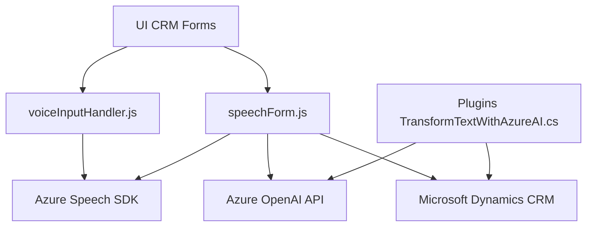

### Breve resumen técnico
El repositorio contiene tres archivos que trabajan con tecnologías de **Microsoft Dynamics CRM** y **Azure Services**. Su funcionalidad principal está orientada a la interacción basada en voz y texto, así como su integración con servicios externos como **Azure Speech SDK** y **Azure OpenAI API**. El propósito general es mejorar la experiencia del usuario mediante funcionalidades avanzadas de transformación de voz y texto en aplicaciones CRM.

### Descripción de la arquitectura
La solución tiene un enfoque modular, pero mantiene una estructura monolítica. No está dividida formalmente en capas o servicios independientes (como en una arquitectura de microservicios o hexagonal). En lugar de ello, la lógica se organiza por módulos funcionales que interactúan directamente con una plataforma de CRM (Microsoft Dynamics CRM). Esto se realiza integrando APIs de servicios externos como **Azure Speech SDK** y **Azure OpenAI API** para el procesamiento de voz y texto.

### Tecnologías usadas
1. **Microsoft Dynamics CRM**:
   - Se usa el contexto `executionContext` que asocia el código con eventos específicos dentro de formularios CRM.
   - APIs como `Xrm.WebApi` permiten realizar llamadas a funciones o servicios dentro del entorno de Dynamics CRM.
   
2. **Azure Speech SDK**:
   - Utilizado para habilitar funcionalidades de reconocimiento de voz y síntesis de texto a voz.
   - Se carga dinámicamente en los archivos JS mediante un script externo.

3. **Azure OpenAI API**:
   - Usado exclusivamente en el plugin C# para transformar texto según normas específicas.
   - Comunicación mediante solicitudes HTTP y manejo del formato JSON para recibir y analizar las respuestas.

4. **Librerías C#**:
   - `System.Net.Http`: Para manejo de solicitudes HTTP a servicios de Azure.
   - `Microsoft.Xrm.Sdk`: Interfaz base para la funcionalidad del plugin en Dynamics CRM.
   - `Newtonsoft.Json.Linq` y `System.Text.Json`: Para manipulación y transformación de respuestas JSON.

### Patrones utilizados
1. **Patrón modular** para la encapsulación lógica de las funciones en los módulos.
2. **Service-Oriented Architecture (SOA)** en el plugin C#, delega la responsabilidad de procesamiento avanzado al Azure OpenAI API.
3. **Patrón basado en eventos**:
   - Los archivos JS reaccionan a las interacciones del usuario (grabación/voice input).
4. **Plugin Pattern** en el archivo C#: Utiliza la interfaz estándar `IPlugin` de Dynamics CRM.

### Dependencias o componentes externos presentes
1. **Azure Speech SDK**: Para funcionalidades de reconocimiento y síntesis de voz.
   - Endpoint dinámico: `https://aka.ms/csspeech/jsbrowserpackageraw`.
   - Azure Key y región necesarias para autenticación.
   
2. **Microsoft Dynamics CRM**:
   - Form context y APIs de la plataforma (e.g., `Xrm.WebApi`, mapeo de campos, manipulación de atributos).

3. **Azure OpenAI API**:
   - Integración mediante un `HttpClient` en C#, autenticación con `api-key` y manejo de solicitudes HTTP para transformación de texto en JSON.

---

### Diagrama Mermaid válido para GitHub

### Conclusión final
La solución presentada consta de una arquitectura monolítica que integra tecnologías avanzadas como **Azure Speech SDK** y **Azure OpenAI API** para mejorar la funcionalidad de CRM en términos de interacción por voz y procesamiento de texto. Si bien la organización del código en forma modular facilita el mantenimiento y escalabilidad parcial, una posible mejora sería explorar una transición hacia una arquitectura de **microservicios** que permita un desacoplamiento más claro entre las funciones de voz, texto y gestión de datos de CRM. Esto simplificaría la implementación de funcionalidades más complejas en el futuro y facilitaría su extensión a otros entornos.