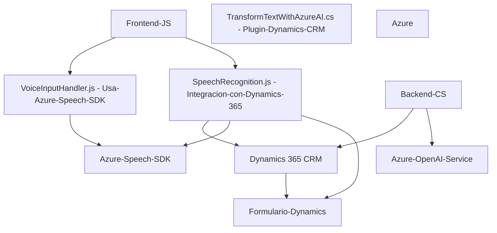

**Breve resumen técnico:**

El repositorio en cuestión implementa un sistema para la interacción de usuarios con formularios de un CRM, haciendo uso de diversas tecnologías de procesamiento de voz y texto. Está compuesto principalmente por componentes frontend (criptas JavaScript para integración de voz) y uno backend (un plugin que extiende la funcionalidad de Dynamics 365 mediante Azure OpenAI y servicios de CRM).

---

### **Descripción de Arquitectura:**

La solución tiene una arquitectura híbrida compuesta por los siguientes elementos:

1. **Frontend:** Módulo de interacción con el usuario basado en JavaScript, que incluye:
   - Reconocimiento de voz y síntesis de texto utilizando el Azure Speech SDK para interactuar con formularios del CRM.
   - Procesamiento de datos directamente en el cliente, incluyendo la extracción de información relevante y transformación básica.
   - Lógica de integración con APIs y servicios externos (i.e., Azure Speech SDK y Dynamics Web API).

2. **Backend:** Un plugin diseñado con el patrón de arquitectura **IPlugin**, el cual interactúa directamente con el sistema Dynamics CRM. Este componente utiliza servicios como Azure OpenAI para procesamiento más complejo de texto y transformación bajo reglas predefinidas en un formato JSON estructurado.

3. **Patrones de diseño:** Se detectan varios patrones como:
   - **Modularidad por responsabilidad:** Cada función/método está diseñada para cumplir roles específicos.
   - **Event-driven-programming:** En el frontend, se observan callbacks para controlar la carga dinámica del SDK y las interacciones con el usuario.
   - **Integración de servicios externos:** El sistema depende de Azure Speech SDK y Azure OpenAI para sus funcionalidades.
   - **Plugin Design Pattern:** El backend utiliza el patrón estándar de Dynamics CRM para plugins con el uso del `Execute`.

---

### **Tecnologías usadas:**

#### **Frontend:**
- **JavaScript:** Base para el desarrollo del módulo del cliente.
- **Azure Speech SDK**: Para reconocimiento de voz y síntesis en diferentes idiomas, con un enfoque en español (e.g., `es-ES-AlvaroNeural`).
- **Dynamics Web API SDK**: Para la interacción con la instancia de Dynamics 365 CRM.

#### **Backend:**
- **C# (.NET Framework)**: Desarrollo de plugins para el entorno de Dynamics CRM.
- **Microsoft.Xrm.Sdk**: Librería oficial para integrar lógica personalizada con Dynamics 365.
- **Newtonsoft.Json.Linq / System.Text.Json**: Manipulación de estructuras JSON.
- **System.Net.Http**: Realización de peticiones HTTP a servicios externos (Azure OpenAI).
- **Azure OpenAI API (GPT-4o)**: Transformación avanzada de texto.

---

### **Diagrama Mermaid**

---

### **Conclusión final:**

Esta solución implementa una arquitectura híbrida con elementos de integración de servicios en tiempo real, orientada en el uso de SDKs externos por parte del frontend y la ejecución de lógica programática en el backend. Las tecnologías seleccionadas son actuales y adecuadas para el caso de uso de sistemas CRM y herramientas de IA/voz.

Sin embargo, algunos aspectos podrían mejorarse:
1. **Gestión de credenciales:** Los secretos como `azureKey` o `apiKey` deben gestionarse de manera más segura, por ejemplo, mediante variables de entorno o servicios de vault.
2. **Tolerancia a fallos:** Incluir estrategias para manejar fallos en los servicios externos (Speech SDK y OpenAI) y comunicar errores al usuario/administrador del sistema.
3. **Validación dinámica:** La interacción entre el plugin y la API OpenAI puede beneficiarse de configuraciones dinámicas para mayores niveles de flexibilidad.

La estructura modular y la separación de responsabilidades proporcionan una buena base para escalabilidad y mantenibilidad en este tipo de solución. Sin embargo, dependiendo del tamaño y crecimiento de las funcionalidades integradas, podría evaluarse si migrar hacia una arquitectura más robusta (e.g. hexagonal) en el futuro.