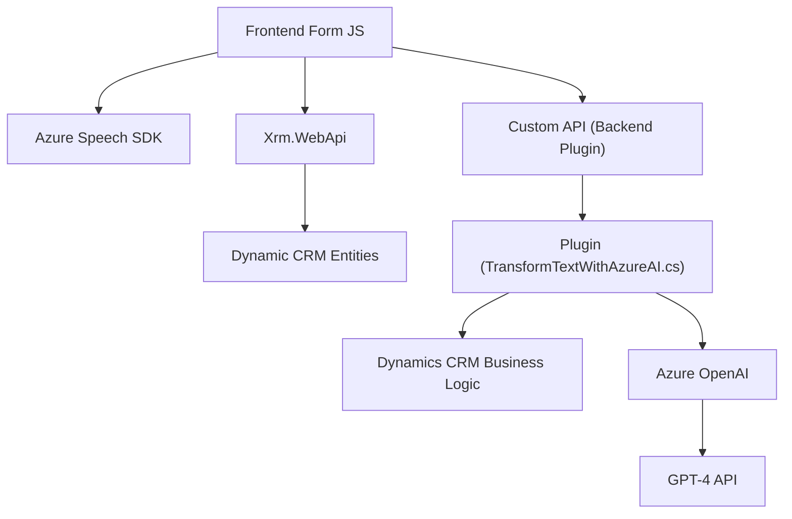

### Resumen Técnico

Este repositorio parece ser parte de una solución que integra servicios de procesamiento de voz y texto con un sistema de manejo de relaciones con clientes (CRM) como Microsoft Dynamics CRM, utilizando tecnologías y APIs de **Azure**. La solución incluye un frontend en JavaScript que interactúa con un backend personalizado basado en plugins .NET/C#, ligado al entorno Dynamics CRM y servicios de Azure como OpenAI y Azure Speech SDK.

---

### Descripción de Arquitectura

La arquitectura general puede catalogarse como una mezcla de:
- **Arquitectura SOA (Service-Oriented Architecture)**: Uso de APIs REST proporcionadas por Azure para servicios como GPT-4 y Azure Speech SDK.
- **Arquitectura N Capas**: Capa de frontend (JavaScript) que interactúa con Dynamics CRM (backend) y plugins en .NET que procesan los datos más estructurados y manejan la lógica del negocio.
- **Extensibilidad CRM**: Los plugins en C# parecen ser extensiones del entorno Dynamics CRM bajo el modelo de diseño de Plugins. Este se integra con servicios externos (Azure OpenAI) para enriquecer el contenido.

---

### Tecnologías y Frameworks Usados

#### Frontend
- **JavaScript**: En archivos como `readForm.js` y `speechForm.js`, el código usa Azure Speech SDK para reconocimiento de voz. También interactúa con el CRM y APIs del plugin backend.
- **Azure Speech SDK**: Captura y síntesis de voz.

#### Backend (.NET/C# Plugins)
- **Microsoft Dynamics CRM SDK**: Base para la creación de plugins, utilizando el modelo `IPlugin`.
- **Azure OpenAI**: Utilizado en el plugin `TransformTextWithAzureAI` para procesar texto con GPT-4.
- **Newtonsoft.Json**: Para manipulación eficiente de JSON.
- **HttpClient**: Integración con servicios REST de Azure.

#### Enlaces y Servicios
- **Xrm.WebApi** (frontend): API para gestionar entidades y atributos de Dynamics CRM.
- **Azure Speech SDK** y **Azure OpenAI REST APIs**: Servicios cloud para procesamiento de datos.

---

### Dependencias o Componentes Externos
- **Azure Services**:
  - Speech SDK para reconocimiento y síntesis de voz (frontend).
  - OpenAI proveedor GPT-4 para procesamiento de texto (backend).
- **Entorno Dynamics CRM**:
  - Interacción del frontend y backend con el CRM usando la API interna de Dynamics (`Xrm.WebApi`).
- **Newtonsoft.Json**: Librería popular para manipular estructuras JSON en .NET.
- **Sistema modular CRM**:
  - Mapear campos dinámicos del formulario utilizando servicios API o lógica interna.
- **API personalizada CRM**: Llamadas a servicios creados específicamente (`trial_TransformTextWithAzureAI`) dentro del sistema.

### Diagrama Mermaid

---

### Conclusión Final

El repositorio representa una solución extensiva centrada en mejorar las capacidades de formularios de Dynamics CRM mediante tecnologías avanzadas como reconocimiento de voz y procesamiento de texto con AI. Utiliza conceptos de **modularidad**, **SOA**, y **extensión CRM** para integrar distintos servicios como Azure Speech SDK y GPT-4. La robustez de las plataformas (Azure y Dynamics CRM) garantiza la escalabilidad y mantiene organizada la lógica del negocio en capas claras.

Este tipo de implementación es ideal para aplicaciones empresariales e interactivos dinámicos que necesitan modernizar la interacción cliente-empresa. Sin embargo, se debe considerar la carga que puede implicar el uso intensivo de servicios API externos y garantizar optimización en costos asociados a servicios de Azure Cloud.