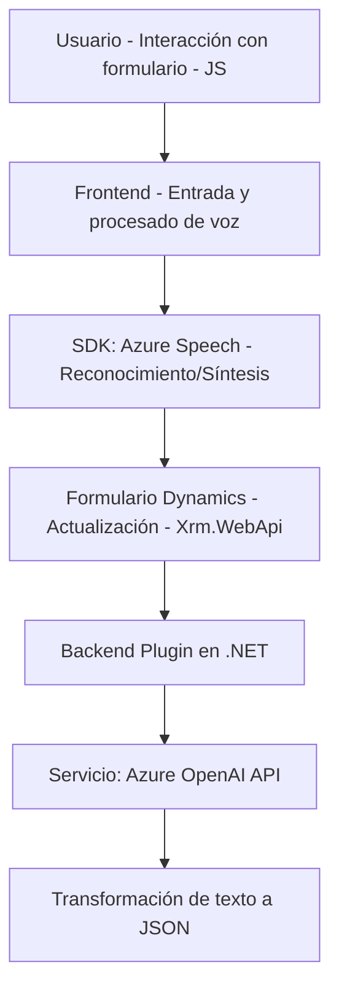

### Breve resumen técnico

El repositorio presenta una solución que está diseñada para ser utilizada con Microsoft Dynamics CRM. Incluye archivos JavaScript para el frontend (formularios) que manejan entrada/salida por voz y un plugin en C# que interactúa con Azure OpenAI para transformar texto. Está claramente orientado a una integración entre Microsoft Dynamics 365 y servicios de Azure.

---

### Descripción de arquitectura

La arquitectura es modular y orientada a servicios (SOA), donde cada componente tiene una responsabilidad clara:
1. **Frontend/JS:** Scripts que procesan datos de formularios y realizan integración con servicios de Azure como Speech SDK para reconocimiento y síntesis de voz.
2. **Backend/Plugin (.NET):** Un plugin que extiende la funcionalidad de Dynamics CRM procesando el texto mediante Azure OpenAI API.

- Arquitectura **n capas**:
  - **Capa de presentación (frontend JS):** Se interactúa directamente con el usuario para tomar comandos y procesar formularios.
  - **Capa de negocio (plugin):** Encapsula la lógica para transformar texto en estructuras específicas utilizando inteligencia artificial.
  - **Capa de datos:** Los formularios de Dynamics se usan como fuente y destino de datos.
  - **Integración con servicios externos:** Comunicación con APIs externas como Azure Speech SDK y Azure OpenAI.

---

### Tecnologías usadas

1. **Frontend:**
   - **JavaScript**
   - **Microsoft Dynamics Framework**
   - **Azure Speech SDK**
   - **JavaScript Promises y Asynchronous Programming**
2. **Backend Plugin:**
   - **C# (Microsoft.NET Framework)**
   - **Microsoft Dynamics CRM SDK**
   - **Azure OpenAI API**
   - **System.Net.Http** for REST API calls.
   - **System.Text.Json** or **Newtonsoft.Json** for JSON deserialization.

---

### Dependencias o componentes externos

1. **Azure Speech SDK:** Para reconocimiento y síntesis de voz en el frontend.
2. **Azure OpenAI API:** Utilizado por el plugin para transformación inteligente de texto a JSON siguiendo reglas específicas.
3. **Dynamics Web API:** Para extracción y actualización de valores en formularios desde Microsoft Dynamics CRM.
4. **Cargador dinámico de JavaScript SDK:** Scripts implementan un patrón de carga dinámica para gestionar dependencias en tiempo de ejecución.

---

### Diagrama Mermaid

---

### Conclusión final

Esta solución combina un frontend para procesamiento dinámico de formularios mediante voz con un backend extensible que transforma datos usando inteligencia artificial. Es ideal para escenarios donde se requiere interacción natural (voz y texto) en formularios CRM y procesamiento avanzado de datos con IA. La arquitectura modular y orientada a servicios garantiza que los componentes puedan evolucionar o ampliarse con nuevas funcionalidades, especialmente para integrar más capacidades de Azure.