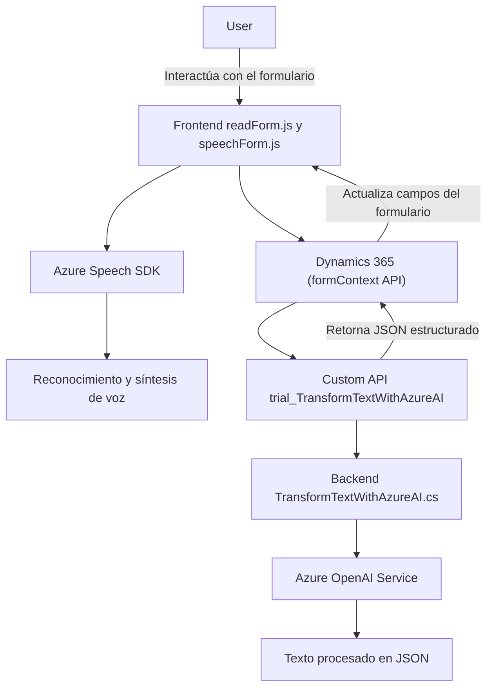

### Breve resumen técnico

El repositorio presentado se centra en la implementación de soluciones de interacción enriquecida con voz y procesamiento de lenguaje natural para formularios dinámicos en una plataforma como **Microsoft Dynamics 365**, integrando tecnologías de reconocimiento de voz, síntesis de texto a voz (Text-to-Speech) y procesamiento inteligente de texto mediante **Azure Speech SDK** y **Azure OpenAI Service**.

---

### Descripción de arquitectura

La solución representa una **Service-Oriented Architecture (SOA)** mediante la composición de varios componentes independientes:

1. **Frontend**:
   - Dos archivos JavaScript (`readForm.js`, `speechForm.js`) implementan la interacción del usuario con el formulario dinámico, utilizando funciones del **Azure Speech SDK** para reconocimiento de voz y síntesis de texto a voz. Naturalmente, estos archivos están diseñados como scripts de cliente para integración directa en Dynamics 365.
   - Procesan datos dinámicos del formulario (atributos visibles), transfieren información mediante una **custom API** o directamente a Dynamics CRM.

2. **Backend**:
   - El archivo C# `TransformTextWithAzureAI.cs` es un **plugin** para Dynamics CRM. Aplica reglas de transformación en el texto utilizando **Azure OpenAI Service**, estructura el resultado y lo expone como JSON para que los formularios puedan consume y aplicar la información transformada.

3. **Integración externa**:
   - Repositorio depende de servicios como **Azure Speech SDK** para síntesis/reconocimiento de voz y **Azure OpenAI Service** para el procesamiento avanzado de lenguaje natural.

La arquitectura es modular con una separación clara entre frontend y backend. Aunque estos componentes son independientes, se alinean bajo una filosofía de integración orientada a servicios con dependencia de servicios externos (Azure Speech SDK, OpenAI API).

---

### Tecnologías y frameworks usados

1. **Frontend (JavaScript)**:
   - **Azure Speech SDK** para entrada y síntesis de voz.
   - **Promesas** y **JavaScript estándar** para control eficiente de asíncronía y manipulación del DOM.
   - **Microsoft Dynamics 365 context APIs** (`executionContext.data.entity.attributes`, `Xrm.WebApi`) para formularios y entidades.

2. **Backend (C#)**:
   - **Microsoft.Xrm.Sdk** para desarrollar plugins que interactúan con Dynamics CRM.
   - **System.Net.Http** y **Newtonsoft.Json** para integrar una API externa, procesar el texto y convertirlo en formato JSON estructurado.
   - **Azure OpenAI Service** para procesamiento avanzado del texto mediante modelos de lenguaje.

---

### Dependencias o componentes externos

1. **Azure services**:
   - **Azure Speech SDK**: Utilizado para reconocimiento y síntesis de voz en tiempo real. Cargado dinámicamente desde el navegador (JavaScript SDK).
   - **Azure OpenAI Service**: Usado por el plugin C# para procesar texto y retornar información estructurada en formato JSON.

2. **Microsoft Dynamics 365**:
   - Integración de formularios con el contexto de API de Dynamics CRM, para manipulación y actualización de datos dependiendo de los resultados del análisis de voz.

3. **Custom API**:
   - La solución requiere una API adicional (`trial_TransformTextWithAzureAI`) para el backend o procesamiento avanzado en el modelo de IA.

4. **JavaScript estándar**:
   - No presenta uso de frameworks como React, Angular o Vue. Se basa en programación básica de JavaScript.

5. **C# estándar**:
   - Uso de bibliotecas comunes de comunicación (HTTP) y serialización JSON, y desarrollo enfocado en dinámicas de plugins de CRM.

---

### Diagrama Mermaid válido para GitHub

---

### Conclusión final

Esta solución se basa en una **arquitectura modular orientada a servicios (SOA)** con interacción entre servicios externos (Azure Speech SDK, OpenAI Service) y los componentes internos de Microsoft Dynamics 365. La combinación de JavaScript en el frontend y un plugin en C# en el backend permite una integración efectiva con Dynamics CRM, enriqueciendo la experiencia del usuario mediante interacción por voz y procesamiento de texto avanzado. 

Además, el diseño general muestra una atención particular hacia las operaciones asíncronas, la modularidad y la integración con servicios para expandir las capacidades funcionales de Dynamics CRM. Es una solución extensible y adecuada para entornos corporativos que demandan interfaces dinámicas y soporten interacción avanzada.