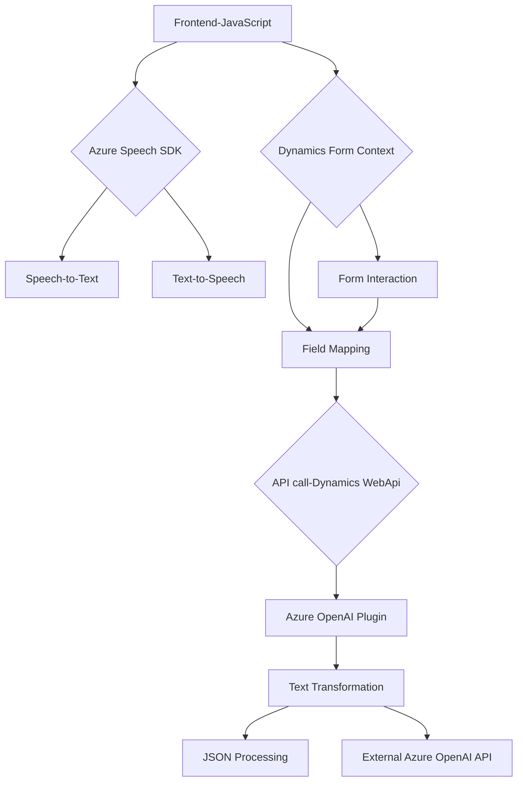

### Resumen Técnico del Repositorio

Este repositorio está diseñado para integrar capacidades avanzadas de interacción con formularios mediante voz y procesamiento de texto en Dynamics CRM, utilizando tecnologías de Microsoft como **Azure Speech SDK** y **Azure OpenAI**. También se adapta a necesidades personalizadas mediante plugins y extensiones específicas.

---

### Descripción de Arquitectura

La arquitectura general del repositorio tiene varios componentes:
1. **Capas de presentación y lógica del cliente (Frontend)**: Scripts en JavaScript permiten la interacción de reconocimiento de voz (Speech-to-Text) y síntesis de voz (Text-to-Speech) para mejorar la accesibilidad y las experiencias de usuario.
2. **Backend basado en Plugins (Dynamics CRM)**: Extensiones que integran la lógica del OpenAI API para la transformación automatizada del texto.
3. **Integración de APIs**: Conecta el frontend con servicios externos como Azure Speech y Azure OpenAI mediante SDKs y APIs.

La arquitectura parece ser **Distribuida Híbrida de Capas**:
- **Frontend/Dynamics**: N-capas, donde los scripts tienen una clara separación respecto al acceso a datos y la lógica de negocio alojada en los plugins.
- **Microservicios**: Aunque no tiene una arquitectura de servicios completa, los plugins y SDKs operan como servicios independientes para tareas específicas.

---

### Tecnologías Usadas

1. **Front-end**:
   - **JavaScript (sin frameworks explícitos)**: Código modular para las interacciones en tiempo real.
   - **Azure Speech SDK**: Reconocimiento de voz y síntesis.

2. **Back-end**:
   - **C# y .NET**: Implementación de plugins personalizados para Dynamics CRM.
   - **Dynamics Planner SDK**: Para manipular formularios y datos en Dynamics CRM.
   - **Azure OpenAI API**: Procesamiento avanzado con IA.

3. **Dependencias**:
   - **Newtonsoft.Json**: Manejo de objetos JSON en C#.
   - **System.Net.Http**: Llamadas HTTP para consumir APIs externas.
   - **FormContext**: API de Dynamics CRM para interactuar con atributos y formularios.

---

### Diagrama Mermaid

---

### Conclusión

El repositorio constituye una solución híbrida que suma capacidades avanzadas de manejos de voz y procesamiento de texto para formularios en Dynamics CRM. Utiliza **Azure Speech SDK** para interacción de voz en el cliente y **Azure OpenAI API** para la transformación de texto en el servidor. La robustez de esta solución radica en la modularidad de su código y el uso de tecnologías modernas basadas en servicios en la nube. Sin embargo, puede mejorarse con una clara separación de responsabilidades y pruebas unitarias para cada componente.