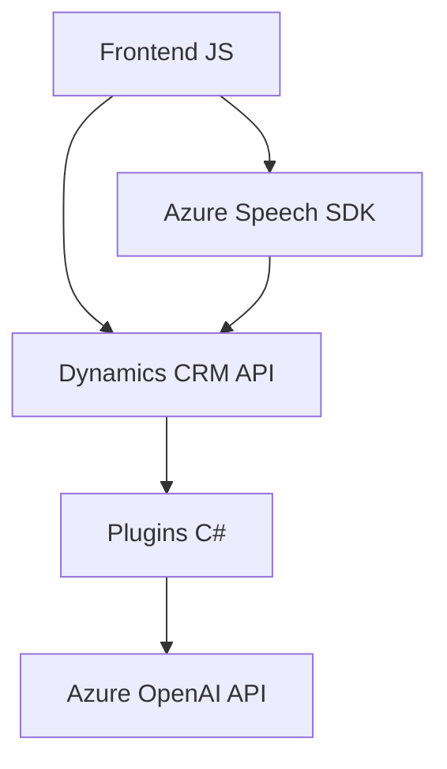

### Resumen técnico

Los archivos del repositorio implementan una solución que combina una interfaz frontend para formularios con reconocimiento de voz y síntesis de texto (usando Azure Speech SDK) y lógica backend para transformar y procesar datos empleando Azure OpenAI. Está orientada hacia la integración y automatización en sistemas Dynamics CRM, donde los datos de formularios son manipulados tanto a través de plugins como mediante servicios integrados.

---

### Descripción de arquitectura del proyecto

La arquitectura general es **n capas**, con una separación entre:
1. **Frontend/interfaz de usuario:** Scripts en JavaScript que manejan la lógica de reconocimiento y sintetización de voz desde formularios basados en Dynamics. Aquí también se integran API de Azure Speech SDK.
2. **Backend/persistencia y lógica de negocio:** Plugins en C# que actúan como capa lógica para procesar datos en Dynamics CRM y enviar solicitudes al servicio Azure OpenAI para procesamiento avanzado de texto.

Cada componente colabora como una unidad funcional que interactúa mediante dependencias externas y APIs (Azure Speech SDK, Azure OpenAI, Dynamics CRM SDK).

---

### Tecnologías utilizadas

1. **Frontend:**
   - **Lenguaje:** JavaScript.
   - **Frameworks:** No se detectan frameworks declarados, aunque el código parece diseñado para el entorno Dynamics CRM.
   - **Dependencias adicionales:** Azure Speech SDK.

2. **Backend:**
   - **Lenguaje:** C#.
   - **Framework:** Dynamics CRM SDK.
   - **Integraciones:** Azure OpenAI para procesamiento de texto inteligente.
   - **Librerías externas:** `Newtonsoft.Json`, `System.Net.Http`.

3. **Plataformas y servicios:**
   - **Dynamics CRM:** Repositorio de datos y mecanismos de ejecución de plugins.
   - **Azure Speech SDK:** Para reconocimiento y síntesis de voz en tiempo real.
   - **Azure OpenAI:** Para procesamiento avanzado de lenguaje natural basado en GPT.

---

### Dependencias y componentes externos presentes

1. **Azure Speech SDK:** Cargado dinámicamente en el frontend para reconocimiento y síntesis de voz desde formularios web.
2. **Azure OpenAI:** Utilizado en los plugins para transformar texto basado en reglas.
3. **Dynamics CRM SDK:** Dependencia principal para manejar datos y plugins integrados en la plataforma Dynamics 365.
4. **Librerías de .NET:** Utilizadas para implementar plugins, manejar solicitudes HTTP, y serializar JSON hacia/desde las APIs externas.

---

### Diagrama Mermaid válido para GitHub

---

### Conclusión final

Este repositorio implementa una solución basada en **n capas** para automatización y gestión de formularios con reconocimiento y sintetización de voz en el frontend y lógica avanzada de transformación de texto en el backend. La arquitectura está diseñada para integrarse con Dynamics CRM y servicios de Azure (Speech SDK, OpenAI), manteniendo un enfoque modular y optimizado para gestión de dependencias externas.