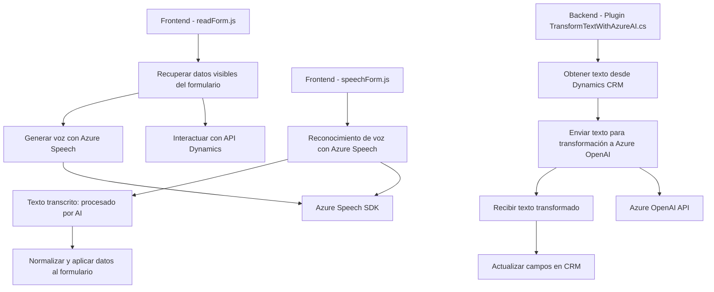

### Breve resumen técnico
Este repositorio contiene implementaciones relacionadas con la integración de Microsoft Dynamics CRM, Azure Speech SDK y servicios de Azure OpenAI para la manipulación de datos mediante entrada y salida de voz, así como para la transformación de texto estructurado. La solución incluye un frontend (basado en JavaScript) y un backend (plugin en C#).

---

### Descripción de arquitectura
La solución está estructurada como una **arquitectura híbrida de n capas con servicios externos**:

1. **Frontend**: Proporciona componentes de entrada y salida de datos basados en voz (usando Azure Speech SDK) para interactuar con formularios de Dynamics CRM.
   - Aquí la lógica se organiza de forma modular: cada parte tiene una tarea definida dentro del ciclo de procesamiento del formulario y del reconocimiento/síntesis de voz.
   - Usa dependencias como APIs de Dynamics CRM y carga de SDKs externos dinámicamente.

2. **Backend**: Implementa un plugin que extiende la funcionalidad de Dynamics CRM. Este plugin utiliza Azure OpenAI para procesar texto basado en reglas personalizadas e integra los resultados con Dynamics via su API nativa.
   - Externamente, el plugin funciona como un microservicio que delega procesos complejos al servicio de Azure OpenAI.

La arquitectura combina:
   - Elementos de **n capas** para separar la lógica del frontend y backend.
   - Uso de **microservicios externos** donde la responsabilidad específica (reconocimiento y síntesis de voz, procesamiento de texto) se delega a servicios de Azure.

---

### Tecnologías utilizadas
- **Frontend (JavaScript)**:
  - Framework: No especificado, parece independiente o ligado al entorno Dynamics CRM (Xrm API).
  - SDK externo: Azure Speech SDK con carga dinámica.
  - Lógica modular siguiendo principios de programación funcional y patrones de carga de dependencias dinámicas.

- **Backend (C# Plugin)**:
  - Framework: Microsoft Dynamics CRM SDK.
  - Servicios externos:
    - Azure OpenAI (GPT-4) para procesamiento basado en IA.
    - .NET Framework y librerías como HttpClient para comunicación automatizada.
  - Arquitectura basada en la implementación de `IPlugin`.

- **Servicios Azure**:
  - Azure Speech SDK: Para síntesis y reconocimiento de voz.
  - Azure OpenAI: Para transformación de texto con IA.

---

### Dependencias y componentes externos
1. **Azure Speech SDK**: Proporciona herramientas para reconocimiento y síntesis de voz, cargado dinámicamente en el frontend.
2. **XRM Form Context API**: Integra el frontend JS con formularios y datos de Microsoft Dynamics CRM.
3. **Custom API**: En el backend, el plugin llama a APIs personalizadas en Dynamics CRM para manejar mapeo de campos.
4. **Azure OpenAI API**: Servicio de IA que maneja procesamiento avanzado de texto (GPT-4).

---

### Diagrama Mermaid válido para GitHub

---

### Conclusión final
La solución demuestra un diseño orientado a la modularidad y delegación de responsabilidades. Combina un frontend para entrada y salida de datos en voz con integración de servicios externos, además de un backend centrado en extender la funcionalidad de Dynamics CRM mediante un plugin. La arquitectura es un híbrido de **n capas** con uso de microservicios externos para la ejecución de tareas específicas, como reconocimiento de voz y procesamiento de texto con IA.