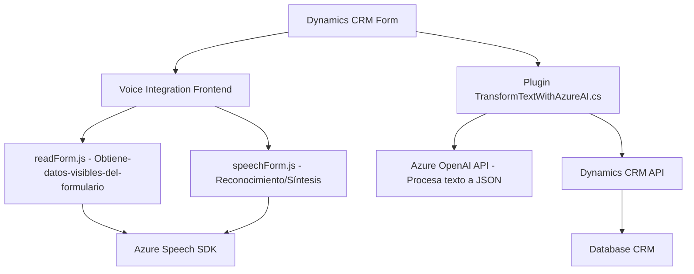

# Análisis técnico del repositorio

## Resumen Técnico
El repositorio contiene componentes centrados en la **integración de voz y reconocimiento en Dynamics CRM**, utilizando tecnologías como **JavaScript** y **Azure Speech SDK** para el frontend, y C# para plugins en Dynamics 365 CRM. Los módulos están orientados a extraer datos desde formularios, realizar síntesis o reconocimiento usando servicios de Azure y transformar datos mediante **Inteligencia Artificial** (Azure OpenAI).

---

## 1. Descripción de la solución
La solución tiene varios componentes:
- **Solución tipo API/plugin y frontend:**  
  - **Plugins** (C#): Facilitan extensibilidad y lógica personalizada directamente en Dynamics CRM, integrando servicios externos como Azure OpenAI.
  - **Frontend:** Módulos de JavaScript que interactúan con Dynamics CRM para implementar funcionalidades de reconocimiento, síntesis de voz y manipulación de datos en formularios.

---

## 2. Tecnologías, frameworks y patrones utilizados

### Tecnologías:
- **Lenguajes:**
  - **Frontend:** JavaScript (para interacción con formularios y manipulación DOM).
  - **Backend:** C# (para desarrollo del plugin de Dynamics CRM).
- **Servicios/nubes:**  
  - **Azure Speech SDK:** Usado para síntesis y reconocimiento de voz en el frontend.
  - **Azure OpenAI API:** Utilizado en el plugin para procesamiento de texto mediante GPT.
- **Frameworks:** Dynamics CRM SDK (`Microsoft.Xrm.Sdk`) para interacción con CRM en el plugin.

### Patrones de diseño:
- **Frontend:**
  - **Modularidad:** Las funciones de cada archivo están divididas según responsabilidades específicas (carga de SDK, procesamiento de datos, síntesis/reconocimiento).
  - **Callback o asincronía:** Uso de callbacks y `Promise` para manejo de SDK externos y API.
  - **Adaptadores:** Implementación de funciones como `getFieldMap()` o `applyValueToField()` para traducir datos entre el formulario de Dynamics CRM y estructuras internas.
- **Backend:**
  - **Segregación de responsabilidades:** Métodos bien divididos en el plugin, como `Execute` para interacción con CRM y `GetOpenAIResponse` para lógica externa.
  - **Plugin Dynamics CRM:** Un patrón específico, diseñado para extender las capacidades del CRM mediante eventos desencadenados por el usuario.
- **Communication Integration:** Plugins y scripts interactúan con APIs externas y SDK mediante solicitudes HTTP o funciones dinámicas.

---

## 3. Arquitectura
La arquitectura se clasifica como **integración polivalente basada en n capas**:
- **Capa de presentación:** Compuesta por las funciones de frontend en JavaScript (`readForm.js`, `speechForm.js`) para capturar inputs y manipular DOM.
- **Capa lógica:** Especialmente representada por el **plugin en C#** que maneja lógica de negocio integrada con Dynamics CRM.
- **Capa de servicios externos:** APIs externas (Azure Speech y OpenAI) para reconocimiento de voz, síntesis y procesamiento de texto basado en IA.

Mientras que proporciona un flujo modular, no se detecta un enfoque estricto como **hexagonal** o **microservicios**. La solución está diseñada para integrarse nativamente como parte de Dynamics CRM.

---

## 4. Dependencias y componentes externos
- **Azure Speech SDK:** Cargado dinámicamente para servicios de voz en el frontend.
- **Azure OpenAI API:** Usada en el plugin para transformar textos usando modelos de AI.
- **Dynamics CRM APIs:**  
  - `Xrm.WebApi` (frontend) para interacción con formularios.
  - `Microsoft.Xrm.Sdk` (plugin) para manipulación y eventos del CRM.
- **Newtonsoft.Json:** Manipulación de JSON en plugins.
- **System.Net.Http:** Usado en C# para invocación de Azure OpenAI.

---

## 5. Diagrama Mermaid válido para GitHub

---

## Conclusión Final
La solución está diseñada para enriquecer la interfaz de Dynamics CRM, proporcionando capacidades avanzadas basadas en voz e inteligencia artificial. Utiliza una combinación de tecnologías modernas como Azure Speech SDK para reconocimiento y síntesis de voz, y Azure OpenAI API para procesamiento inteligente mediante IA. Su arquitectura está basada en **capas**, con modularidad clara entre frontend y backend, optimizando la extensibilidad y el manejo de servicios externos.

Aunque cumple estrictamente con las necesidades de integración para Dynamics CRM, podría beneficiarse de mejoras en:
- Mayor parametrización de claves API y configuración para facilitar despliegues a múltiples entornos.
- Adopción de prácticas avanzadas como **patrones hexagonales** en el plugin C#.