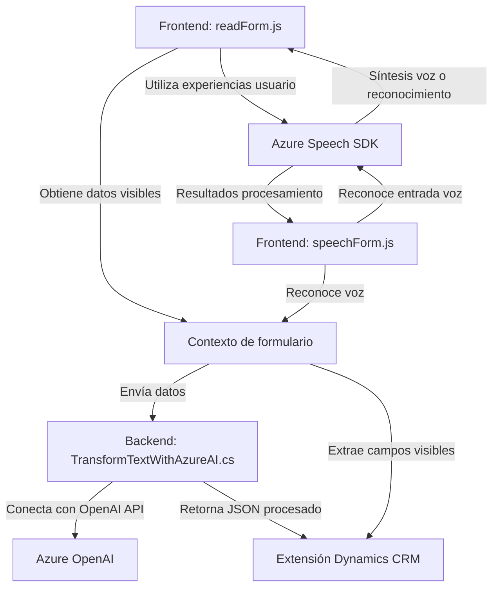

### Breve resumen técnico
El repositorio describe una solución utilizada dentro de un sistema basado en Dynamics 365 (posiblemente un CRM) para integrar funcionalidades de entrada y salida de voz basada en **Azure Speech SDK** y **Azure OpenAI**. Incluye aspectos de frontend para procesar formularios y backend, donde se implementan plugins que ejecutan transformaciones de texto en formato JSON estructurado.

---

### Descripción de arquitectura
La solución sigue un enfoque modular de arquitectura que combina frontend y backend. La funcionalidad frontend se basa en la interacción del usuario con formularios (contexto visual) y el mapeo hacia componentes relacionados con datos introducidos de forma manual, verbal o automática. En el backend, la integración de un plugin con Dynamics CRM se apoya en la conexión a APIs externas como Azure OpenAI para modificar información estructurada.

La arquitectura tiene características híbridas:
1. **Multicapa (n capas)**: Separación entre capa de presentación (FRONTEND: `readForm.js` y `speechForm.js`) y capa de lógica empresarial (`Plugins/TransformTextWithAzureAI`).
2. **Hexagonal (implementada parcialmente)**: Reflejado en la separación de lógica de negocio del contenido SDK, así como en la integración de servicios externos como Azure Speech SDK y OpenAI a través de adaptadores.
3. **Orientación a microservicios (limitada)**: Aunque los archivos presentan componentes muy modulares, todos dependen de Dynamics CRM como plataforma centralizada, lo cual las hace más cercanas al paradigma monolítico.

---

### Tecnologías usadas
1. **Frontend (JavaScript)**:
   - **Azure Speech SDK**: Para síntesis de voz y reconocimiento.
   - Integración directa con formularios de Dynamics CRM.
   - Patrones: Separación de Concerns, Delegación.

2. **Backend (C#)**:
   - **Dynamics CRM Plugin Framework**: Extiende CRM mediante `IPlugin`.
   - **Azure OpenAI API**: Procesamiento avanzado de texto mediante GPT.
   - **Newtonsoft.Json / System.Text.Json**: Para estructuración y desestructuración de objetos JSON.

3. **Frameworks y servicios**:
   - **Xrm.WebApi.online**: Dinámicas API para Dynamics CRM.
   - Funcionalidades de recuperación y asignación dinámica de campos en formularios.

---

### Dependencias o componentes externos
- **Azure Speech SDK**: Usada en todos los archivos de frontend para entrada y salida de voz.
- **Azure OpenAI**: Servicio externo para manipular texto usando inteligencia artificial y transformar el resultado en JSON estructurado.
- **Microsoft Dynamics CRM SDK**: Presente en el archivo backend para conectarse, operar y extender la lógica de Dynamics.

---

### Diagrama Mermaid válido para GitHub
Diagrama de interacción general entre los componentes identificados.

---

### Conclusión final
El repositorio representa una solución tecnológica que integra **Azure Speech SDK** y **Azure OpenAI** directamente con **Dynamics CRM**. La funcionalidad está diseñada para mejorar la interacción usuario-sistema mediante voz, automatizando la entrada y salida de información en formularios.

Aunque la arquitectura exhibe características de **hexagonal arquitectura**, principalmente por las adaptaciones para interactuar con servicios externos, su dependencia de Dynamics 365 sugiere más bien un **monolito extendible**. La solución es innovadora en su uso de tecnologías avanzadas como AI y síntesis de voz, pero presenta limitaciones de desacoplamiento en el contexto más amplio.