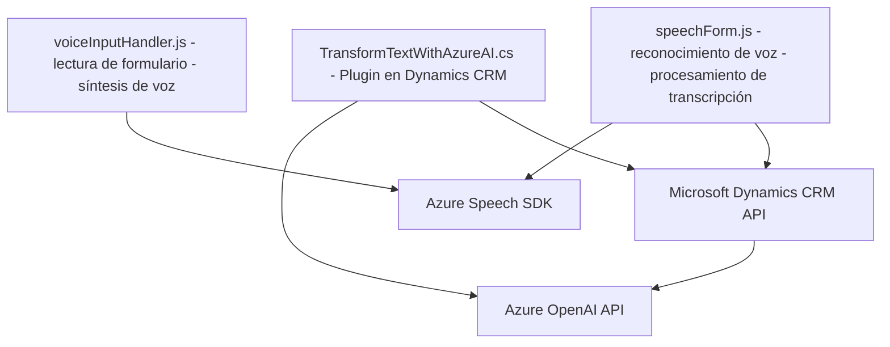

### Breve resumen técnico

El repositorio contiene tres archivos representativos, cada uno sirviendo para gestionar la interactividad entre usuarios, formularios dinámicos de Microsoft Dynamics CRM y plataformas externas (Azure Speech SDK y Azure OpenAI). La solución parece ser una plataforma híbrida basada en **out-of-the-box CRM customization** con soporte para **voice-to-data** y procesamiento de texto usando inteligencia artificial.

---

### Descripción de arquitectura

La solución combina una **arquitectura de n-capas** con capacidades distribuidas características de un enfoque de integración con APIs externas. Los principales componentes de la arquitectura incluyen:

1. **Frontend JS**: Contiene los módulos `voiceInputHandler.js` y `speechForm.js`. Estos archivos se encargan de interactuar con formularios dinámicos de Dynamics CRM mediante JavaScript, accediendo al contexto del formulario y actualizando datos de forma dinámica. Además, integran el **Azure Speech SDK** para reconocimiento y síntesis de voz.
   
2. **Backend CRM Plugin**: Implementado en C#, el archivo `TransformTextWithAzureAI.cs` actúa como un **plugin de Dynamics CRM**, llevando a cabo procesamiento adicional del texto mediante **Azure OpenAI API**. Se observa una combinación entre el diseño de plugins y la comunicación con una API REST para procesamiento de inteligencia artificial.

---

### Tecnologías usadas

1. **Frontend**:
   - **JavaScript** (Vanilla): Lenguaje usado para interactuar con elementos del DOM y librerías externas.
   - **Azure Speech SDK**: Usado para el reconocimiento y síntesis de voz.
   - **Event-driven programming**: Utilización de eventos (callbacks) para el manejo de flujos asincrónicos.
   - **Microsoft Dynamics CRM SDK** (context APIs): Para manipular datos del CRM.

2. **Backend Plugins**:
   - **C#**: Lenguaje utilizado para el desarrollo de plugins de Dynamics CRM.
   - **Microsoft.Xrm.Sdk**: Framework para extender la funcionalidad de Dynamics CRM.
   - **Azure OpenAI API**: Servicio cloud de procesamiento de lenguaje natural basado en modelos GPT.
   - **System.Net.Http**: Para solicitudes HTTP hacia el servicio Azure OpenAI.
   - **Newtonsoft.Json**: Manejo de datos estructurados en formato JSON.

---

### Diagrama Mermaid válido para GitHub

---

### Conclusión final

La solución representa una **arquitectura híbrida** basada en una separación técnica de responsabilidades: un frontend interactivo y modular que maneja la interacción entre usuarios y formularios dinámicos, y un backend conectado que procesa información con capacidades extendidas mediante plugins y servicios en la nube. Tecnologías como Azure Speech SDK y Azure OpenAI son claves en la integración, mostrando un diseño moderno que aprovecha servicios serverless y cloud AI. La arquitectura n-capas asegura simultáneamente modularidad y escalabilidad, mientras que el uso de external APIs fomenta la interoperabilidad con plataformas externas como Azure y Dynamics CRM. Esta solución es ideal para entornos empresariales y workflows automatizados basados en interacción y procesamiento avanzado de datos.