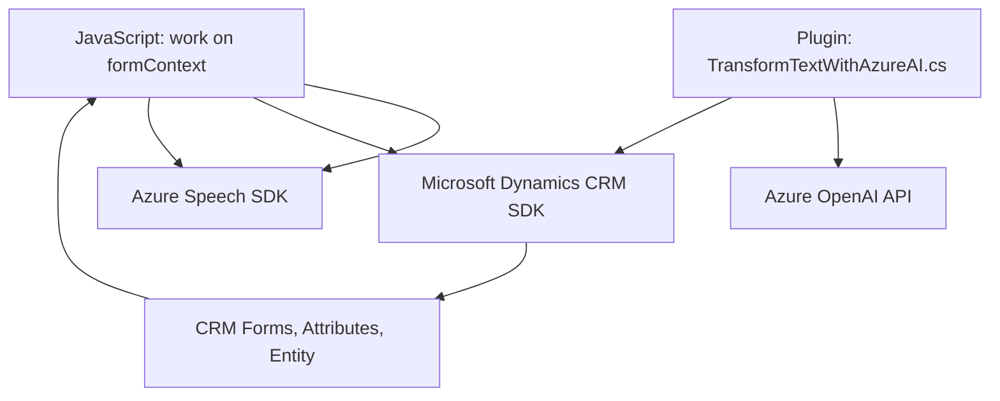

## Breve resumen técnico
La solución en el repositorio implementa funcionalidades relacionadas con la interacción entre formularios dinámicos (potencialmente en un contexto CRM) y servicios basados en inteligencia artificial (como Azure Speech y Azure OpenAI). Está compuesta por tres tipos principales de artefactos: 
1. Frontend (basado en JavaScript).
2. Servicios asíncronos y conectores API.
3. Plugins para Microsoft Dynamics CRM en C#.

Este sistema parece constituir una solución híbrida que facilita la entrada de voz (speech-to-text), salida en texto hablado (text-to-speech) y transformaciones avanzadas de datos mediante AI.

---

## Descripción de arquitectura
La arquitectura del sistema es una solución modular basada en múltiples capas:
- **Frontend basado en eventos:** Manejo de datos y funciones específicas en JavaScript, integrados con servicios externos, principalmente Azure Speech.
- **Plugins en Dynamics CRM:** Extensiones para conectar y enriquecer funcionalidades del sistema con plugins personalizados.
- **Integración con Servicios Externos:** Uso del SDK de Azure Speech, Azure OpenAI y API Dynamics para habilitar la interacción cognitiva y datos procesados.
- **Event-driven structure:** El sistema reacciona a eventos del usuario, como entrada de voz o acciones en el CRM, y sigue un flujo descendente basado en la ejecución de servicios externos.

La arquitectura puede clasificarse como un **sistema de múltiples capas (n capas)** debido a la división clara entre:
1. **Capa de presentación:** Componentes en JavaScript para interacción directa con el usuario.
2. **Capa de lógica de negocio:** Transformaciones de datos mediante plugins en C#.
3. **Capa de acceso a datos:** Gestión de datos en formularios CRM y comunicación con servicios como Azure Speech y Azure OpenAI.

---

## Tecnologías usadas
### Lenguajes:
- **JavaScript** (Frontend, manipulación de datos, integración con Azure Speech SDK).
- **C#** (.NET Framework para plugins en Dynamics CRM).

### Frameworks y SDK:
- **Dynamics CRM SDK** para la interacción con el contexto del sistema CRM (manipulación de formularios y atributos).
- **Azure Speech SDK** para convertir texto a voz y voz a texto, habilitando una experiencia cognitiva.
- **Azure OpenAI** (GPT-4) para transformar texto en JSON mediante un endpoint HTTP.
- **Newtonsoft.Json** para serialización y deserialización de objetos JSON en C#.

### Arquitectura/Patrones:
1. **Patrón modular:** Separación de responsabilidades en funciones claras y específicas en cada archivo.
2. **External Service Integration:** Dependencia de servicios cloud externos (API Azure Speech y Azure OpenAI).
3. **Event-driven Workflow:** Procesamiento de eventos y entrada/salida asíncrona.
4. **Plugin Architecture:** Extensiones mediante Microsoft Dynamics CRM Plugins.

---

## Diagrama Mermaid

---

## Conclusión final
La solución presentada parece implementada como un ecosistema de múltiples capas, diseñado para dotar de capacidades avanzadas de reconocimiento y síntesis de voz a formularios dinámicos dentro de una plataforma CRM. Además, utiliza un plugin inteligente para transformar textos en JSON con la ayuda de Azure OpenAI, adaptándose a requisitos específicos del negocio.

Aunque el sistema es funcional, muestra varias áreas de mejora:
1. **Seguridad:** Las credenciales y configuraciones están incrustadas en el código fuente, lo que compromete la seguridad del sistema.
2. **Escalabilidad:** Parece depender mucho de servicios externos fijos. Considerar la incorporación de estrategias de resiliencia y fallback en caso de fallos.
3. **Modularidad:** Los archivos son claramente separados, pero en proyectos mayores esto podría evolucionar a una arquitectura más definida como hexagonal o basada en servicios.

La solución ejemplifica una integración efectiva entre servicios cloud y un sistema CRM, garantizando una experiencia accesible y moderna para el usuario final.