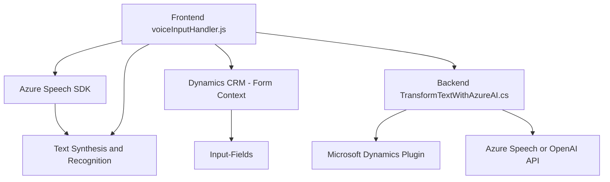

### Breve resumen técnico
El repositorio contiene archivos organizados en una estructura típica para una solución bifocal: incluye parte del frontend (JavaScript para interacción y procesamiento de formularios, además de reconocimiento y síntesis de voz) y una parte backend (C# plugin para conexión con Dynamics 365 y Azure OpenAI). Está orientado a una implementación que procesa formularios en entornos Dynamics 365, integrando algún nivel de Inteligencia Artificial mediante servicios externos como Azure AI.

---

### Descripción de arquitectura
La solución sigue un **modelo de arquitectura n-capas combinada** con componentes desacoplados:
1. **Frontend**:
   - En la capa de presentación, la funcionalidad de entrada y salida de voz se integra directamente con los formularios de Dynamics 365.
   - Utiliza el SDK de Azure Speech y ofrece métodos para lectura de datos del formulario o entrada de voz y aplicación de los valores transformados.
   - Presenta un diseño modular procedimental basado en funciones altamente específicas y reutilizables.

2. **Backend (plugin en Dynamics)**:
   - Gestionada como un plugin que actúa en respuesta a eventos en Dynamics CRM.
   - El plugin interactúa con el servicio **Azure OpenAI API** para transformar textos en objetos JSON estructurados según reglas definidas.
   - Utiliza la estructura de plugins característica de CRM, conectando dos capas: el cliente que envía datos y un microservicio remoto (API de Azure) que los procesa.

En conjunto, la implementación muestra un diseño orientado a servicios (middleware para conectar Dynamics y Azure), pero en términos generales se puede categorizar como **monolito extendido** con integraciones externas.

---

### Tecnologías usadas
1. **Frontend:**
   - **JavaScript:** Implementación del lado cliente para leer formularios, sintetizar y transcribir voz.
   - **Azure Speech SDK:** Provee las herramientas necesarias para entrada y salida de voz, como reconocimiento y síntesis de texto.
   - **Dynamics 365 SDK:** Específicamente, el contexto de formularios y funcionalidades de manipulación mediante JavaScript.

2. **Backend:**
   - **Microsoft Dynamics CRM SDK:** Para la implementación de plugins personalizados que manipulan datos dentro de Dynamics CRM.
   - **Azure OpenAI API:** Servicio externo basado en IA para transformación avanzada de texto en objetos JSON.
   - **C#:** Lenguaje principal para implementar el plugin, que sigue el patrón de extensibilidad `IPlugin`.

3. **Otros servicios:**
   - Uso de servicios REST para conectarse con Azure APIs.
   - Dependencia de SDK cargados dinámicamente o gestionados por el navegador.

---

### Diagrama Mermaid válido para GitHub

---

### Conclusión final
Esta solución es un híbrido entre un **frontend integrado** y un **backend extensible** para el ecosistema de Dynamics 365. Está diseñada para lograr una integración avanzada con los servicios de Azure, tanto para síntesis de voz como para inteligencia artificial. Este enfoque evidencia el uso de patrones como **Plugin Pattern** y **Service Orientation** para dividir la funcionalidad y permitir una arquitectura flexible que interactúe con sistemas externos sin duplicar la lógica. Sin embargo, presenta una estructura monolítica sobre el stack de Microsoft Dynamics combinado con integraciones externas, particularmente el SDK de Azure Speech y las APIs de OpenAI. La gestión de claves (API Key) es un punto crítico que debería revisarse para entornos de producción.