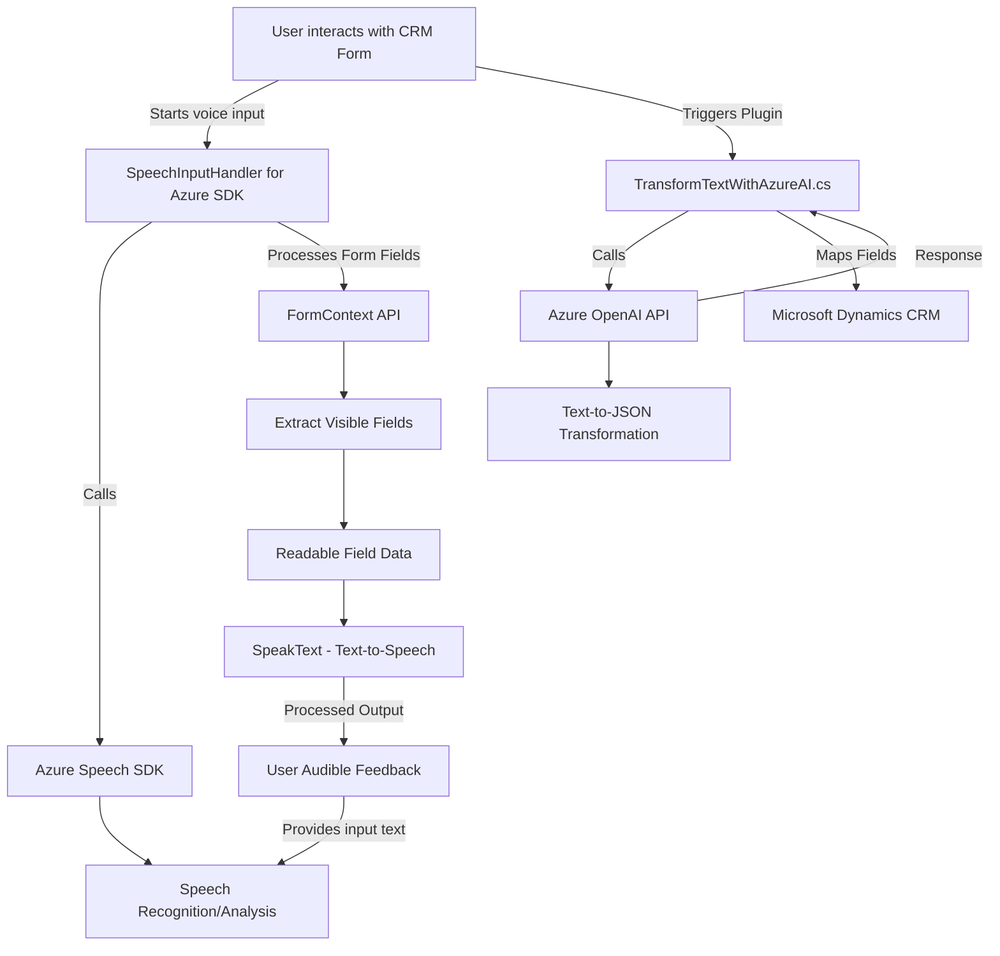

### Resumen técnico

A continuación se analiza la estructura del repositorio para determinar las tecnologías, arquitectura y propósito de los componentes:

1. **Tipo de solución**: Es una solución **híbrida** que interactúa con Microsoft Dynamics CRM mediante la manipulación de formularios (frontend en JavaScript) y el uso de plugins (backend en C#) extendido por servicios de IA (Azure Speech SDK y Azure OpenAI). Por su estructura y dependencias, facilita el procesamiento de datos de los formularios mediante reconocimiento de voz y generación de texto procesado.

2. **Tecnologías y frameworks**:
   - **Frontend:**
     - JavaScript para la lógica del cliente.
     - Azure Speech SDK: Para síntesis y reconocimiento de voz.
     - Integración con Microsoft Dynamics CRM ("FormContext API" y `Xrm.WebApi`).
   - **Backend:**
     - **C#**, direccionado a la implementación de plugins en Dynamics CRM.
     - **Azure OpenAI**: API para generación de contenidos estructurados y procesamiento de lenguaje con GPT-4.
     - **Newtonsoft.Json** y **System.Text.Json**: Manejo de JSON en el backend.
     - **System.Net.Http**: Llamadas HTTP para consumir servicios externos.

3. **Arquitectura empleada**:
   - **Frontend**: Modularidad basada en funciones JavaScript separadas con responsabilidades específicas. Sigue un enfoque "n capas" en el manejo de datos de entrada/salida, procesamiento internamente, y delegación a APIs.
   - **Backend**: **Arquitectura basada en plugins**, donde cada acción está asociada a una funcionalidad específica dentro del sistema Dynamics CRM.
   - **Integración con servicios externos**: El uso de API externas como Azure Speech y Azure OpenAI implica una **arquitectura centrada en servicios**.
   - **Patrones de integración**:
     - Delegación asíncrona.
     - Llamadas HTTP (REST).
     - Manejo dinámico de transcripciones y normativas definidas.

4. **Dependencias externas**:
   - **Azure Speech SDK**: Usado para procesamiento y síntesis de voz en el frontend.
   - **Azure OpenAI API**: En el backend para procesamiento y generación de texto en formato JSON según reglas específicas.
   - **Microsoft Dynamics CRM (FormContext API)**: Framework principal para manipulación de formularios.
   - **Microsoft.Xrm.Sdk**: Biblioteca para interactuar profundamente con Dynamics CRM desde la capa de plugins.
   - **Newtonsoft.Json**, **System.Text.Json**, y **HttpClient**: Herramientas para el manejo de datos JSON y consumo de APIs.

---

### Diagrama **Mermaid**

---

### Conclusión final

El repositorio combina frontend y backend para interactuar con formularios en **Microsoft Dynamics CRM**, integrando soluciones de reconocimiento y síntesis de voz con procesamiento de lenguaje natural mediante **Azure Speech SDK** y **Azure OpenAI API**. La arquitectura utiliza una mezcla de patrones, incluyendo modularidad en el frontend, arquitectura por plugins en el backend y una integración centrada en servicios para el manejo de APIs externas.

La solución podría beneficiarse de:
1. Mejores prácticas para gestionar claves API sensibles (e.g., variables de entorno o Azure Key Vault).
2. Una especificación más clara sobre cómo los datos son validados y procesados dentro del contexto del formulario.
3. Mayor atención a la gestión de errores para robustecer la interacción con servicios externos y evitar fallos críticos.