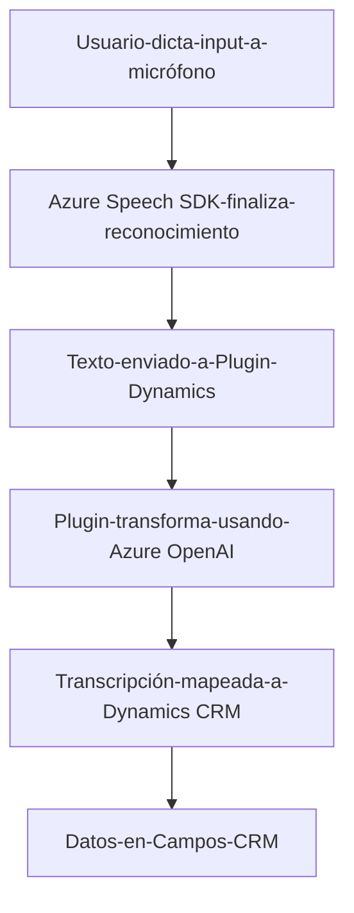

### Breve Resumen Técnico:
La solución descrita en los archivos del repositorio parece ser una integración entre el reconocimiento de voz/síntesis de voz con Dynamics CRM (Microsoft) utilizando tecnologías como **Azure Speech SDK** y **Azure OpenAI**. Su propósito principal es facilitar la entrada de datos en los formularios dinámicos del CRM por medio de procesamiento y síntesis del texto obtenido de transcripciones de voz.

---

### Descripción de Arquitectura:
1. **Tipo de solución:**  
   - Principalmente **API** e integración con **frontend** en Dynamics CRM.
   - Funcionalidades distribuidas entre frontend (interacción con Azure Speech SDK y el usuario) y backend (plugin en Dynamics CRM que utiliza Azure OpenAI).

2. **Arquitectura:**  
   La solución sigue una arquitectura híbrida:
   - **Complementos Asociados**: El frontend maneja el salto inicial activando el reconocimiento de voz, mientras que el backend concentra la lógica empresarial (transformaciones con IA).
   - **Client-server-style design**: La interacción entre el frontend y Dynamics CRM utiliza patrones de comunicación cliente-servidor para manejar tanto datos locales como consultas externas (Azure).
   - **Plug-in design en back-end**: La lógica de transformación AI está encapsulada dentro de un *plugin* en Dynamics, siguiendo las recomendaciones de orientación a eventos de Microsoft.

---

### Tecnologías, Frameworks y Patrones:
1. **Frontend (readForm.js, speechForm.js)**:
   - **Anchura Tecnológica:** Se utiliza JS moderno y el SDK de JavaScript de Azure Speech para reconocimiento de voz/síntesis.
   - **Framework externo**: Dynamics CRM para diseño y operación de formularios.
   - **Patrones:**
     - **Modularidad**: Cada funcionalidad está encapsulada en funciones específicas.
     - **Event-driven architecture**: Basado en eventos de interacción para iniciar transcripción, procesar entrada/output de voz.
     - **API Integration**: Llamadas REST hacia APIs propietarias de Dynamics y Azure Speech.

2. **Backend (TransformTextWithAzureAI.cs)**:
   - **Frameworks:** 
     - `Microsoft.Xrm.Sdk` para manipulación y acceso directo al CRM.
     - `Newtonsoft.Json` para procesamiento estructurado basado en JSON.
     - **Azure OpenAI**: Un servicio externo RESTful que proporciona inteligencia artificial para formato de texto.
   - **Patrones de software:** 
     - **Plugin pattern/Observer**: Código estructurado como un evento en Dynamics CRM y su ejecución programada por reglas del framework.

3. **Dependencias:**  
   Las dependencias principales detectadas son:
   - **Externas**: 
       - Azure OpenAI (GPT-based API).  
       - Azure Speech SDK.
   - **Internas:**
       - Custom Dynamics CRM API (`trial_TransformTextWithAzureAI`) para transformar texto.
       - Dynamics CRM entity framework (Xrm APIs).

---

### Diagrama Mermaid: 

---

### Conclusión Final:
La solución implementa una arquitectura basada en la interacción de múltiples tecnologías dentro del ecosistema Microsoft Dynamics. La integración con el **Azure Speech SDK** y **Azure OpenAI** demuestra un enfoque moderno hacia la automatización y el uso de inteligencia artificial para mejorar experiencias de usuario, especialmente en ambientes empresariales centrados en manejo de datos.

Si bien el código parece funcionalmente correcto, presenta oportunidades de mejora en robustez de error, eficiencia del mapping de campos y un posible uso de patrones avanzados (ej., hexagonal) para desacoplar responsabilidades entre frontend y backend. **En general, es una integración destacable para la entrada de datos basada en voz en sistemas CRM.**