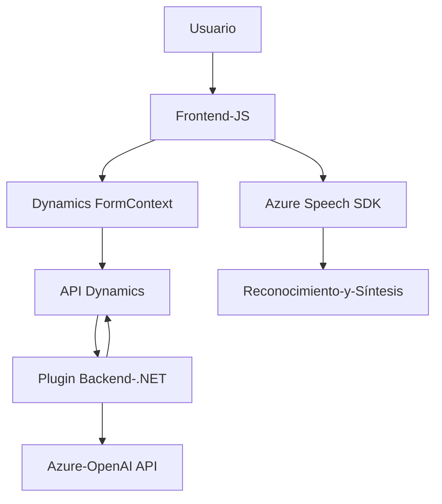

### Breve Resumen Técnico
Con base en los archivos proporcionados, se puede determinar que este repositorio corresponde a una solución híbrida que implementa procesamiento de entrada de voz en formularios basados en Dynamics 365. Utiliza el SDK de Azure Speech para síntesis y reconocimiento de voz, y emplea la API de Azure OpenAI para realizar transformaciones de texto con reglas específicas. 

---

### Descripción de Arquitectura
La solución implementa una arquitectura **modular de n capas** dentro de un entorno CRM (Dynamics 365). La estructura combina: 
1. **Frontend (JavaScript):** Encargado de la interacción del usuario a través de formularios, conexión con servicios de reconocimiento y síntesis de voz.
2. **Plugin Backend (.NET):** Ejecuta operaciones en el servidor de Dynamics CRM y realiza las transformaciones de texto con un enfoque basado en plugins.
3. **Servicios Externos:** Integración con servicios de Microsoft Azure (Speech SDK y OpenAI).

El diseño emplea patrones como **delegación**, **procesamiento basado en flujo asíncrono** y **plugin design pattern** en el backend.

---

### Tecnologías Usadas
1. **Frontend:**
   - JavaScript como lenguaje base.
   - Integración con Microsoft Dynamics 365.
   - Integración con Azure Speech SDK para reconocimiento y síntesis de voz.

2. **Backend:**
   - .NET Framework y C# para el desarrollo del plugin.
   - API de Azure OpenAI para procesamiento avanzado con inteligencia artificial.
   - Uso de estándares de Dynamics CRM:
     - `IPlugin` para implementar lógica de negocio.
     - `IOrganizationService` para interacción directa con datos de CRM.

3. **Dependencias Comunes:**
   - **Servicios Azure**: Speech SDK y OpenAI.
   - **Microsoft Dynamics CRM API**: Para gestionar el formulario y sus atributos.
   - JSON Manipulation Libraries: Newtonsoft.Json y System.Text.Json.

---

### Diagrama Mermaid

---

### Conclusión Final
El repositorio implementa una solución robusta que integra funciones avanzadas como reconocimiento de voz y síntesis de texto, destinadas a trabajar en conjunto con formularios de Dynamics 365. La arquitectura de **n capas** facilita la separación de responsabilidades:
- El **frontend (JS)** realiza la captura y síntesis de voz mediante Azure Speech SDK.
- El **plugin backend (.NET)** se encarga de procesar y transformar el texto utilizando servicios de Azure OpenAI.
Ambas capas interactúan con servicios de Dynamics 365 para proporcionar una experiencia fluida y extensible. El uso de Azure como proveedor externo garantiza escalabilidad y soporte para IA.