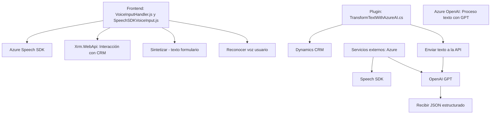

### Breve resumen técnico
El repositorio analizado implementa funcionalidades relacionadas con la integración y manipulación de voz y texto en un sistema CRM (Dynamics), utilizando servicios externos como Azure Speech SDK y Azure OpenAI. También incluye un plugin para procesar texto en Dynamics CRM con normas específicas mediante una transformación realizada por Azure OpenAI.

### Descripción de arquitectura
La solución está compuesta por tres elementos:
1. **Frontend**: Archivos en JavaScript que habilitan la interacción entre usuarios y el sistema CRM, permitiendo la síntesis y el reconocimiento de voz mediante Azure Speech SDK.
2. **Backend Plugin**: Una extensión que interactúa directamente con Dynamics CRM para transformar texto utilizando la API de Azure OpenAI.
3. **Comunicaciones Externas**: Conexión a servicios de Azure (Speech SDK, OpenAI) para delegar funciones de procesamiento especializados (síntesis de voz y transformación de texto).

La arquitectura global puede clasificarse como **n capas**, con una separación clara entre:
- **Capa de cliente**: Procesamiento local de datos (en frontend).
- **Capa lógica intermedia**: Plugin que habilita la interacción entre el CRM y el servicio OpenAI.
- **Capa de servicio externo**: Uso de APIs de Azure Speech y Azure OpenAI.

### Tecnologías usadas
1. **Frontend**:
   - Azure Speech SDK: Reconocimiento de voz y síntesis.
   - ECMAScript/JavaScript: Desarrollo de funciones basadas en lógica procedural y modular.
   - Web APIs: Para cargar dinámicamente scripts y acceder al DOM.
   - CRM Xrm.WebApi: Para interactuar directamente con el sistema Dynamics CRM.

2. **Backend Plugin**:
   - Microsoft Dynamics SDK: Implementación de `IPlugin` para integrarse al CRM.
   - Azure OpenAI: Procesamiento de texto vía modelo GPT mediante solicitudes HTTP.

3. Frameworks y librerías:
   - **JSON Handlers**: Como `Newtonsoft.Json.Linq` y `System.Text.Json`.
   - **HttpClient**: Para conexiones externas.
   - **Dynamics System Libraries**: `Microsoft.Xrm.Sdk`.

### Dependencias o componentes externos
1. **Azure Speech SDK**: Utilizado en el frontend para reconocimiento de voz y síntesis de texto a voz.
2. **Azure OpenAI**: Utilizado en el plugin para procesar texto basado en reglas específicas mediante GPT-4.
3. **Dynamics CRM Environment**: Necesario para integrar las soluciones tanto del frontend como del plugin.
4. **Web APIs y DOM**: Para operaciones como cargar dinámicamente scripts en el frontend.
5. **HttpClient**: Para realizar solicitudes HTTP desde el plugin.

---

### Diagrama Mermaid para toda la solución

---

### Conclusión final
La solución presentada utiliza paradigmas de **n capas** y buena separación de responsabilidades. Los módulos de frontend interactúan con el sistema CRM utilizando reconocimiento de voz y síntesis de texto, delegando las operaciones especializadas en Azure Speech SDK. El plugin backend completa la solución mediante una integración directa con Dynamics CRM, enviando texto a la API de Azure OpenAI para transformaciones específicas. Aunque se trata de una solución eficiente y escalable gracias a la delegación de tareas en APIs de Azure, posibles áreas de mejora incluyen centralizar configuraciones sensibles (API keys y endpoints), implementar un sistema de caché para el SDK de Speech y realizar validaciones de entrada más robustas.