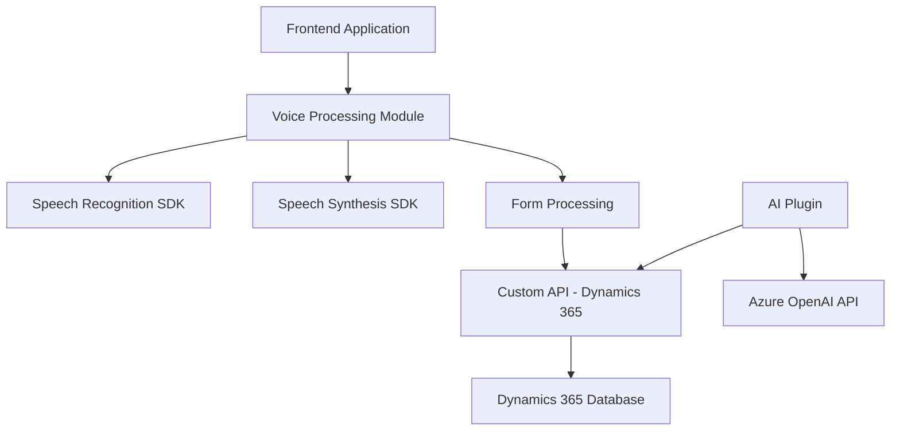

### Breve resumen técnico

El repositorio parece contener una solución que integra entrada y salida de voz (usando el Azure Speech SDK) con formularios en Dynamics 365, y además aprovecha servicios de IA (Azure OpenAI) para transformar texto. Principalmente está dividido en tres áreas funcionales: frontend, voz e IA aplicadas en forma de servicios.

---

### Descripción de arquitectura

La solución sigue un enfoque **modular**, donde cada componente está aislado para realizar tareas específicas. El frontend codifica lógica de usuario y conecta interfaces visuales con servicios de Azure y Dynamics 365. Dentro del backend, el archivo `TransformTextWithAzureAI.cs` implementa un **plugin basado en eventos** para extender Dynamics 365, aplicando procesamiento IA desde Azure. Aunque cada módulo es independiente, el diseño parece estar orientado hacia una aplicación cliente-servidor conectada a servicios de nube.

---
### Tecnologías usadas

- **Frontend**:
  - **JavaScript**: Configura la entrada y síntesis de voz.
  - **Azure Speech SDK**: Permite convertir texto en voz y procesar comandos hablados.
  - **Dynamics 365 Web APIs (`Xrm.WebApi`)**: Actualiza dinámicamente los formularios en base a los resultados del procesamiento de voz.

- **Backend (plugin)**:
  - **C#:** Lenguaje para el desarrollo de plugins en Dynamics 365.
  - **Azure OpenAI Service:** API de procesamiento de texto para reformatear y estructurar los datos.
  - **Microsoft Dynamics SDK (`IPlugin`)**: Extensiones de Dynamics CRM para ejecutar lógica personalizada.
  - **ASP.Net WebAPI (posible):** La integración y estructura sugiere el uso de servicios WebAPI en el plugin.

---
### Diagrama Mermaid (100 % compatible con GitHub Markdown)

---

### Conclusión final

La arquitectura de este proyecto se centra en integrar dos áreas funcionales clave: interacción por voz en el **frontend** con **formulario dinámico**, y lógica backend basada en IA para modifica y enriquecer el texto dentro de Dynamics 365. Se aprovechan APIs avanzadas de cloud (Azure Speech y OpenAI). Este diseño modular, aunque próximo a un enfoque **microservicio**, sigue el patrón de un sistema **cliente-servidor**, que se adapta bien para integraciones con un CRM como Dynamics 365. El repositorio podría mejorarse mediante documentación de implementación técnica y pruebas automatizadas para garantizar escalabilidad y estabilidad.