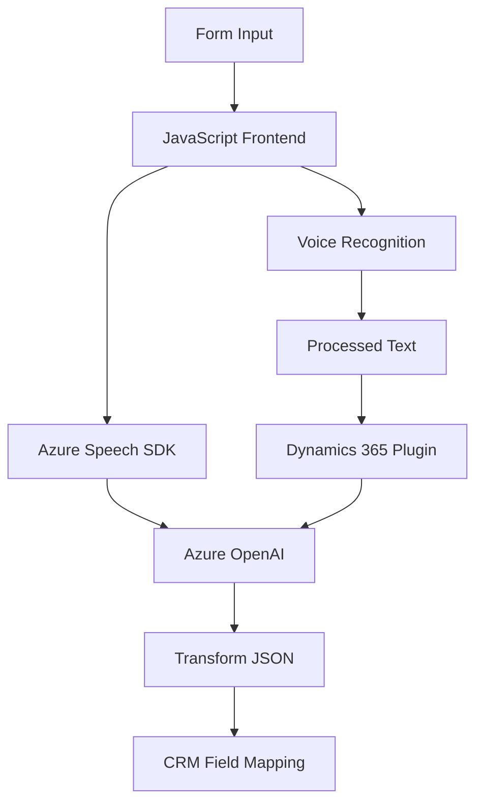

# Análisis Técnico, Arquitectura y Diagramas

## Breve resumen técnico
Este repositorio implementa una solución integrada que combina tres capas principales:
1. **Frontend**: Scripts en JavaScript para interactuar con un formulario y manipular la entrada/salida de datos, incluyendo integración con servicios de voz de Azure Speech SDK.
2. **Backend**: Plugins personalizados en C# para Dynamics 365, que interactúan con Azure OpenAI, transformando texto utilizando IA para su uso en la plataforma CRM.
3. **API Externa**: Llamadas directas a Azure Speech y Azure OpenAI, configuradas para realizar síntesis de voz, reconocimiento y manipulación de datos utilizando inteligencia artificial.

La solución busca mejorar la interacción entre usuarios y el sistema mediante entrada por voz y transformación automatizada de datos en un contexto de Dynamics 365.

---

## Descripción de arquitectura
1. **Arquitectura general**: 
   - **Frontend N-capas**: Utilización de JavaScript estructurado en múltiples funciones para interactuar con formularios y servicios externos, manteniendo separación de responsabilidades. 
   - **Backend Hexagonal**: Los plugins en C# están diseñados para responder a eventos específicos en Dynamics 365, con una fuerte integración con servicios externos como Azure OpenAI.
2. **Patrones aplicados**:
   - **SDK Loader dinámico** (Front): Carga del Azure Speech SDK según demanda.
   - **Event-driven**: Manejo de eventos y controladores en Dynamics 365 y en los scripts del Frontend.
   - **Encapsulación en lógica de Plugins**: El procesamiento IA está estrictamente delimitado en métodos específicos en el Backend, siguiendo el patrón **Plugin-based**.
   - **Cliente-Servidor**: Interacción entre Dynamics 365 y Azure OpenAI vía API, destacando una dependencia hacia el modelo microservicio proporcionado por Azure.

---

## Tecnologías usadas
1. **Frontend**:
   - JavaScript y DOM para el manejo de formularios.
   - Azure Speech SDK para síntesis y reconocimiento de voz.
   - HTML/JavaScript dinámico para carga de recursos externos.
2. **Backend**:
   - C# para la construcción de plugins de Dynamics 365.
   - `Microsoft.Xrm.Sdk` para interacción directa con el sistema CRM.
   - `System.Net.Http` para realizar llamadas HTTP a las APIs de Azure OpenAI.
3. **Servicios externos**:
   - Azure OpenAI para procesamiento de IA.
   - Azure Speech para síntesis y entrada de voz.

---

## Dependencias y componentes externos
1. **Azure Speech SDK**:
   - Para síntesis de voz desde texto y reconocimiento de entrada por voz.
2. **Azure OpenAI**:
   - Usado desde el backend para transformar texto y convertirlo en JSON inteligible.
3. **Dynamics 365**:
   - Base de operaciones para los plugins y datos del sistema CRM.
4. **API personalizada de Dynamics (trial_TransformTextWithAzureAI)**:
   - Plugin diseñado para invocar Azure OpenAI.

---

## Diagrama Mermaid

---

## Conclusión final
La solución presentada utiliza una arquitectura híbrida que conecta frontend y backend con servicios cloud, aprovechando patrones como modularidad, n-capas y hexagonal. Es una combinación de tecnologías clásicas (Dynamics 365 y plugins personalizados) con recursos avanzados de Azure, cubriendo desde el manejo de voz hasta la integración de IA. La elección de Azure Speech y OpenAI junto con Dynamics refuerza el enfoque hacia la nube y la interacción inteligente entre el usuario y los sistemas CRM.

Esta arquitectura es robusta y flexible, pero depender fuertemente de servicios externos como Azure requiere considerar la latencia, el control de costos y la administración de credenciales para evitar problemas de seguridad y performance.