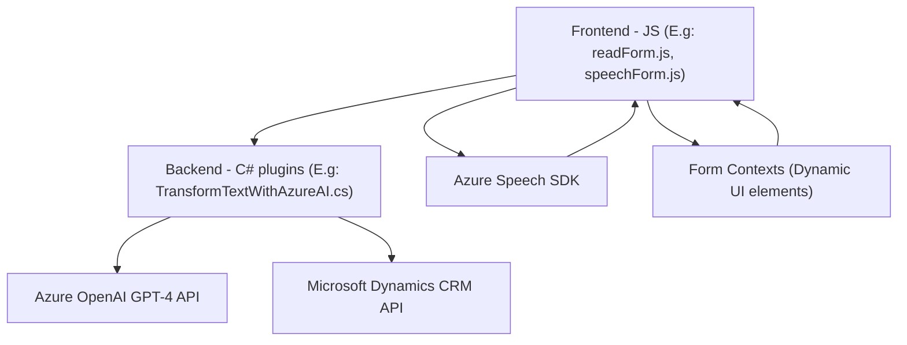

### Breve resumen técnico:
El repositorio parece formar parte de una solución más amplia para un sistema de gestión interactiva (posiblemente un CRM). Incluye funcionalidades integradas para reconocimiento y síntesis de voz (frontal), junto con lógica en el backend para transformar texto usando inteligencia artificial con Azure OpenAI. La solución utiliza herramientas avanzadas para facilitar la interacción dinámica con usuarios en formularios visuales y convertir datos mediante servicios de AI.

---

### Descripción de arquitectura:
1. **Frontend:**
   - Procesa formularios interactivos mediante reconocimiento de voz y síntesis de audio (Azure Speech SDK).
   - Tiene una arquitectura modular orientada al procesamiento de datos dinámicos del UI y eventos basados en SDK.

2. **Backend:**
   - Siga una **arquitectura basada en plugins** para Microsoft Dynamics CRM.
   - Consume servicios externos (Azure OpenAI y APIs personalizadas) para transformar datos de texto según reglas definidas por lógica empresarial.

3. **Modelo global:**
   - La solución tiene un enfoque híbrido entre cliente (frontend) y servidor (backend), organizándose como una arquitectura de **n capas**:
     - Capa de presentación (Frontend interactivo).
     - Capa lógica intermedia (procesamiento de datos con SDK).
     - Capa de datos/backend (mutación de texto y datos en el CRM mediante Azure OpenAI y plugins).
   - También incorpora aspectos de **microservicio/API Consumption**, interactuando con servicios como Azure OpenAI y Speech SDK.

---

### Tecnologías usadas:
1. **Frontend:**
   - **JavaScript** para manejo dinámico de DOM en formularios.
   - **Azure Speech SDK** para síntesis y reconocimiento de voz.
   - **AJAX/Promesas** para llamadas a APIs personalizadas dinámicas.
   - Usa patrones como `event-driven programming` y `dependency injection`.

2. **Backend:**
   - **C#** con **Microsoft.Xrm.Sdk** para la implementación de plugins en Dynamics CRM.
   - **Azure OpenAI** (GPT-4) consumido mediante REST API.
   - Manejo de JSON con `System.Text.Json` y `Newtonsoft.Json.Linq`.

---

### Dependencias o componentes externos presentes:
1. **Azure Speech SDK:** Usado en frontend para reconocimiento y síntesis de voz.
2. **Azure OpenAI:** Para transformación avanzada de texto en backend.
3. **Microsoft Dynamics CRM SDK:** Utilizado en el backend para interacción con custom plugins.
4. **APIs personalizadas:** Para implementar lógica avanzada de IA y CRUD de datos dinámicos.
5. **Notas de posibles adicionales:**
   - Autenticaciones basadas en Azure Active Directory (según las configuraciones de API).
   - Conexión a entidades del CRM mediante `Xrm.WebApi`.

---

### Diagrama **Mermaid**:

---

### Conclusión final:
La solución parece orientada a transformar la interacción entre usuarios y sistemas a través de una combinación de reconocimiento de voz, síntesis de audio y transformación inteligente de texto mediante inteligencia artificial. La arquitectura es un **modelo híbrido de n capas**, que incluye aspectos de microservicio para consumo de APIs externas. Esto lo convierte en una solución escalable y extensible, adecuada para sistemas como CRMs interactivos o plataformas de atención automatizada al cliente.