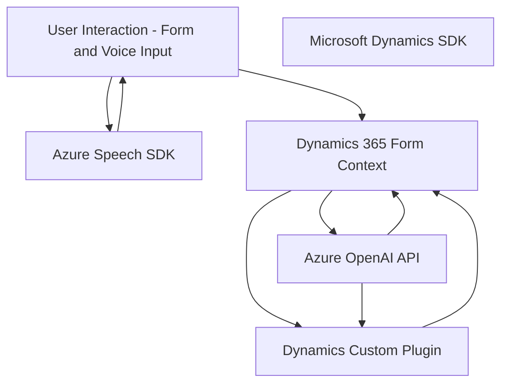

### Breve resumen técnico

Este repositorio integra la funcionalidad de interacción dinámica con formularios mediante entrada/salida de datos basada en voz, enriquecida con inteligencia artificial (IA) y servicios en la nube como Azure Speech SDK y Azure OpenAI. Los componentes están diseñados para obtener datos visibles de formularios, procesarlos mediante IA y sintetizar/transcribir comandos hablados usando una arquitectura modular y basada en servicios externos.

---

### Descripción de arquitectura

1. **Tipo de solución**: 
   Este sistema combina una **API backend** basada en plugins de Dynamics 365, un **frontend JavaScript** para interacción de usuario, y servicios externos como **Azure Speech SDK** y **Azure OpenAI**. Es un ejemplo claro de integración entre aplicaciones empresariales (Dynamics 365), IA en la nube y procesamiento de voz.

2. **Arquitectura detectada**: 
   - **División de capas/modular**: Aplicación estructurada en componentes con separación de responsabilidades entre frontend, APIs personalizadas (backend) y servicios externos. 
   - **Integración de Microservicios**: Aunque no sigue completamente la arquitectura de microservicios, los plugins y la interacción con APIs externas (Dynamics y Azure AI) imitan patrones de "micro-servicios" dentro de una arquitectura extendida.
   - **Patrones detectados**:
     - **Cargador dinámico de dependencias**: Azure Speech SDK se importa dinámicamente según necesidad.
     - **Delegación funcional**: Las tareas como extracción de datos de formularios o asignación a atributos están divididas por funciones específicas.
     - **Plugin-Based Architecture**: En la parte backend, indica la implementación de plugins propios de Dynamics CRM para extensibilidad.

---

### Tecnologías usadas

1. **Frontend (JavaScript):**
   - `Azure Speech SDK`: Sintetización y transcripción de comandos de voz.
   - `Dynamics 365 APIs`: Extracción y manipulación de datos de formularios en Dynamics.
   - **JavaScript**: Interacción dinámica en formularios y comunicación con APIs y SDK externos.

2. **Backend (C#):**
   - `Microsoft Dynamics SDK`: Gestión de eventos y lógica mediante implementación de plugins (`IPlugin`).
   - `Azure OpenAI API`: Procesamiento y transformación de texto con inteligencia artificial utilizando modelos como GPT-4.
   - Serialización y comunicación:
     - `Newtonsoft.Json`: Manipulación JSON para los datos estructurados.
     - `System.Net.Http`: Envío de solicitudes HTTP a servicios externos.

3. **Servicios Externos:**
   - **Azure Speech Service**: Reconocimiento y síntesis de voz.
   - **Azure OpenAI Service**: Chatbot y procesamiento de IA para comandos y transformaciones.
   - **Dynamics 365 Web API**: Interacción directa con entidades de CRM y ejecución de operaciones en el sistema.

---

### Diagrama Mermaid válido para GitHub

---

### Conclusión final

Este repositorio implementa una solución de integración profunda entre APIs externas y un sistema ERP (Dynamics 365). La arquitectura es modular y se basa en principios sólidos de separabilidad de funciones y delegación a servicios externos. La combinación de entrada/salida por voz (Azure Speech SDK), inteligencia artificial (Azure OpenAI) y manipulación de datos empresariales (Dynamics CRM API) lo convierte en una solución flexible y avanzada con aplicabilidad en diversos escenarios empresariales.

Aunque no es estrictamente una arquitectura "microservicios", tiene elementos que imitan dichos patrones gracias al uso de servicios externos escalables. Es una configuración adecuada para proyectos que integren tecnología avanzada con aplicaciones empresariales.