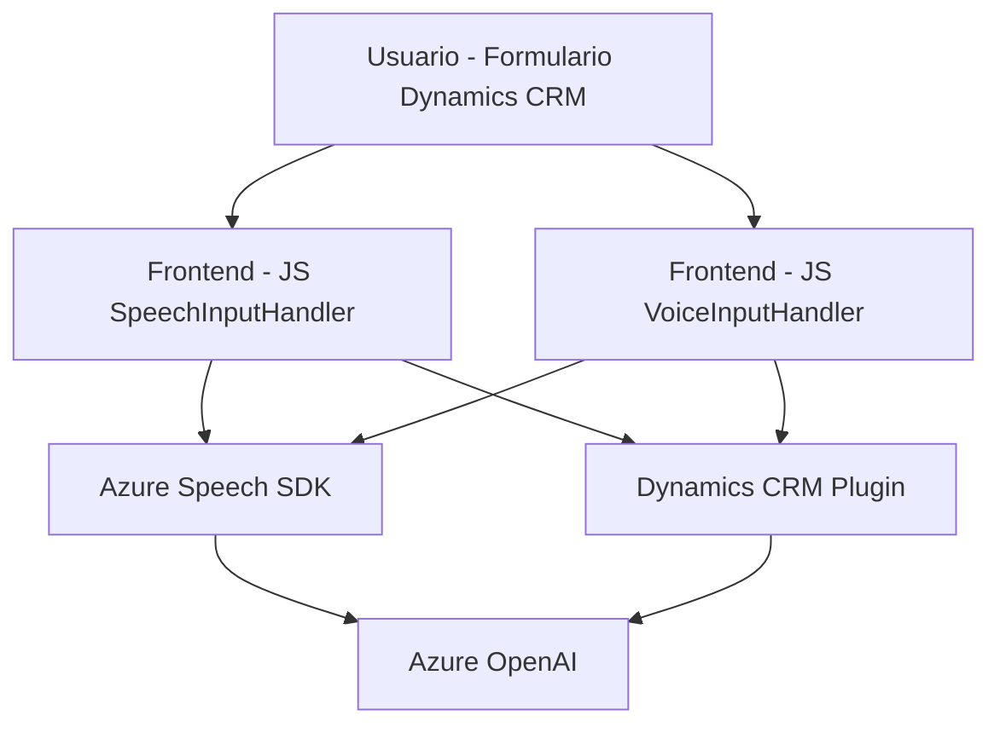

### Breve resumen técnico

El repositorio parece implementar una solución que conecta con Dynamics CRM y Azure SDKs, ofreciendo funcionalidades relacionadas con la lectura y síntesis de voz y transformación automatizada de texto. Combina lógica backend, frontend (JavaScript) y extensiones de la API de Dynamics CRM con inteligencia artificial (Azure OpenAI y Speech SDK).

---

### Descripción de arquitectura

La solución utiliza una arquitectura **modular** y extendida sobre una base híbrida:

1. El frontend (JavaScript) gestiona la interacción del usuario con la generación de texto a voz y la captura de datos del formulario.
2. Un backend en .NET, con plugins que se registran en Dynamics CRM, añade capacidades adicionales como la manipulación de texto mediante Azure OpenAI.
3. Existen integraciones con servicios externos como Azure Speech SDK y Azure OpenAI API para delegar tareas especializadas (voz y texto transformado).

El diseño general incluye características de una arquitectura **n capas** en la que:
- La capa de presentación permite mostrar y capturar datos.
- La capa lógica interactúa con servicios (Azure) y procesa datos recogidos del usuario.
- Las dependencias externas representan la capa de integración con terceros.

Esta arquitectura también incluye algunos elementos de patrones de microservicios en las comunicaciones backend y llamadas a servicios externos que pueden ser considerados independientes.

---

### Tecnologías usadas

- **Frontend:**
  - **JavaScript** (browser-based SDK).
  - **Azure Speech SDK**: Para síntesis y análisis de voz.
  - Framework probable: Diseño decoupled no evidencia explícitamente el uso de React o Angular; se puede asumir JavaScript puro.

- **Backend:**
  - **Dynamics CRM Plugins** sobre **.NET Framework/Standard**:
    - SDK: `Microsoft.Xrm.Sdk`.
    - Sistema de plantillas y eventos proporcionado por Dynamics CRM.
  - APIs de Azure:
    - **Azure OpenAI (GPT-4)**: Transformación de texto con IA.
    - **Azure Speech SDK**: Reconocimiento y síntesis de voz.

---

### Diagrama Mermaid

El siguiente diagrama ilustra las relaciones entre los componentes de la solución:

---

### Conclusión final

La solución combina capacidades avanzadas como interacción dinámica de voz, procesamiento de datos de formularios y transformación textual mediante IA en un entorno empresarial (Dynamics CRM). Las dependencias externas (Azure Speech SDK y OpenAI) se integran para habilitar funcionalidades críticas y potenciar la modularidad del sistema.

Aunque el diseño evidencia modularidad y la externalización de servicios, la integración de lógica en plugins de Dynamics CRM apunta más hacia una arquitectura **n capas** que hacia una arquitectura puramente de microservicios. Sin embargo, la interacción con APIs externas sugiere elementos relacionados con servicios por demanda (microservicios).