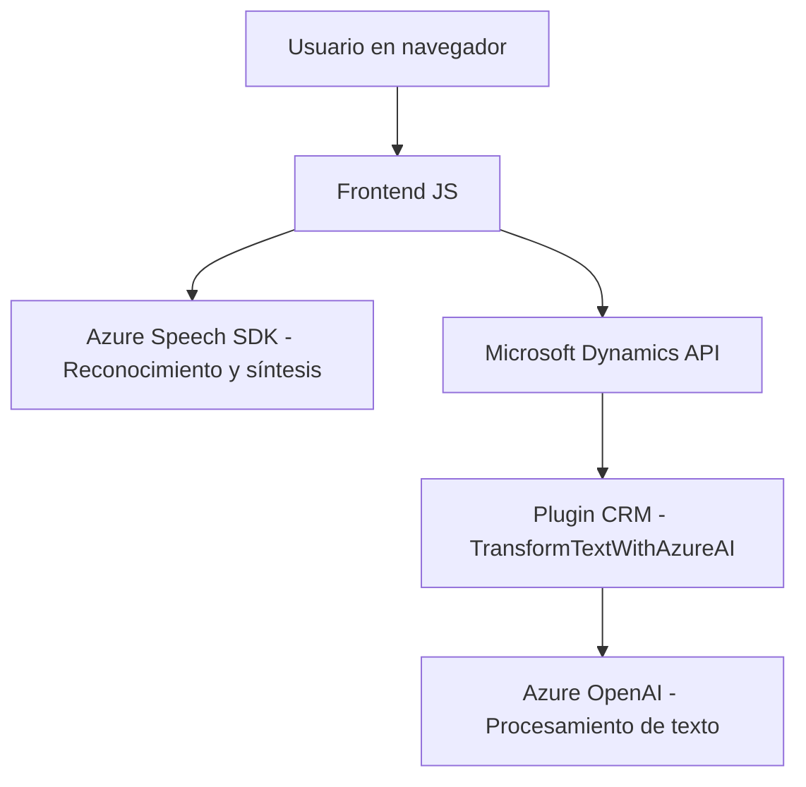

### Breve Resumen Técnico

Este repositorio representa una solución híbrida que integra capacidades de frontend (interacción con formularios del navegador), procesamiento asincrónico con servicios externos (Azure Speech SDK y OpenAI), y plugins personalizados para Dynamics CRM. Los módulos están diseñados para habilitar funcionalidad avanzada basada en conversión de voz a texto, síntesis de voz, y procesamiento de texto en base a reglas predefinidas.

---

### Descripción de Arquitectura

Se observa una **arquitectura modular desacoplada**, donde cada componente tiene roles claros:
- **Frontend:** Implementa la lógica de interacción con el usuario en el navegador, cargando dinámicamente SDKs y manipulando formularios mediante DOM.
- **Backend CRM:** Utiliza plugins que interactúan directamente con el sistema Dynamics CRM para transformar datos con APIs de Microsoft Azure OpenAI.
- **Patrones observados:**
  - **Orientación a Servicios:** Conexiones ligeras a servicios externos (Azure Speech SDK, Azure OpenAI, Dynamics CRM API).
  - **Arquitectura de Plugins:** Para manipulación de datos en el backend.
  - **Estructura Modular:** Separación de responsabilidades claras entre cada componente del código.

---

### Tecnologías Usadas

1. **Frontend:**
   - **Tecnología principal:** JavaScript.
   - **Dependencias externas:** Azure Speech SDK, APIs del DOM, Microsoft Dynamics CRM API.
   - **Patrones:** Modularidad y asincronía.

2. **Backend CRM:**
   - **Lenguaje principal:** C# (Plugins para Dynamics CRM).
   - **Dependencias externas:** Microsoft.Xrm.Sdk, System libraries (.Net), Azure OpenAI via REST API.
   - **Patrones:** Lógica de integración via servicios desacoplados.

3. **Servicios Externos:**
   - **Azure Speech SDK:** Para reconocimiento de voz y síntesis de voz.
   - **Azure OpenAI:** Para generación y transformación de texto.

---

### Diagrama Mermaid

El siguiente diagrama resume la interacción entre componentes del sistema:

---

### Conclusión Final

La solución está diseñada para extender la funcionalidad de formularios y sistemas como Dynamics CRM mediante servicios avanzados de inteligencia artificial. Presenta una arquitectura modular orientada a servicios, con clara separación entre el frontend basado en JavaScript y el backend conectado a Dynamics CRM. La utilización de SDKs externos y APIs permite una integración eficiente pero dependiente de conectividad y configuraciones adecuadas. Ideal para ecosistemas corporativos que necesitan enriquecer sus capacidades de interacción y procesamiento automático de datos.