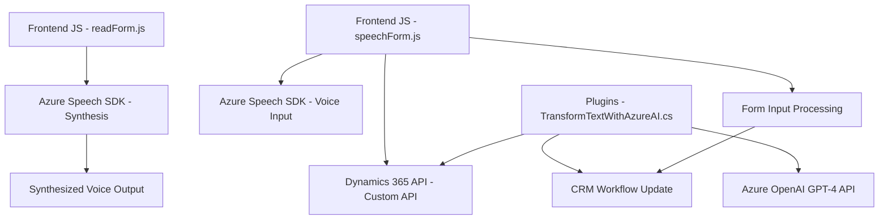

### Breve resumen técnico

Este repositorio presenta módulos orientados al **procesamiento y síntesis de voz** y al manejo de **entrada de texto mediante inteligencia artificial**. Se articula con la plataforma **Microsoft Dynamics 365** y utiliza servicios de **Azure Cloud** (Azure Speech SDK y Azure OpenAI). Cada archivo implementa funcionalidades independientes pero relacionadas, como transformar texto, sintetizar voz y actualizar formularios basados en entrada de usuario.

---

### Descripción de la arquitectura

La solución sigue un enfoque de **arquitectura modular con componentes desacoplados**:
1. **Frontend (Javascript):** Procesa y sintetiza datos de formularios y entrada de voz mediante el cliente web y servicios como Azure Speech SDK.
2. **Backend (Plugins en C#):** Gestiona eventos y actualizaciones en Dynamics CRM mediante plugins construidos sobre una arquitectura basada en componentes.
3. Los módulos se comunican mediante **integración con servicios externos**:
   - Servicios RESTful (Azure Speech SDK y Azure OpenAI).
   - API personalizada de Dynamics CRM.

Aunque no es estrictamente una arquitectura de **microservicios**, sí utiliza integración con componentes externos, lo que orienta hacia un **modelo modular orientado a eventos y funciones específicas**.

---

### Tecnologías usadas

#### **Frontend**:
- **Azure Speech SDK**: Para síntesis de voz y captura de voz.
- **Javascript**: Para lógica de interacción en los formularios.

#### **Backend**:
- **Microsoft Dynamics 365**: Plataforma CRM para gestionar datos y formularios.
- **Azure OpenAI (GPT-4)**: Procesamiento de texto y transformación avanzada.
- **C#**:
  - Manipulación de datos en plugins.
  - Conexión con servicios externos vía `HttpClient`.
- **Newtonsoft.Json**: Biblioteca para manejo de JSON en .NET.
- **System.Net.Http** y **System.Text.Json**: Para invocación y procesamiento de APIs REST.

#### Patrones:
- **Modularidad**: División en funciones y clases independientes.
- **Callback/Promesas**: Uso de funciones async en frontend.
- **Integración RESTful**: Para servicios de Azure y APIs propias.
- **Event-Driven Architecture**: Plugins de Dynamics que reaccionan a eventos como `update` del sistema CRM.

---

### Diagrama **Mermaid** válido para **GitHub**

---

### Conclusión final

La solución es un ejemplo de una **arquitectura modular** orientada a la integración de servicios externos. Los módulos colaboran para ejecutar tareas específicas, como captura de voz, síntesis de voz y procesamiento de texto con IA, mientras que aprovechan herramientas de cloud (Azure Speech SDK, Azure OpenAI) y sistemas como Dynamics CRM. Esto facilita la escalabilidad y el desarrollo por componentes. Un posible punto de mejora sería encapsular la totalidad de la lógica en microservicios desacoplados para mayor portabilidad, dependencia reducida y mejor reutilización.