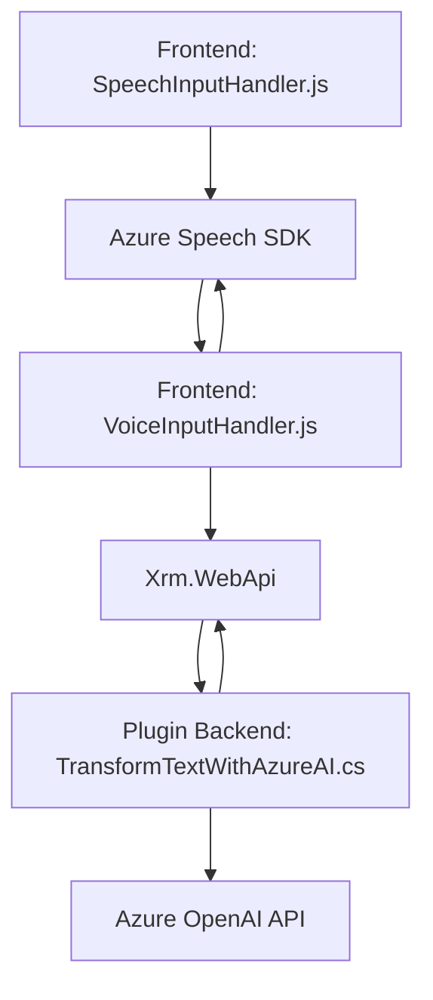

### Breve resumen técnico
El repositorio presenta tres archivos clave que implementan integración con Microsoft Dynamics CRM y Azure Cognitive Services para facilitar la interacción mediante entrada de voz (reconocimiento y síntesis) y procesamiento de texto utilizando IA. Los archivos están diseñados para aplicaciones CRM y operan como parte de un sistema basado en arquitectura de n capas.

---

### Descripción de arquitectura
La solución está estructurada como un sistema de **n capas**, adecuado para entornos CRM:
1. **Frontend**:
   - Capas de interacción de usuario, traducción de voz a texto y síntesis de voz con Azure Speech SDK.
   - Opera con formularios y gestiona datos mediante el SDK de Microsoft Dynamics CRM.
2. **Backend**:
   - Plugins para procesamiento avanzado mediante Azure OpenAI e integración con CRM, utilizando servicios .NET (como `IOrganizationService` y `IPlugin`).

El proyecto sigue principios de **Inversión de Dependencias** al usar servicios externos (_Speech SDK, OpenAI_) y desacoplamiento lógico (separación entre lectura, transcripción y procesamiento). Además, se observa el uso del patrón de **Modularidad** en la implementación de funciones específicas por responsabilidades.

---

### Tecnologías usadas
1. **Frontend:**
   - **JavaScript ES6+:** Implementación de funciones centradas en lógica del cliente.
   - **Azure Cognitive Services Speech SDK:** Capacidades de síntesis de voz y reconocimiento.
   - **Xrm.WebApi:** Acceso directo a API personalizada de Dynamics CRM.

2. **Backend:**
   - **C# .NET:** Plugins para extensibilidad de Dynamics CRM.
   - **Microsoft.Xrm.Sdk:** Framework para interacción con servicios CRM.
   - **System.Net.Http:** Para integración con el API de Azure OpenAI.
   - **System.Text.Json:** Manejo eficiente de JSON estructurados.

3. **Exclusivamente para IA y voz:**
   - **Azure Cognitive Services Speech SDK**: Entrada y salida de voz.
   - **Azure OpenAI Service**: Procesamiento de texto con IA avanzada.
   - **Azure Cloud Platform**: Implementación de la arquitectura más servicios API externos.

---

### Diagrama Mermaid

---

### Conclusión
Este repositorio representa una solución integrada para enriquecer la interacción con formularios de CRM mediante herramientas de IA, síntesis de voz y reconocimiento del lenguaje natural. Con una separación explícita entre lógica de cliente (frontend) y procesamiento avanzado (backend), la arquitectura sigue el modelo de **n capas** y utiliza patrones como **Modularidad**, **Dependency Injection** y **Event-Driven Architecture**. La dependencia hacia Azure Cognitive Services y OpenAI demuestra una apuesta por funcionalidades avanzadas de IA y servicios cloud manejados.