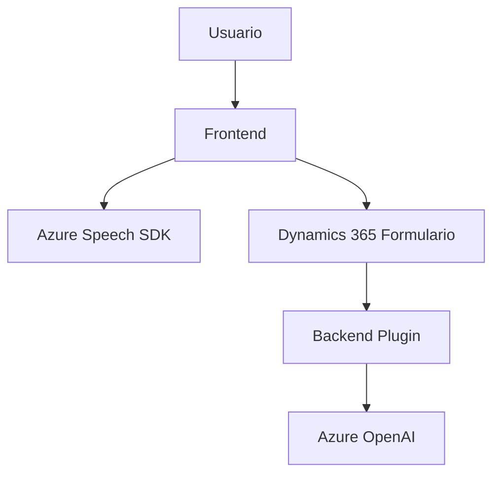
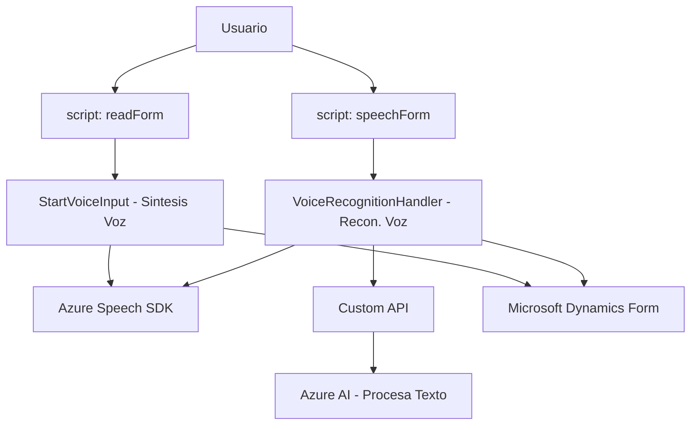
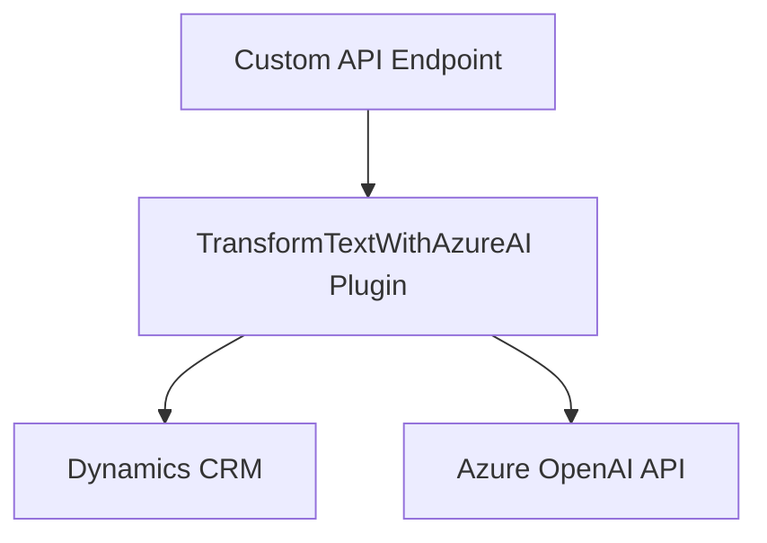

### Breve Resumen Técnico:
El repositorio contiene tres componentes principales:
1. **Frontend**: Scripts en JavaScript que integran Azure Speech SDK para lectura y reconocimiento de voz. Interactúan con formularios en un entorno Dynamics 365.
2. **Backend Plugin**: Código en C# que utiliza servicios de Azure OpenAI para transformar texto con normas definidas, actuando como un plugin dentro de Dynamics CRM.
3. **API Gateway**: Dependencia de servicios externos como Azure Speech SDK y OpenAI, con integración en los scripts del frontend y el backend.

---

### Descripción de Arquitectura:
La solución sigue una arquitectura **orientada a servicios (SOA)** con elementos que interactúan como componentes descentralizados:
- **Frontend**: Maneja la interacción con el usuario y la captura/transcripción de voz. Incluye módulos independientes y altamente acoplados con servicios externos.
- **Backend Plugin**: Implementa funcionalidad a través de la arquitectura plugin de Dynamics CRM, con servicios específicos de Azure OpenAI para procesamiento de texto.
- **Microservicios**: El uso de APIs externas (Speech SDK y Azure OpenAI) establece bases para una integración desacoplada, típica de **microservicios**.

---

### Tecnologías Usadas:
- **Frontend**:
  - **JavaScript ES6**
  - **Azure Speech SDK**: Para lectura y reconocimiento de voz en tiempo real.
  - **Promises y callbacks**: Usados para administrar asincronía en el flujo de datos.
  - **Microsoft Dynamics 365**: La interacción con `executionContext` indica que los scripts están diseñados para integrarse con formularios de Dynamics CRM.
  
- **Backend Plugin**:
  - **C# / .NET**: Implementación del plugin con el SDK de Microsoft Dynamics.
  - **Azure OpenAI API**: Transformación semántica de texto mediante IA generativa.
  - **Newtonsoft.Json**: Manipulación y manejo de estructuras JSON.
  - **Microsoft CRM SDK**: Para interactuar con entidades y atributos del modelo de datos de Dynamics 365.

---

### Diagramas **Mermaid**:
Diagrama de flujo para la arquitectura general de la solución:

Diagrama de componentes del frontend:

Diagrama de componentes del backend plugin:

---

### Conclusión Final:
Esta solución implementa un **frontend orientado a eventos** con microservicios en segundo plano para integración con Azure Speech SDK y OpenAI, y un **backend plugin basado en la arquitectura de Dynamics 365**. Los patrones utilizados (como Factory Pattern, Event-driven, y Repository Pattern) hacen que los componentes sean modularizados y reutilizables, útiles para entornos de Dynamics 365 donde se trabaja con formularios interactivos y APIs. La integración con externos mediante APIs refuerza la modularidad, aunque habría que mejorar la seguridad del backend evitando la inclusión de claves en texto plano.