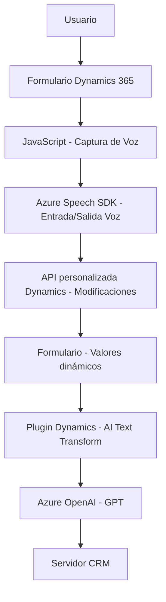

### Breve resumen técnico:

El repositorio contiene tres archivos principales que abarcan una solución técnica integrada en un entorno Dynamics 365 con soporte para entrada y salida de voz y procesamiento de texto enriquecido mediante Azure Speech SDK y Azure OpenAI. Las funcionalidades están orientadas a mejorar la interacción de los usuarios con formularios y datos mediante IA y capacidades de síntesis de voz.

---

### Descripción de arquitectura:

La solución implementa una arquitectura **n-capas** y un enfoque híbrido con características de microservicios. Los archivos del frontend están organizados como módulos funcionales para tareas específicas (voz, síntesis, transformación de datos), mientras que el backend se enfoca en complementar Dynamics CRM mediante plugins. Además, los servicios externos (Azure Speech SDK y Azure OpenAI) ofrecen una clara separación de responsabilidades, delegando procesamiento intensivo a servicios en la nube.

1. **Frontend:**
   - Desarrollado con JavaScript en combinación con Dynamics 365.
   - Utiliza un controlador basado en eventos para manejar la entrada de voz y la manipulación del formulario.
   - Modularidad en funciones que interactúan con SDKs externos y la lógica de negocio.

2. **Backend:**
   - Implementado como un plugin para Dynamics CRM con la interfaz `IPlugin`.
   - Cliente-consumidor de servicios Azure OpenAI para transformar datos en tiempo real.

3. **Arquitectura general:**
   - **Integración de servicios externos:** Los servicios de Azure proporcionan el núcleo de las funcionalidades avanzadas.
   - **Asincronía:** Uso extensivo de promesas y operaciones `async/await`.
   - **Modularidad:** División de código para separaciones funcionales automáticas (voz y texto) tanto en frontend como en backend.

---

### Tecnologías usadas:

1. **Frontend:**
   - **JavaScript:** Para la lógica de interacción en el navegador y el manejo de eventos.
   - **Azure Speech SDK:** Utilizado para síntesis de voz y reconocimiento de comandos.
   - **Dynamics 365 API:** Permite manipular el contenido del formulario.

2. **Backend:**
   - **C#:** Lenguaje base para el plugin en Dynamics CRM.
   - **Azure OpenAI:** Servicio GPT que transforma el texto como parte del flujo de trabajo.
   - **Microsoft Dynamics SDK:** Manejo de contexto y eventos de ejecución.

---

### Dependencias externas:

- **Azure Speech SDK:** Utilizado en el frontend para entrada y salida de voz.
- **Azure OpenAI:** Procesa texto de entrada y genera JSON estructurado en el plugin.
- **Dynamics 365 SDK:** Manejo de la lógica de negocio y eventos en el entorno CRM.
- **Servicios REST:** Comunicaciones HTTP con Azure para transformación y síntesis de texto.

---

### Diagrama **Mermaid**:

---

### Conclusión final:

La solución presentada es una integración avanzada en un entorno Dynamics 365 que utiliza herramientas de IA (Azure Speech SDK y Azure OpenAI) para lograr una nueva forma de interacción entre los usuarios y los datos. La arquitectura mezcla un modelo de **n-capas** tradicional con características puntuales típicas de un enfoque basado en microservicios, como la externalización de cómputo hacia servicios en la nube.

El diseño modular facilita la reutilización y escalabilidad, mientras que la integración de servicios externos como parte esencial de la solución asegura una ejecución eficiente de procesos computacionalmente intensivos. Sin embargo, para garantizar una mayor robustez, sería recomendable expandir las validaciones de errores provenientes de servicios como Azure OpenAI.