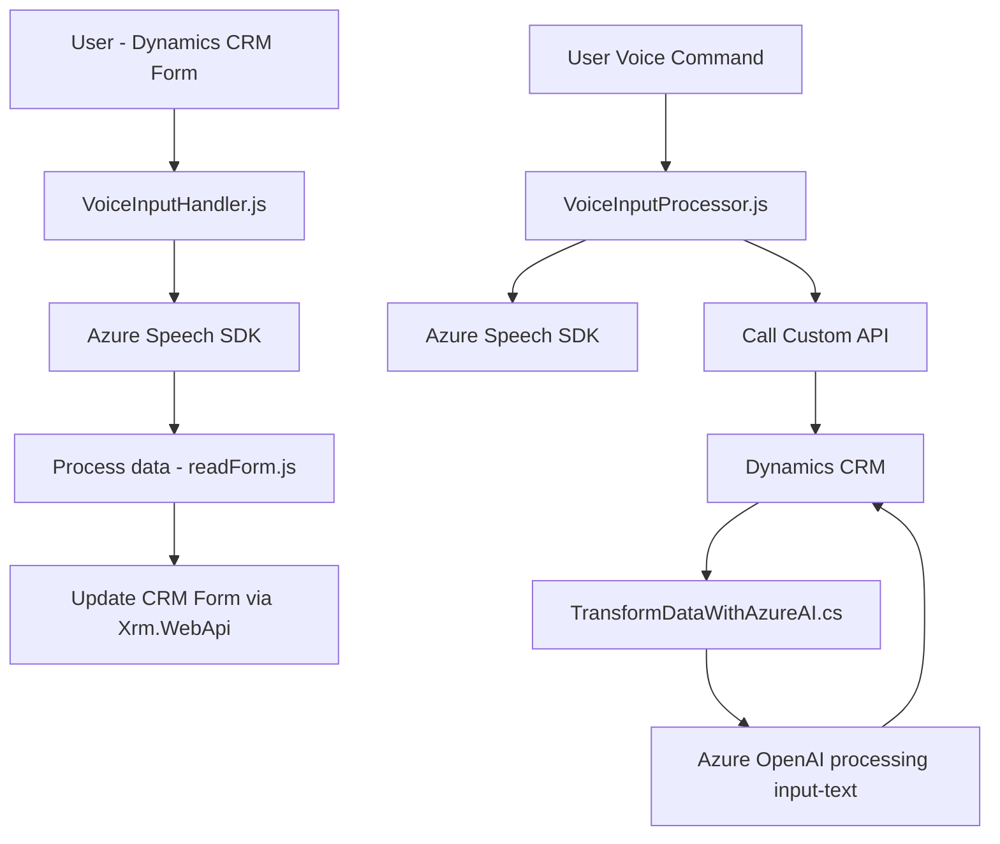

### Breve resumen técnico:

- Este repositorio incluye archivos para integrar reconocimiento de voz y generaciones automáticas de texto mediante **Azure Cognitive Services Speech SDK** y **Azure OpenAI** en Dynamics 365 CRM.
- Está dividido en dos archivos frontend (`readForm.js`, `speechForm.js`) y un archivo plugin backend (`TransformTextWithAzureAI.cs`).
- La funcionalidad aborda la recolección de datos del usuario (ya sea por voz o estructura de formularios), los transforma usando Azure servicios y los aplica dentro del entorno de Dynamics CRM.

---

### Descripción de arquitectura:

La solución utiliza una arquitectura híbrida compuesta por:

1. **Frontend**:
    - Modular y orientado a servicios que interactúan directamente con Azure Speech SDK para reconocimiento de voz y síntesis de texto.
    - Procesa datos y comandos en formato legible para el usuario y los aplica sobre formularios del CRM mediante APIs internas de Dynamics 365.

2. **Backend**:
    - Plugin que funciona como parte del esquema de extensión de Dynamics CRM (`IPlugin`).
    - Implementa una integración con Azure OpenAI, conectado mediante llamadas HTTP, para transformar datos textuales introducidos manualmente en el sistema o procesados por el frontend.

**Tipo de arquitectura**:
- **N Capas**: Con componentes centrados en frontend, API interna y un plugin backend.
- Incluye **orientación a servicios** debido al uso intensivo de servicios externos como Azure (Cognitive y OpenAI).

---

### Tecnologías usadas:

1. **Frontend**:
   - **Azure Cognitive Services Speech SDK**: Para reconocimiento de voz y síntesis de texto.
   - **JavaScript**: En los archivos frontend, con soporte asíncrono y programación reactiva basada en eventos.
   - **CRM Dynamics APIs** (como `Xrm.WebApi`): Para manipulación directa de formularios.

2. **Backend Plugin**:
   - **C#**, con **Microsoft Dynamics CRM SDK**: Base para escribir extensiones (usando interfaces como `IPlugin`).
   - **Azure OpenAI**: Llamadas a un servicio RESTful para procesamiento de texto y transformación.
   - **JSON Handlers**: `System.Text.Json`, `Newtonsoft.Json.Linq`.
   - **HTTP Communication**: `System.Net.Http` para solicitar datos desde el servicio de Azure.

---

### Diagrama Mermaid:

---

### Conclusión final:

Este repositorio forma un sistema integrado entre **Microsoft Dynamics CRM**, **Azure Cognitive Services Speech SDK**, y **Azure OpenAI**. Su arquitectura se clasifica como una solución de varias capas con orientación a servicios externos.

- **Frontend modules** manejan la interacción con el usuario, desde formularios y comandos por voz hasta interoperabilidad con Dynamics CRM para actualizar datos.
- **Backend plugins** extienden el CRM mediante componentes reutilizables que invocan servicios avanzados como **Azure OpenAI** para transformación de texto JSON.
- Los módulos están escritos de forma modular y funcional, con uso eficiente de recursos externos (SDKs, APIs).

Esta arquitectura está diseñada específicamente para CRM en escenarios de trabajo con voz e inteligencia artificial, lo que la hace escalable y extendible a otros proyectos con requisitos similares.