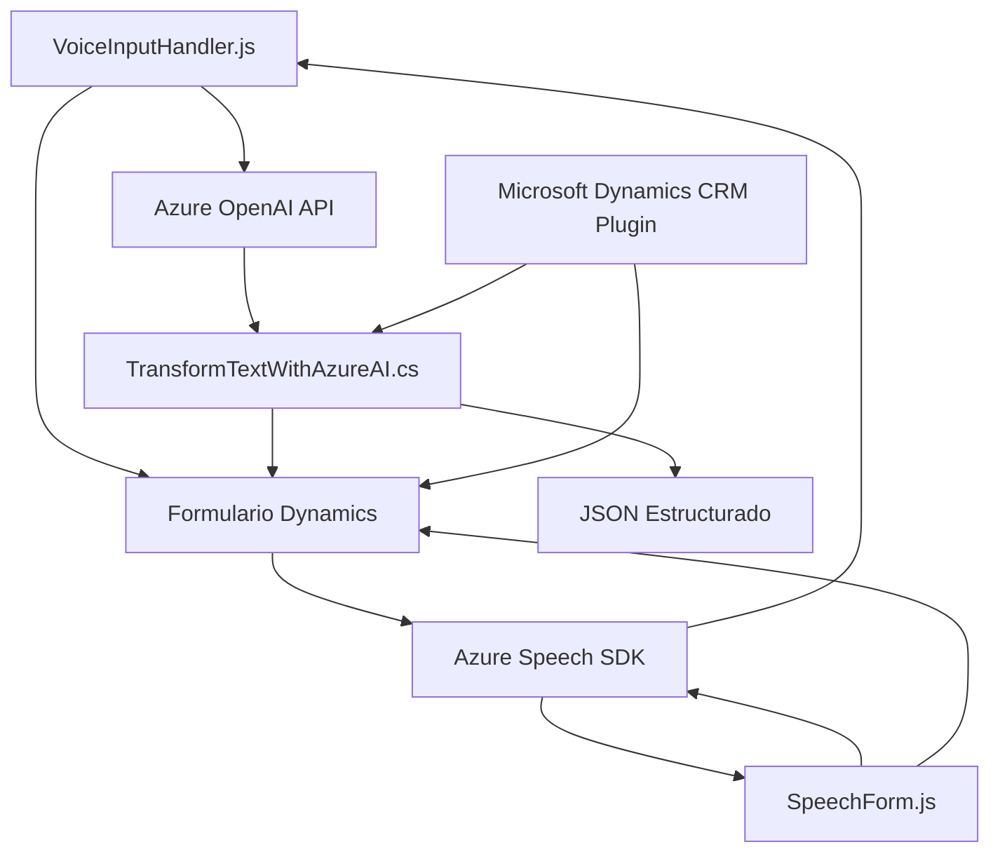

# Resumen técnico

Este repositorio contiene una solución que integra tecnologías frontend, plugins para Microsoft Dynamics CRM, y APIs inteligentes de Azure (Speech SDK y Azure OpenAI). Los archivos principales están enfocados a la interacción con formularios y a la manipulación de datos (con reconocimiento de voz y sintetización de texto a voz), junto con la transformación de datos textuales en JSON estructurados mediante Azure OpenAI.

---

## Descripción de arquitectura

1. **Tipo de solución**: Este repositorio parece formar parte de una aplicación híbrida centrada en la interacción con Microsoft Dynamics CRM. Integra una capacidad **frontend** para trabajo con formularios (reconocimiento de voz y síntesis de voz), y **plugin backend** en C# para procesamiento de datos en el contexto del CRM.

2. **Arquitectura predominante**: 
   - **Frontend**: Arquitectura unificada basada en modularización de funcionalidades y comunicación con APIs (patrón n-capas).
   - **Plugin y API Backend**: Basado en **arquitectura de plugins** de Dynamics CRM, con integración a servicios de Microsoft Azure (como API externas).

3. Patrón principal observado:
   - **Carga dinámica** de dependencias externas: El uso del SDK de Azure Speech se permite de forma asíncrona mediante módulos en JavaScript.
   - **Façade Pattern**: Interacción encapsulada con Azure Speech y OpenAI mediante métodos especializados.
   - **Integración de servicios externos**: Uso de SDK de Azure para reconocimiento y síntesis de voz, y Azure OpenAI para transformación avanzada de datos.
   - **Delegación de responsabilidad**: Métodos y clases organizados según tareas específicas.
   - **Strategy Pattern (parcial)**: Selección dinámica basada en reglas (ejemplo, procesamiento IA o manual en transcripciones de voz).

---

## Tecnologías usadas

### Frontend:
1. **JavaScript**: Solución principal para el manejo del reconocimiento, transcripción y síntesis de voz en Microsoft Dynamics CRM.
2. **Azure Speech SDK**: Para la entrada por voz y síntesis de texto a voz.
3. **Dynamics 365 SDK**: Para trabajar con formularios y datos de CRM.

### Backend:
1. **C# (Plugins)**: Plugins implementados en Dynamics CRM.
2. **Azure OpenAI API**: Usada para transformar texto en objetos JSON estructurados.
3. **Newtonsoft JSON**: Para manipulación confiable de datos JSON en C#.

### General:
1. **Dependencias externas principales**:
   - Azure Speech SDK y OpenAI API.
   - Espacios de nombres estándar como `System.Net.Http` para consumo HTTP, y `Newtonsoft.Json.Linq` para manipulación JSON.

---

## Diagrama **Mermaid**

---

## Conclusión final

Este repositorio implementa una **solución híbrida** para Microsoft Dynamics CRM, combinando capacidades **frontend** y **backend** con una fuerte dependencia en servicios externos de Azure (Speech SDK y OpenAI). La solución utiliza patrones robustos de integración y modularización, lo que facilita la escalabilidad y personalización en trabajos complejos con datos de formularios y procesamiento de voz. La tecnología está bien organizada, aunque se podría mejorar la seguridad de las claves API mediante la adopción de medidas adicionales como **Azure Key Vault** o servicios equivalentes.