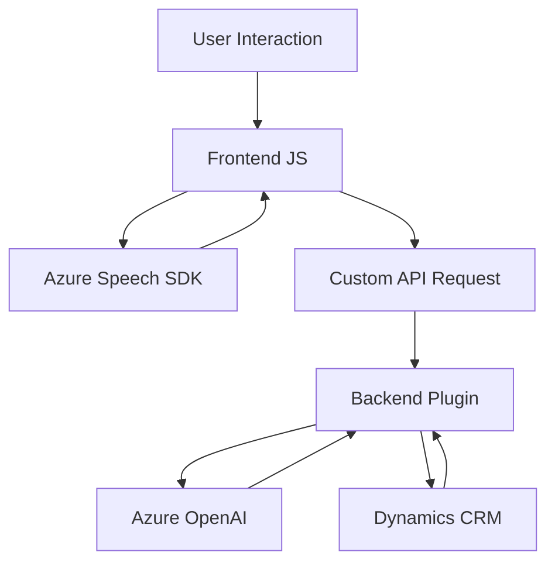

### Breve resumen técnico:
El repositorio contiene tres componentes principales que se integran en un sistema capaz de procesar formularios mediante entrada de voz, reconocimiento de texto y síntesis de voz utilizando tecnologías como Azure Speech SDK y Azure OpenAI. Los módulos frontend están orientados a la interacción directa con el usuario, mientras que el backend (Plugin en Dynamics CRM) se centra en procesos más avanzados internos.

---

### Descripción de arquitectura:
1. **Tipo de solución:** 
   - La solución corresponde a una aplicación de entrada y análisis de datos basada en reconocimiento y síntesis de voz (Frontend), procesamiento asistido por inteligencia artificial (Backend/Plugin), y diversas integraciones externas (Azure SDK, OpenAI).
   
2. **Arquitectura:**
   - La arquitectura general parece seguir un patrón híbrido formado por **n capas** para el frontend y **event-driven programming** con interacciones del plugin backend mediante la integración de API externas.
   - El componente **TransformTextWithAzureAI.cs** aplica el patrón **Hexagonal Architecture** mediante conexión a sistemas externos (OpenAI) y CRM como capas plug-and-play.
   - La funcionalidad distribuida y modular sugiere elementos que pueden ser divididos en microservicios.

---

### Tecnologías usadas:
#### Frontend:
- **Azure Speech SDK:** Para reconocimiento y síntesis de voz, incluido mediante carga dinámica.
- **JavaScript:** Para interacción con formularios y usuarios.
- **Microsoft Dynamics CRM Context:** Para interacciones con datos en formularios.
- **Custom API:** Conexión directa al backend para usos de inteligencia artificial.

#### Backend:
- **Azure OpenAI:** Utilizado para procesar texto con modelos GPT-4o.
- **Microsoft Dynamics CRM SDK:** Amplio uso del modelo de extensibilidad para trabajar con datos almacenados en CRM.
- **JSON Manipulation:** Para estructuración y serialización de datos procesados.

---

### Dependencias/componentes externos:
1. **Azure Speech SDK:** Manejo de entrada de voz, síntesis, configuración de idiomas y voces específicas.
2. **Microsoft Dynamics 365 / CRM SDK:** Contexto para gestión de formularios y datos.
3. **Azure OpenAI (GPT-4o):** Procesamiento avanzado basado en IA.
4. **HTTP Libraries:** Para conexión y consumo de servicios API (e.g., OpenAI).
5. **Custom API (Trial_TransformTextWithAzureAI):** Utilizada para procesamiento de voz/transcripción con Dynamics CRM.

---

### Diagrama Mermaid:

---

### Conclusión final:
La solución está diseñada para entornos administrativos con requisitos de procesamiento avanzado de formularios mediante entrada de voz e inteligencia artificial. La modularidad de los componentes frontend y su integración con un plugin altamente especializado en el backend lo hacen ideal para sistemas basados en Dynamics CRM. Se destacan los siguientes puntos:
1. **Flexibilidad escalable:** Gracias al uso de SDK externos cargados dinámicamente y APIs modulares.
2. **Patrones claros:** Separación de responsabilidades, integración API externa (Azure Speech y OpenAI), y carga condicional de dependencias.
3. **Riesgos:** Hardcoding de configuraciones (como API keys en el backend) puede comprometer la seguridad.
4. **Uso efectivo:** La solución puede ser extendida a otras aplicaciones que combinen input basado en voz con procesamiento usando inteligencia artificial.