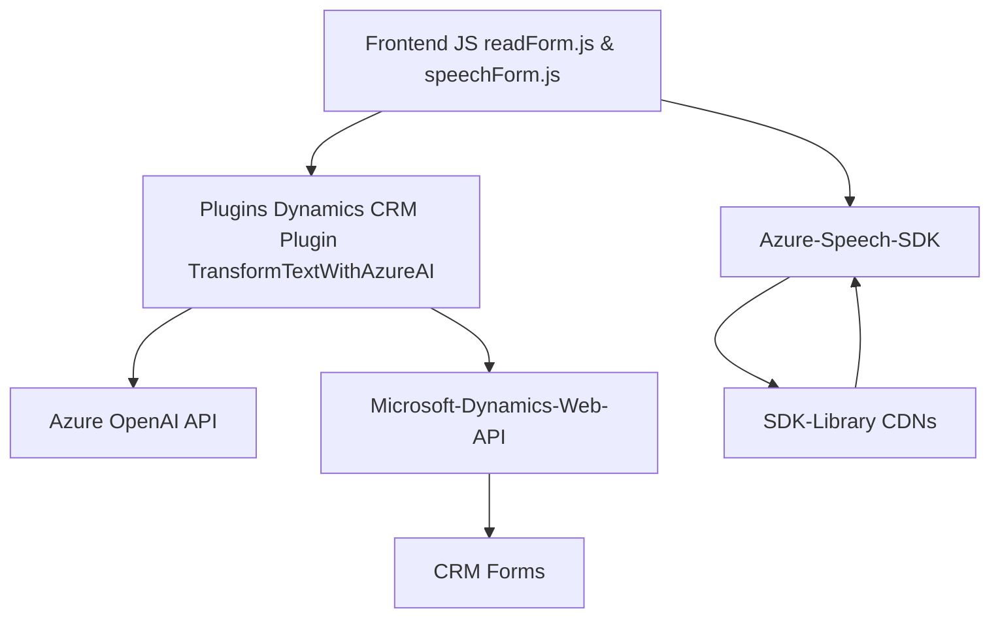

### Análisis General

#### Resumen Técnico
El repositorio contiene múltiples archivos organizados en carpetas para gestionar la funcionalidad de voz, formularios web y el manejo de inteligencia artificial (IA). Este conjunto de componentes parece formar parte de una solución empresarial que utiliza servicios cognitivos (Azure Speech SDK y Azure OpenAI) en combinación con un sistema CRM y está altamente modularizado para garantizar extensibilidad en la integración de servicios externos.

---

#### Descripción de la Arquitectura
1. **Tipo de solución:**  
   - La solución parece combinar un sistema **frontend web** que interactúa con formularios y un backend integrado con un **CRM** (Microsoft Dynamics 365). Adicionalmente, se apoya en **servicios de IA/voz externos** (Azure Speech SDK y Azure OpenAI).  
   - Resuelve problemas relacionados con entrada y salida de datos en formularios utilizando reconocimiento de voz y síntesis de texto.

2. **Tipo de Arquitectura:**  
   - La arquitectura se guía por principios de **N Capas** (Frontend, Middleware/Backend, CRM y Servicios Externos) combinada con **Service-Oriented Architecture (SOA)** para hacer uso de servicios externos como Azure Speech SDK y OpenAI API.
   - El frontend es modular, con componentes claramente separados para funcionalidades específicas (e.g., inicio de grabación, síntesis de voz, asignación de valores a campos).
   - En la arquitectura del backend (Microsoft CRM), se emplea **Plug-in-Based Architecture** donde los plugins interactúan con la API de Dynamics. Esto asegura extensibilidad y personalización para procesos individuales en el CRM.

---

#### Tecnologías, Frameworks y Patrones Usados
1. **Tecnologías principales:**  
   - **Frontend:** JavaScript, Azure Speech SDK.  
   - **Backend:** Microsoft Dynamics 365 Web API, Plugins (`IPlugin` interface), Azure OpenAI API.  

2. **Frameworks/SDKS:**  
   - **Azure Speech SDK:** Usado para síntesis y transcripción de voz en el frontend.  
   - **Azure OpenAI:** Se utiliza para transformación de texto en JSON en el backend.  

3. **Patrones de diseño/arquitectura:**  
   - **SOA:** Los componentes interactúan con servicios externos como Azure Speech y OpenAI.  
   - **Plug-in-Based Architecture:** En el escenario de backend/CRM, los plugins se ejecutan como módulos de Dynamics CRM.  
   - **Factory/Builder Patterns:** El frontend utiliza creación dinámica de objetos (SpeechConfig, AudioConfig) para configurar servicios del SDK.  
   - **Modular Design:** Las funciones en los archivos de JavaScript están separadas por tareas específicas.  
   - **Adapter Pattern:** El plugin transforma las respuestas de Azure AI en estructuras JSON para el CRM.  
   - **Event-Driven Architecture:** El sistema maneja eventos como resultados de transcripciones para desencadenar procesos en tiempo real.

---

#### Dependencias y Componentes Externos
1. **Azure Speech SDK:** Para integración de capacidades avanzadas de síntesis y reconocimiento de voz.  
2. **Azure OpenAI:** Servicio de transformación de texto en JSON mediante modelos de IA de OpenAI.  
3. **Microsoft Dynamics Web API:** Interacción con el CRM para administrar datos sobre formularios y usuarios.  
4. **Newtonsoft.Json:** Para el manejo de objetos JSON en el backend del plugin.  
5. **Custom APIs:** Apoyadas en Microsoft Dynamics CRM para personalización de tareas específicas.  
6. **JavaScript DOM APIs:** Manejo de elementos dinámicos en el frontend con funciones como `document.createElement`.

---

#### Diagrama **Mermaid**
A continuación se presenta un diagrama para ilustrar la arquitectura.

---

#### Conclusión Final

La solución emplea una arquitectura **N Capas con componentes orientados al servicio (SOA)** para integrar un frontend modular interactivo con capacidades de entrada y salida de voz basadas en **Azure Speech SDK**, junto con un backend extensible en **Dynamics CRM** que utiliza plugins personalizables. Además, incluye procesamiento externo de datos mediante **Azure OpenAI API**, transformando dinámicamente texto ingresado en valores legibles y estructurados para mejorar las operaciones dentro del sistema. Esta estructura destaca por ser escalable, adaptable al uso de servicios de IA y diseñada con principios arquitectónicos modernos.