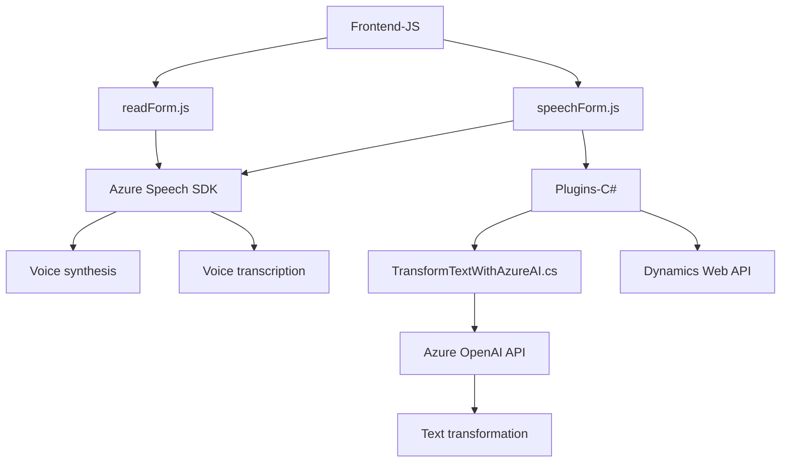

### Breve Resumen Técnico
Este repositorio implementa una solución integrada entre Microsoft Dynamics 365 y servicios en la nube de Azure (Azure Speech SDK y Azure OpenAI API). Consta de componentes para interacción de voz con formularios (entrada y salida) y un plugin para procesar texto mediante IA. La finalidad es automatizar procesos accesibles y mejorar la gestión de datos.

---

### Descripción de Arquitectura
La solución tiene una **arquitectura de n capas**:
1. **Capa de presentación:** Archivos JS en el frontend para interacción directa con Dynamics (captura de voz y síntesis).
2. **Capa de lógica de negocio:** Plugin en C#, ejecutado como extensión de Dynamics CRM, para transformar datos usando Azure OpenAI API.
3. **Capa API de integración:** Servicios de Azure Speech SDK y OpenAI. Estas interacciones se realizan mediante HTTP.

Los principales patrones identificados son:
- Modularidad en el diseño de funciones y métodos.
- Plugin estándar del framework Dynamics para extensibilidad.
- Service-based architecture para la integración de servicios externos (Azure Speech y OpenAI).
- Responsabilidad única en métodos/funciones (cada operación tiene su tarea específica).

---

### Tecnologías Usadas
1. **Frontend:**
   - Lenguaje: JavaScript.
   - SDK: Azure Speech SDK (síntesis y transcripción de voz).
   - Plataforma: Microsoft Dynamics 365.
   - Contexto operativo: `executionContext`, Form Control API de Dynamics.

2. **Backend:**
   - Lenguaje: C#.
   - Framework: Dynamics CRM SDK (Plugin Architecture).
   - Dependencias:
     - `Newtonsoft.Json.Linq` para procesamiento JSON.
     - `System.Net.Http` para solicitudes HTTP.
     - `Microsoft.Xrm.Sdk` para interacción con Dynamics CRM.
   - Servicio externo: Azure OpenAI API.

---

### Diagrama Mermaid

---

### Conclusión Final
La solución implementa una arquitectura robusta y extensible basada en **n capas**. Proporciona funcionalidades de accesibilidad al convertir formularios en voz mediante Azure Speech SDK y permite capturar transcripciones para actualizar datos en formularios. Además, utiliza un plugin en Dynamics CRM para transformar texto mediante Azure OpenAI API. Cada módulo está diseñado siguiendo principios de modularidad y responsabilidad única.

Sin embargo:
- Es fundamental asegurar las claves API y secretos de configuración en entornos seguros.
- Poner un mayor énfasis en el manejo de errores en interacciones con servicios externos, especialmente en APIs como OpenAI.  
La solución es ideal para escenarios en Dynamics 365 que requieren mejoras de accesibilidad y automatización inteligente, siendo escalable para más casos mediante una arquitectura orientada a servicios.