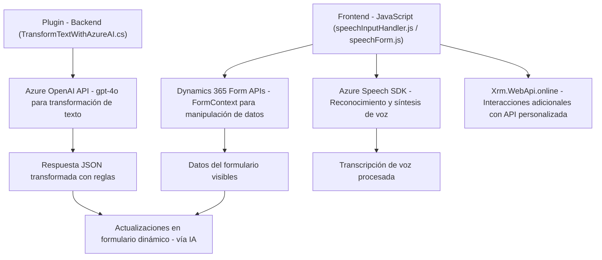

### Breve resumen técnico
El repositorio evidencia una solución basada en la integración de servicios de voz y procesamiento de texto mediante Azure Speech SDK y Azure OpenAI. Aunque aparecen partes independientes (frontend, plugins), la estructura indica un sistema que interactúa con **Dynamics 365** a través de APIs y plugins.

---

### Descripción de arquitectura
Esta arquitectura combina piezas de un sistema **n-capas** y patrones cliente-servidor:
1. **Frontend**: Scripts JavaScript que manejan reconocimiento y síntesis de voz, manipulando formularios visibles en Dynamics CRM.
   - Opera como cliente que consume servicios externos (Azure Speech SDK) y actualiza datos dinámicos.
2. **Backend / Plugins**: Complementa el sistema con **plugins orientados a eventos** en Dynamics 365. Estos actúan como intermediarios entre el sistema CRM y Azure OpenAI para transformar texto y aplicar reglas de negocio.
3. **Integración modular**: Aunque sigue un enfoque de separación funcional, no implementa microservicios, ya que opera dentro de un entorno de Dynamics CRM.

La arquitectura evidencia:
- **N-capas**: Backend (plugin), integración externa (OpenAI), lógica de dominio (formContext) y presentación/formulario.
- **Integración por SDK**: Servicios Azure Speech y OpenAI se integran como dependencias externas específicas.
- **Modularidad**: Componentes funcionales claramente definidos (frontend, backend/plugin).

---

### Tecnologías usadas
1. **Frontend**:
   - **JavaScript**: Para reconocimiento y síntesis de voz.
   - **Azure Speech SDK**: Reconocimiento de voz y síntesis con servicios externos.
   - **Contexto Dynamics 365**: `formContext`, manipulación de datos en formularios.
   - **DOM API**: Para interactuar con scripts y cargar dinámicamente recursos.
   - **Xrm.WebApi.online**: Llamada a servicios en Dynamics CRM.
   - **Promises/async-await**: Para manejo de asincronía.
2. **Backend**:
   - **C# y .NET Framework**: Lenguaje para escribir plugins de Dynamics CRM.
   - **Azure OpenAI API**: Para transformar texto en un JSON estructurado conforme a reglas.
   - **Microsoft.Xrm.Sdk**: Librería central para la interacción con el sistema Dynamics CRM.
   - **System.Net.Http**: Invocación de servicios.
   - **JSON manipulation**: System.Text.Json y Newtonsoft.Json.Linq para trabajar con datos JSON.

---

### Dependencias o componentes externos
- **Azure Speech SDK**: Para síntesis y reconocimiento de voz.
- **Azure OpenAI (GPT)**: Procesamiento avanzado de texto con API personalizadas.
- **Dynamics CRM Form APIs**: Manipulación de datos de formulario dentro del entorno corporativo de Dynamics.
- **JavaScript DOM APIs**: Para cargar dinámicamente scripts y manejar la interfaz web del CRM.
- **Dynamics CRM Plugin SDK**: Para implementación de lógica de negocio en sistemas Dynamics.
- **Integración HTTP**: Con Azure OpenAI mediante JSON y HttpClient.

---

### Diagrama Mermaid válido para GitHub Markdown

---

### Conclusión final
Este repositorio define una solución que integra tecnologías y servicios avanzados en el ecosistema de **Dynamics 365**, aprovechando APIs externas como **Azure Speech SDK** para voz y **Azure OpenAI** para procesamiento de texto avanzado. Su arquitectura es modular y sigue una disposición **n-capas**, optimizada para reutilización y extensibilidad en el contexto de aplicaciones empresariales.