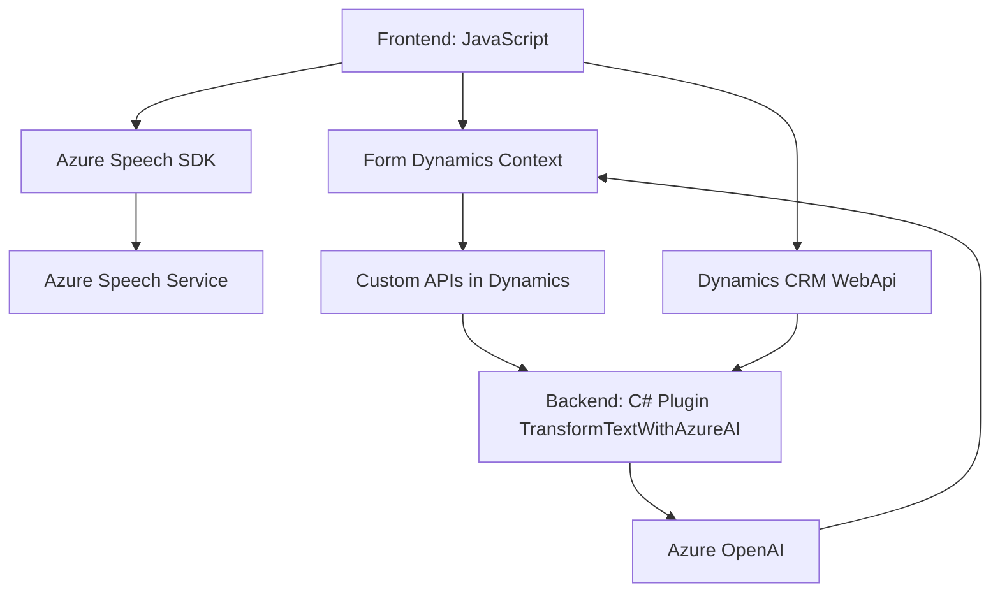

### Breve resumen técnico
Este repositorio presenta una solución que integra funcionalidades de entrada y salida de voz, junto con transformación avanzada de texto mediante inteligencia artificial (Azure OpenAI). Está orientado a trabajar dentro de Microsoft Dynamics CRM, interactuando con formularios, APIs personalizadas y servicios externos (Azure Speech SDK y OpenAI).

---

### Descripción de arquitectura
#### Tipo de solución:
Es una solución híbrida que combina:
- **Frontend**: JavaScript para manipulación de formularios y dinámicas de entrada/salida en Dynamics CRM.
- **Backend**: Plugins en .NET para lógica avanzada y comunicación con Azure OpenAI.

#### Tipo de arquitectura:
La solución utiliza una **arquitectura de capas**:
- **Capa Presentation**:
  - Archivos JavaScript (interacción con formularios y datos en Dynamics).
- **Capa Business Logic** (Plugin Dynamics CRM):
  - Coordinación entre Dynamics CRM y Azure OpenAI mediante reglas específicas.
- **Capa External Services**:
  - Integración con Azure Speech SDK y OpenAI.

El diseño refleja características de una arquitectura basada en eventos y modular, especialmente por el uso de funciones con una responsabilidad específica y APIs externas.

---

### Tecnologías usadas
1. **Frontend**:
   - **JavaScript** para la manipulación de formularios y eventos del cliente en Dynamics CRM.
   - **Azure Speech SDK** para entrada/salida de voz dinámica.
2. **Backend**:
   - **C# (.NET)** para el desarrollo de Plugins.
   - **Microsoft Dynamics CRM SDK**:
     - `Xrm.WebApi` para interacciones con datos y entidades del CRM.
     - `IPlugin` y otros servicios relacionados al contexto del CRM.
   - **Azure OpenAI (GPT-4)** para transformación de texto inteligente.
   - Librerías .NET: `System.Net.Http`, `System.Text.Json`, `Newtonsoft.Json.Linq`, entre otras.
3. **Servicios externos**:
   - Azure OpenAI (text transformations with GPT-4).
   - Azure Speech SDK (voice synthesis and recognition).

#### Patrones empleados:
- **Patrón de inicialización dinámica**: Carga de SDK según sea necesario.
- **Separación funcional** (Single Responsibility Principle): Cada función o método es responsable de una acción específica (e.g., leer datos visibles, procesar texto, etc.).
- **Delegación**: Mantenimiento de claridad estructural mediante delegación de tareas específicas (e.g., síntesis de voz, transformación de texto).
- **Orientación a eventos**: Las funciones se disparan según eventos en contexto de formularios (Dynamics CRM executionContext).

---

### Dependencias o componentes externos
1. **Azure Speech SDK**:
   - Dinámicamente cargado mediante URL.
   - Funciona para síntesis de voz (Frontend).
2. **Azure OpenAI**:
   - Plugin en backend realiza llamadas HTTP al servicio OpenAI, a través de un endpoint específico y autenticación API-Key.
   - Modelo GPT-4 para transformación de texto.
3. **Microsoft Dynamics CRM SDK**:
   - Utilizado en las interacciones de frontend y backend para modificar dinámicas y datos en formularios.
4. **Custom APIs**:
   - No especificado en detalle, pero está claro que existen APIs personalizadas en Dynamics para programación adicional.

---

### Diagrama Mermaid

---

### Conclusión final
Esta solución implementa una arquitectura modular y distribuida, ideal para integrating advanced AI capabilities into enterprise systems like Microsoft Dynamics CRM. The coexistence of frontend JavaScript files and backend plugins supports the transformation of data (via AI APIs) and enhances user interactivity (via voice input/output). The use of Azure-based SDKs and cloud services reinforces scalability and advanced feature capabilities. Potential improvements could involve advanced monitoring/logging mechanisms to ensure reliability during SDK/API interactions.