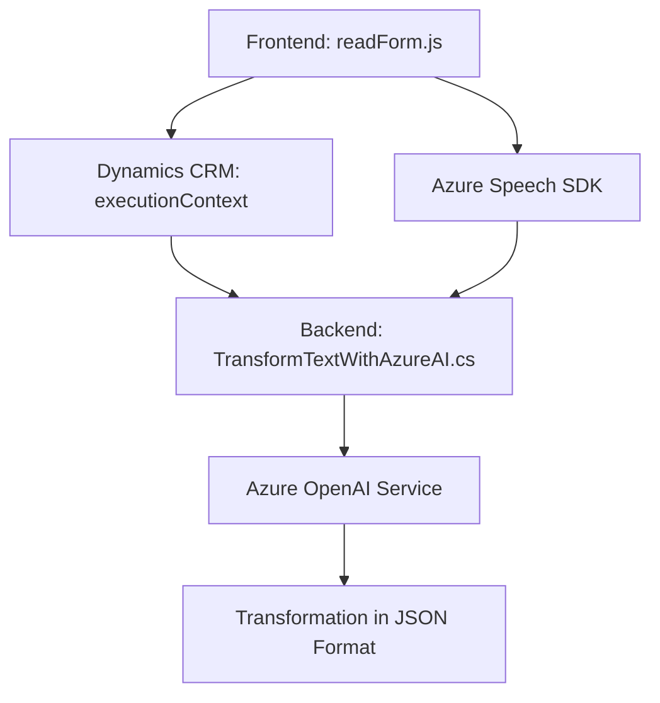

### Breve resumen técnico:
Este proyecto integra varios componentes para formularios web, reconocimiento de voz y procesamiento basado en inteligencia artificial, orientado a la plataforma Dynamics CRM y usando servicios de nube como Azure Speech SDK y Azure OpenAI. Sus funcionalidades principales van desde la lectura/síntesis de datos hasta el reconocimiento de comandos de voz y transformación de texto con IA.

### Descripción de arquitectura:
La solución sigue una arquitectura modular y descentralizada. Aunque no sería un sistema completamente de microservicios, tiene componentes distribuidos que se integran con APIs externas:
1. **Frontend**: Archivos JavaScript (`readForm.js`, `speechForm.js`) para la interacción con el usuario en Dynamics CRM.
2. **Backend plugin**: Un plugin escrito en C# (`TransformTextWithAzureAI.cs`) para ejecutar transformaciones en texto usando Azure OpenAI.
3. Comunicación entre el frontend y el backend ocurre mediante APIs de Dynamics CRM y servicios de terceros como Azure Speech y OpenAI.

### Tecnologías usadas:
1. **Frontend**:
   - Lenguaje: JavaScript.
   - Azure Speech SDK (para reconocimiento y síntesis de voz).
   - Asynchronous Programming (async/await, Promises).

2. **Backend (plugin)**:
   - Lenguaje: C#.
   - Framework: Microsoft Dynamics CRM SDK.
   - Dependencias: `Newtonsoft.Json`, `System.Net.Http`.
   - Azure OpenAI (GPT).

3. **APIs externas**:
   - Azure Speech SDK: Reconocimiento y síntesis de voz en tiempo real.
   - Azure OpenAI Service: API para generación y transformación de texto.

4. **Patrones de diseño**:
   - Modular Design: División por funciones específicas.
   - Facade Pattern: Simplificación de la interfaz de entrada en métodos como `startVoiceInput`.
   - Plugin Pattern: Utilizado en el archivo `TransformTextWithAzureAI.cs`.
   - API Integration: Comunicación con servicios externos (Azure API, Dynamics CRM).

### Dependencias o componentes externos:
1. **Azure services**:
   - Azure Speech SDK para sintetizar y reconocer voz.
   - Azure OpenAI para transformación basada en IA.
2. **Microsoft Dynamics CRM**:
   - API para gestión de formularios, atributos y entidades.
   - API personalizada: `trial_TransformTextWithAzureAI`.
3. **Librerías externas**:
   - `Newtonsoft.Json` y otras de .NET para manejo de datos JSON.
4. **Web APIs**:
   - Comunicación HTTP (`HttpClient`).

### Diagrama Mermaid válido para GitHub:

### Conclusión final:
El repositorio constituye una solución híbrida que combina frontend dinámico en JavaScript interactuando con formularios de Dynamics CRM, junto con un backend especializado en C#. La arquitectura está bien modularizada, y se apoya fuertemente en APIs y servicios externos como Azure Speech y Azure OpenAI. Aunque no adopta una arquitectura estrictamente de microservicios, sí implementa integraciones especializadas y desacoplamiento entre las distintas capas de funcionalidad. Esto permite extensibilidad y administración centralizada dentro del ecosistema Dynamics CRM.