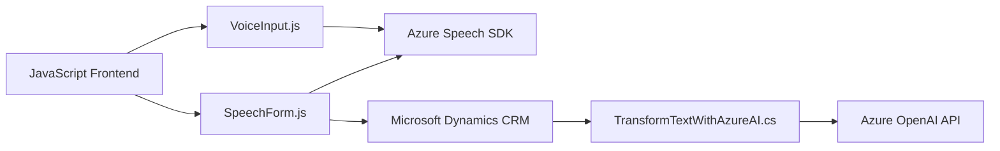

### Breve resumen técnico:

El repositorio contiene varios archivos que implementan funcionalidad basada en voz e inteligencia artificial para interactuar con formularios y datos en Microsoft Dynamics 365. Se identifica el uso de Azure Speech SDK para la síntesis y reconocimiento de voz y Azure OpenAI API para el procesamiento y transformación de textos. Las soluciones están diseñadas para integrar los servicios externos en una estructura modular compatible con Dynamics CRM.

---

### Descripción de arquitectura:

La arquitectura general parece ser una **modular de integración con APIs externas**:

1. **Frontend (JavaScript)**: 
   - Implementa reconocimiento y síntesis de voz, así como operaciones en los formularios de Dynamics 365.
   - Funciona como un cliente ligero que facilita la operatividad de los formularios.
   - Modular, con separación de funciones para tareas específicas como carga del SDK, procesamiento de datos visibles, y comunicación con APIs externas.

2. **Backend (Dynamics Plugin en C#)**:
   - Ejecución de lógica en el servidor de Dynamics CRM mediante plugins.
   - Integra servicios avanzados de procesamiento de IA como Azure OpenAI para realizar transformaciones inteligentes de texto.  
   - Utiliza programación orientada a objetos y robustos principios de encapsulación.

La combinación de tecnologías y patrones sugiere una **arquitectura de n capas** al integrar la capa de presentación (JavaScript frontend), capa de lógica (backend Dynamics Plugin) y capa de servicios externos (Azure APIs).

---

### Tecnologías usadas:

1. **Frontend**:
   - **JavaScript**: Para el desarrollo del cliente y la interacción con Dynamics 365.
   - **Azure Speech SDK**: Para habilitar funcionalidades de síntesis y reconocimiento de voz.

2. **Backend**:
   - **Microsoft Dynamics CRM SDK**: Para el desarrollo de plugins bajo la arquitectura específica de Dynamics.
   - **Azure OpenAI API**: Procesamiento avanzado de lenguaje natural (GPT-4).
   - **C#**: Desarrollo del plugin bajo .NET Framework.

---

### Dependencias o componentes externos:

1. **Azure Speech SDK**:
   - Reconocimiento de voz y síntesis.
   - Parámetros necesarios: `azureKey`, `azureRegion`.

2. **Azure OpenAI API**:
   - Requiere configuración específica: endpoint API y credenciales de autenticación.

3. **Microsoft Dynamics CRM Web API**:
   - Soporte para manejo de formularios y datos dentro de Dynamics CRM.

4. **HTTP Client Libraries**:
   - Uso de `System.Net.Http` para realizar solicitudes a servicios externos desde plugins.

---

### Diagrama **Mermaid**:

---

### Conclusión final:

El repositorio representa una solución modular que utiliza tecnologías modernas en múltiples capas:

1. **Frontend en JavaScript**:
   - Reconocimiento y síntesis de voz incorporando el servicio Azure Speech SDK.
   - Interacción directa con los formularios de Dynamics 365.

2. **Backend en C#**:
   - Integración de servicios Azure OpenAI (GPT-4) para transformar datos y aplicarlos en el sistema CRM.
   - Asegura separación clara entre la lógica de procesamiento del lenguaje natural y las operaciones en Dynamics.

Además, la arquitectura modular facilita la extensión y el mantenimiento, mientras se utiliza una fuerte integración con APIs externas. Para implementar soluciones empresariales robustas, este modelo es ideal por su capacidad de escalar y por aprovechar al máximo las capacidades de las tecnologías de Microsoft y Azure.