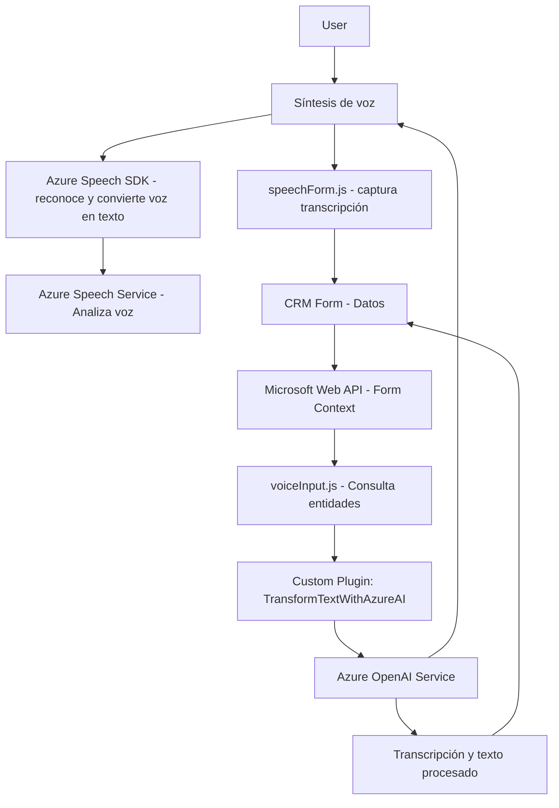

# Breve resumen técnico:
El repositorio parece contener una solución orientada al desarrollo de una integración entre un sistema CRM (posiblemente Dynamics CRM) y servicios basados en inteligencia artificial de Azure, especialmente Azure Cognitive Services y Azure OpenAI. La estructura revela que es un sistema híbrido con componentes dentro del CRM y una capa frontend para interacción del usuario a través de interfaces de formularios.

---

## Descripción de la arquitectura:
La arquitectura tiene al menos dos componentes:
1. **Frontend (FRONTEND)**:
   - Basado en JavaScript, interactúa directamente con el usuario para permitir entrada por voz, recolecta datos de formularios y reproduce texto mediante los servicios de evaluación semántica y síntesis de voz (Azure Speech API).
   - Modular y enfocada en tareas específicas: lectura de formularios, síntesis de voz y normalización de datos. Cada función en el frontend cumple con un único propósito, conformando una lógica clara y desacoplada.

2. **Backend (Plugins)**:
   - Implementado en C# como un plugin de Dynamics CRM que hace uso del servicio Azure OpenAI para el procesamiento y transformación avanzada de texto.
   - Arquitectura basada en patrones típicos de plugins de Microsoft Dynamics, incluyendo interacción con las entidades del CRM y uso de servicios externos como REST APIs.

La arquitectura general puede ser clasificada de la siguiente manera:
- **Integración Cliente-Servidor/Microservicios:** La solución se apoya en Microsoft Dynamics CRM (que actúa como backend) y en APIs de Azure para agregar funcionalidades avanzadas.
- **Arquitectura basada en n capas:** El sistema está estructurado en layers (base de datos y servicios del CRM, lógica del plugin y cliente, interacción del usuario en el frontend).

---

## Tecnologías usadas:
1. **Frontend/JS**:
   - JavaScript.
   - Azure Speech SDK.
   - Patrones utilizados: Modularización, Facade, Event-driven architecture.

2. **Backend/Plugins**:
   - C# .NET Framework.
   - Microsoft Dynamics CRM SDK (`Microsoft.Xrm.Sdk`).
   - Azure OpenAI API (con interacción REST).
   - System.Net.Http y Json Libraries (`Newtonsoft.Json` y `System.Text.Json`).

3. **Servicios de nube**:
   - **Azure Cognitive Services**: Para síntesis y reconocimiento de voz.
   - **Azure OpenAI Service**: Procesamiento de lenguaje natural.

---

## Dependencias o componentes externos:
1. **Azure Speech SDK**:
   - Interacción para reconocimiento y síntesis de voz.
2. **Azure OpenAI Service**:
   - Procesa y transforma texto con funciones avanzadas de inteligencia artificial.
3. **Microsoft Dynamics CRM APIs**:
   - Xrm.WebApi para manejar datos del contexto CRM.
   - IPlugin para extender funcionalidades mediante lógica de negocios.
4. **System libraries**:
   - `System.Net.Http`: Para realizar llamadas HTTP al servicio web REST.
   - JSON serializers (Json.Net o Newtonsoft.Json).
5. **Front-end**:
   - Usa funciones ECMAScript para el procesamiento y síntesis de voz interactiva.

---

## Diagrama **Mermaid** válido para **GitHub Markdown**:

---

## Conclusión final:
La solución es una integración híbrida que combina funcionalidades de reconocimiento y síntesis de voz en el frontend con el procesamiento avanzado mediante un plugin de Dynamics CRM que utiliza Azure OpenAI. La arquitectura modular y enfocada en una separación clara de responsabilidades asegura flexibilidad y escalabilidad para funciones de entrada y salida de voz junto con procesamiento semántico automatizado. Este diseño encaja perfectamente en escenarios de trabajo enfocados en sistemas CRM y optimización de datos basados en inteligencia artificial orientados a mejorar la interacción usuario-aplicación, como en entornos empresariales.