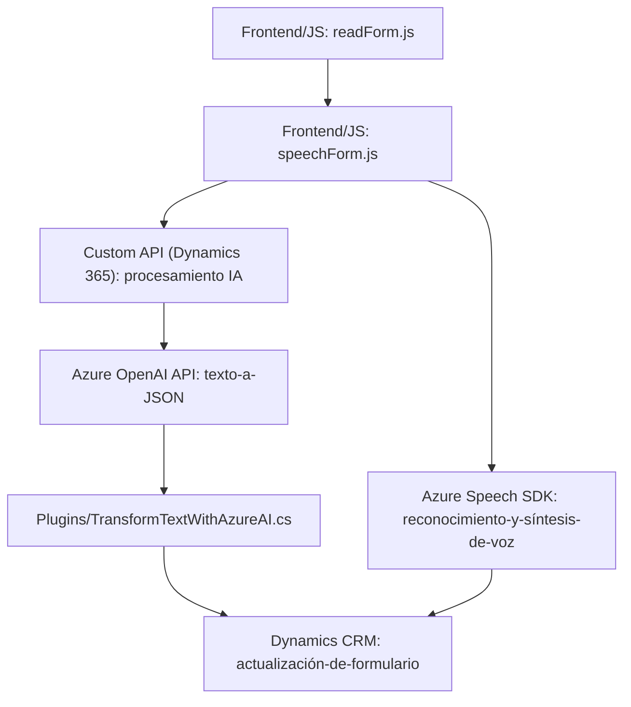

### Breve Resumen Técnico
El repositorio presentado contiene una solución enfocada en la integración de *Microsoft Dynamics 365* con servicios de inteligencia artificial y manejo de voz utilizando **Azure Speech SDK** y **Azure OpenAI**. La solución combina tres principales componentes: un *frontend JS* para gestión de formularios y voz, otro archivo para entrada y procesamiento de voz con asistencia externa, y un plugin en C# para transformación de texto con normas específicas a través de la API de Azure.

---

### Descripción de Arquitectura
1. **Tipo de Solución**: Esta solución implementa funcionalidades para complementar **Microsoft Dynamics 365** mediante:
   - **Frontend**: Funciones de captura de entrada y síntesis de voz.
   - **Backend (Plugin)**: Procesamiento avanzado de texto con capacidades de AI.
2. **Arquitectura**: Este diseño combina lógicamente la **arquitectura de n capas** (para separación estructural de datos, lógica y presentación en Dynamics) con ciertas influencias de la **arquitectura hexagonal** al interactuar con APIs externas (Azure Speech SDK y OpenAI) mediante puertos y adaptadores.
3. **Modularización**: Cada componente (frontend y plugin backend) tiene roles bien definidos y encapsulación funcional.
4. **Integración de tecnología externa**: Interacciones dinámicas con servicios de Azure (OpenAI API y Speech SDK) y la API de Dynamics 365 CRM.

---

### Tecnologías Usadas
- **Frontend**:
  - **JavaScript ES6**: Utilizado para control dinámico y modular de formularios y voz.
  - **Azure Speech SDK**: Reconocimiento y síntesis de voz.
  - **REST API**: Comunicación dinámica con la API personalizada en Dynamics.
- **Backend**:
  - **C#**: Desarrollo de plugins integrados con Dynamics CRM.
  - **Microsoft.Xrm.Sdk**: Acceso a servicios para interacción con el motor de Dynamics CRM.
  - **Azure OpenAI API**: Procesamiento de texto con AI utilizando modelos avanzados como GPT-4o.
  - **NewtonSoft.JSON** / **System.Net.Http**: Manejo de JSON y comunicación HTTP.
- **Servicios Externos**:
  - **Microsoft Dynamics 365 CRM API**: Gestión de datos (formularios, atributos).
  - **Azure Cloud Services**: Para síntesis de voz, procesamiento AI y API intermedia.

---

### Diagrama Mermaid

---

### Conclusión Final
La solución presentada es una integración avanzada de Dynamics 365 con servicios de Azure para extender sus capacidades de interacción con usuarios. La arquitectura, aunque simple en organización, es robusta al utilizar patrones como modularización, separación por capas, y componentes externos para habilitar procesamiento cognitivo y síntesis de voz. Para un despliegue efectivo, se necesitará validar la compatibilidad de librerías (como Speech SDK y Dynamics Plugin Framework) y la seguridad de las llaves API utilizadas.