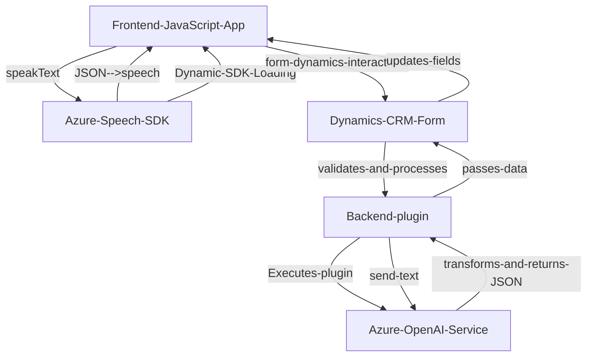

### **Breve resumen técnico:**
El repositorio contiene una solución híbrida que integra el frontend desarrollado en JavaScript con Dynamics CRM/Dataverse, y un plugin backend en C# que extiende la funcionalidad con Azure OpenAI. En el frontend, la solución utiliza el Azure Speech SDK para sintetizar y procesar entrada de voz, mientras que el plugin backend llama a un servicio REST en Azure OpenAI para transformar texto mediante inteligencia artificial. Esta integración agiliza tareas de entrada de datos en formularios.

---

### **Descripción de arquitectura:**
La arquitectura de la solución puede clasificarse como **n-capas**, ya que existen una capa de presentación (frontend en JavaScript), una capa de negocio (plugins de Dynamics CRM en C# que interactúan con las APIs de Azure), y una capa de servicios externos (integración con Azure Speech SDK y Azure OpenAI Service). Además, la solución presenta una integración con una plataforma SaaS, Dynamics 365 CRM, que actúa como base funcional del sistema.

- **Frontend**: Responsable de interacción con el usuario utilizando formularios de Dynamics CRM/Dataverse y Azure Speech SDK.
- **Backend plugin**: Funcionalidad plugin en Dynamics CRM que interactúa directamente con Azure OpenAI mediante una API REST.
- **Azure integrations**: Comunicación con servicios de Azure (Speech SDK y OpenAI), haciéndola dependiente de la infraestructura cloud.

---

### **Tecnologías usadas:**
1. **Frontend:**
   - **JavaScript**: Lenguaje base del desarrollo.
   - **Azure Speech SDK**: Servicios de síntesis de voz y reconocimiento de voz.
   - **Dynamics 365 Web API**: Para interactuar con formularios y entidades del sistema.

2. **Backend plugin (Dynamics CRM):**
   - **C#**: Lenguaje de programación principal para la implementación del plugin.
   - **Microsoft.Xrm.Sdk**: Manejo del modelo de objetos y contexto de plugin de Dynamics 365.
   - **Azure OpenAI**: Servicios de inteligencia artificial de procesamiento de lenguaje natural.
   - **JSON (System.Text.Json, Newtonsoft.Json)**: Serialización/deserialización de datos estructurados.
   - **HTTP Client**: Comunicación con servicios REST en Azure.

---

### **Diagrama Mermaid 100% compatible**:

---

### **Conclusión final:**
La solución combina tecnologías modernas como **Azure Speech SDK**, **OpenAI**, y **Dynamics CRM/Dataverse APIs** en un esquema de arquitectura **multi-capa orientada a eventos y servicios cloud**. Es ideal para aplicaciones empresariales centradas en la automatización de procesos, mejorando la interacción con formularios vía sintetización y reconocimiento de voz, junto con procesamiento avanzado de texto mediante IA. Sin embargo, el uso de servicios en la nube hace que la solución dependa de conectividad y APIs proporcionadas por Azure, lo que podría tener un impacto en la robustez si no se maneja correctamente la tolerancia a fallas.