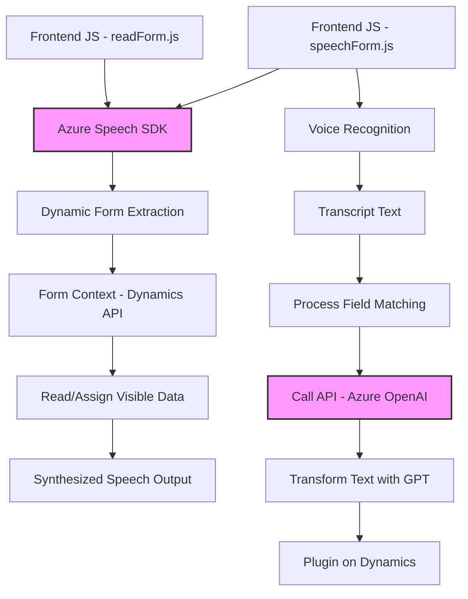

### Breve resumen técnico
La solución analizada combina la interacción con formularios en Dynamics 365, sincronización con el reconocimiento de voz (mediante Azure Speech SDK), interacción con inteligencia artificial (Azure OpenAI), y la generación de plugins personalizados. Está diseñada para mejorar la experiencia del usuario al interactuar con formularios, automatizando la conversión entre texto y voz y procesando datos mediante IA para mejorar la entrada de datos en sistemas CRM.

---

### Descripción de arquitectura
La arquitectura es modular, con los siguientes componentes y responsabilidades:
- **Frontend:** Implementado en JavaScript, interactúa con el SDK de Dynamics 365 y Azure Speech SDK para procesar formularios y sintetizar/transcribir texto.
- **Backend:** Implementado como plugin de Dynamics CRM (arquitectura en capas del CRM), utiliza la API de Azure OpenAI para procesar el texto.
- **Integración vía servicios externos:** Azure Speech SDK y Azure OpenAI se utilizan como servicios para los procesos de síntesis y transformación de texto.

La arquitectura es un modelo **mixto basado en Service-Oriented Architecture** (SOA) que utiliza un ecosistema de microservicios externos gestionados (Azure Speech SDK, Azure OpenAI) conectados a Dynamics CRM.

---

### Tecnologías utilizadas
1. **Frontend:**
   - **JavaScript:** Base para implementar procesos de lectura y reconocimiento de voz.
   - **Dynamics 365 API (Xrm):** Para interactuar con formularios CRM y gestionar sus datos.
   - **Azure Speech SDK:** Convertir texto a audio mediante la síntesis de voz y recolectar datos por reconocimiento de voz.
   
2. **Backend:**
   - **C#.NET:** Implementación del plugin en Dynamics 365.
   - **Azure OpenAI API:** Procesa texto por inteligencia artificial usando el modelo GPT.
   - **Microsoft Dynamics CRM SDK (Xrm):** Para ejecutar lógica de negocio específica en el contexto de CRM.

---

### Dependencias o componentes externos presentes
1. **Azure Speech SDK:** Interacción entre el procesamiento de voz (lectura y síntesis) y los formularios.
2. **Azure OpenAI API:** Funcionalidad de transformación de texto mediante inteligencia artificial (GPT).
3. **Dynamics 365 Web API:** Permite leer, asignar y modificar datos en formularios de Dynamics CRM.
4. **Newtonsoft.Json:** Serialización/deserialización de objetos JSON para comunicarse con APIs.
5. **System.Net.Http:** Realiza solicitudes HTTP sincronizadas para externalizar el procesamiento de texto con Azure OpenAI.

---

### Diagrama Mermaid

---

### Conclusión final
La solución analizada tiene un enfoque técnico robusto pero claramente modular que integra servicios externos mediante un modelo híbrido. Por un lado, los elementos clave del frontend gestionan la recolección y síntesis de información usando Azure Speech SDK y llamada directa a APIs, mientras el backend (plugin) está diseñado para procesar datos enriquecidos mediante Azure OpenAI en relaciones CRM.

- **Ventajas:** Modularidad que facilita mantenibilidad; uso eficiente de servicios externos; cumplimiento de principios como SRP (responsabilidad única).
- **Recomendaciones:** Refactorizar las funciones para separar servicios en capas más independientes y adoptar programación asíncrona en la gestión del plugin para evitar bloqueos en solicitudes a OpenAI.