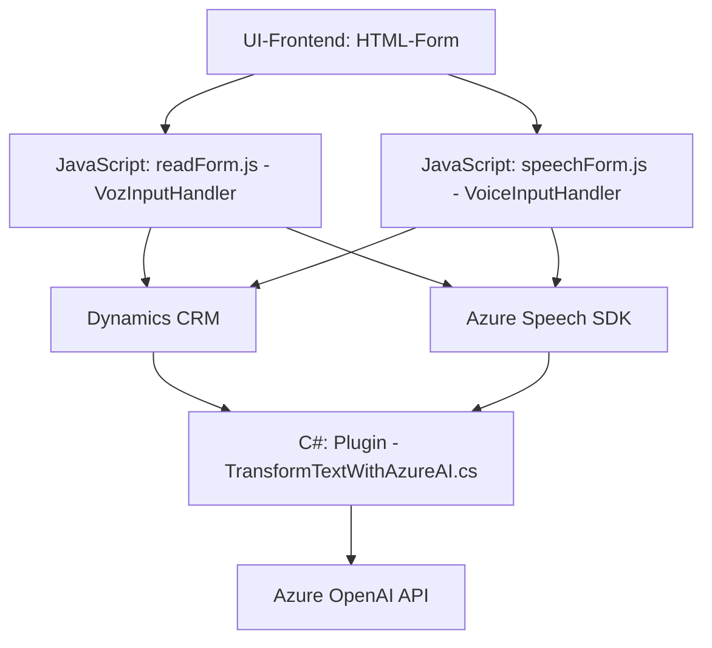

### Breve resumen técnico

El repositorio contiene distintos archivos que implementan integración con APIs externas (Azure Speech SDK, Dynamics CRM API, Azure OpenAI) para procesamiento de formularios y datos verbales, con un enfoque modular y estructurado. **`readForm.js`** y **`speechForm.js`** se centran en la lectura y síntesis de voz a partir de formularios, mientras que **`TransformTextWithAzureAI.cs`** actúa como un plugin del Dynamics CRM para transformar texto en formato JSON utilizando Azure OpenAI.

---

### Descripción de arquitectura

La solución está basada en una arquitectura **modular de n capas con integración a APIs externas**. 

1. **Frontend/JS:**
   - Las funciones en `readForm.js` y `speechForm.js` obedecen a un patrón cliente/servicio, interactuando directamente con APIs de Azure Speech y el CRM.
   - Modular y fragmentado en funciones independientes para tareas específicas: lectura y síntesis de datos.

2. **Plugins/.NET:**
   - El código en `TransformTextWithAzureAI.cs` sigue una arquitectura basada en eventos de Dynamics CRM, mediante el uso del diseño **Plugin**.
   - Hace uso del patrón proxy client para la interacción con Azure.

---

### Tecnologías utilizadas

1. **Frontend**
   - **JavaScript** (ES6+): Para la lógica cliente de manipulación del DOM, lectura de formularios y llamada a APIs.
   - **Azure Speech SDK**: Para síntesis de voz y reconocimiento de comandos hablados.
   - **Dynamics CRM SDK WebAPI (Xrm.WebApi)**: Para operaciones manipuladoras de datos en el CRM directamente desde los formularios.

2. **Backend (Plugin)**
   - **C# (.NET)**: Implementación de un plugin para Dynamics CRM.
   - **Microsoft Dynamics CRM SDK**: Extensibilidad en los eventos CRM.
   - **Azure OpenAI API**: Transformación de texto en formato JSON.
   - **Newtonsoft.Json** y **System.Text.Json**: Serialización y deserialización de JSON.
   - **System.Net.Http**: Gestión de solicitudes HTTP (REST API).

---

### Diagrama Mermaid

---

### Conclusión final

Este repositorio presenta una solución híbrida de **frontend y backend** que interactúa con **Microsoft Dynamics CRM** y servicios de **Azure** (Speech SDK, OpenAI). La arquitectura sigue una estructura **modular n capas**, con funciones de cliente enfocadas en síntesis y reconocimiento de voz, mientras el backend está vinculado a Dynamics CRM mediante plugins. Los patrones usados, como **proxy client**, hacen que esta solución sea fácilmente extensible y adaptada para sistemas empresariales interactivos basados en inteligencia artificial.