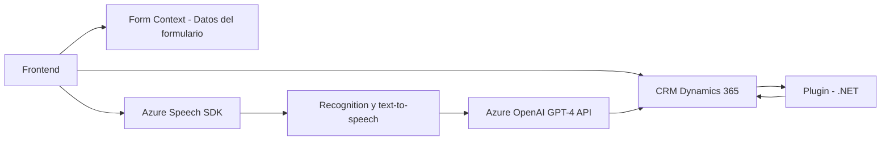

# **Análisis Técnico del Repositorio**

## **Breve Resumen Técnico**
El repositorio contiene implementaciones divididas en dos áreas principales: un **Frontend** orientado a la interacción por voz mediante Azure Speech SDK, y un **Backend Plugin** en .NET para Dynamics CRM que utiliza el servicio Azure OpenAI para transformaciones textuales. Juntos forman una solución completa que integra interacción por voz, procesamiento de datos en tiempo real y transformación textual basada en IA.

---

## **Descripción de Arquitectura**
1. **Tipo de Solución:**  
   Esta solución es una **API híbrida** y **microservicios centrados en datos y procesamiento de voz**. Sus módulos abarcan:
   - **Frontend:** Jugando el rol de cliente/UI en un entorno web, facilitando la interacción con formularios mediante síntesis y reconocimiento de voz.
   - **Backend Plugin (.NET):** Realiza procesamiento avanzado de texto orquestado por Azure OpenAI, siguiendo reglas específicas y devolviendo estructuras JSON que amplían la funcionalidad del CRM.
   
2. **Arquitectura General:**  
   - **Frontend:** Diseñado siguiendo el patrón de capas (funciones independientes para cada responsabilidad y modelos estadísticos vinculados al CRM como fuente de datos).  
   - **Backend Plugin:** Utiliza conceptos de arquitectura basada en **SOA (Service-Oriented Architecture)**, donde los servicios remotos de terceros (Azure) representan microservicios que procesan operaciones específicas. Además, el plugin cumple con el patrón **stateless**, ya que opera sin mantener un estado persistente.  
   - **Integración de APIs externas:** Ambas partes integran APIs. El Frontend conecta con el Speech SDK, mientras que el backend interactúa con el Azure OpenAI API (REST).

3. **Patrones comunes:**  
   - **Encapsulación modular:** Las funciones del Frontend y los métodos del Backend están diseñados con responsabilidades bien delimitadas.  
   - **Asincronía:** Especialmente en el Frontend, se aplica el uso de Promises para manejar interacciones con APIs en tiempo real.  
   - **Carga dinámica de dependencias:** En el Frontend se garantiza la disponibilidad del Speech SDK a través de una función que dinamiza su carga.  
   - **Integración SOA:** Conexión a external services mediante APIs REST (Azure Speech, Azure OpenAI).

---

## **Tecnologías Utilizadas**
1. **Frontend:**
   - **JavaScript (ES6):** Base del desarrollo del cliente y manejo del DOM.
   - **Azure Speech SDK:** Para reconocimiento de voz y síntesis de audio (dinámicamente cargado vía URL).
   - **Dynamics 365 SDK:** Trabaja con formularios en el entorno CRM.

2. **Backend Plugin/Server-Side Logic:**
   - **C# .NET:** Lenguaje principal utilizado para la creación del plugin.
   - **Microsoft Dynamics CRM SDK:** Interfaz para desarrollo de plugins en Dynamics.
   - **Azure OpenAI API (GPT-4):** Transformación de texto utilizando AI en formato JSON estructurado.
   - **Newtonsoft.Json:**
     - Para la deserialización y manipulación de JSON.
   - **HttpClient:** Realiza peticiones HTTP hacia el servicio Azure OpenAI.

---

## **Detección de Tecnologías y Funcionalidades**
La solución implementa las siguientes tecnologías y dependencias externas:
- **Azure Speech SDK**: Para la síntesis de texto en audio y reconocimiento de voz.
- **Azure OpenAI API (GPT-4)**: Procesamiento y transformación textual con inteligencia artificial.
- **Dynamics 365 SDK**: Para integraciones con un modelo CRM.
- **JavaScript (ES6)**: Para manipulación de formularios y comunicación con APIs.
- **Newtonsoft.Json y System.Text.Json**: Manejo de JSON en el backend.
- **HttpClient (C#):** Para peticiones HTTP.
- **Promise/Await:** Manejo de asincronía en JavaScript y .NET.

---

## **Diagrama Mermaid**

---

## **Conclusión Final**
El repositorio implementa una solución robusta y tecnológicamente avanzada para interactuar en contextos CRM mediante interfaces por voz y transformación textual basada en IA. Se compone de módulos altamente modulares y dependientes de servicios de cloud computing administrados como Azure Speech y Azure OpenAI.  
La arquitectura, aunque híbrida, utiliza conceptos de SOA y patrones como encapsulación y asincronía en su diseño. Es una solución adecuada para aplicaciones corporativas que busquen expandir sus capacidades, integrando comunicación por voz e IA avanzada.