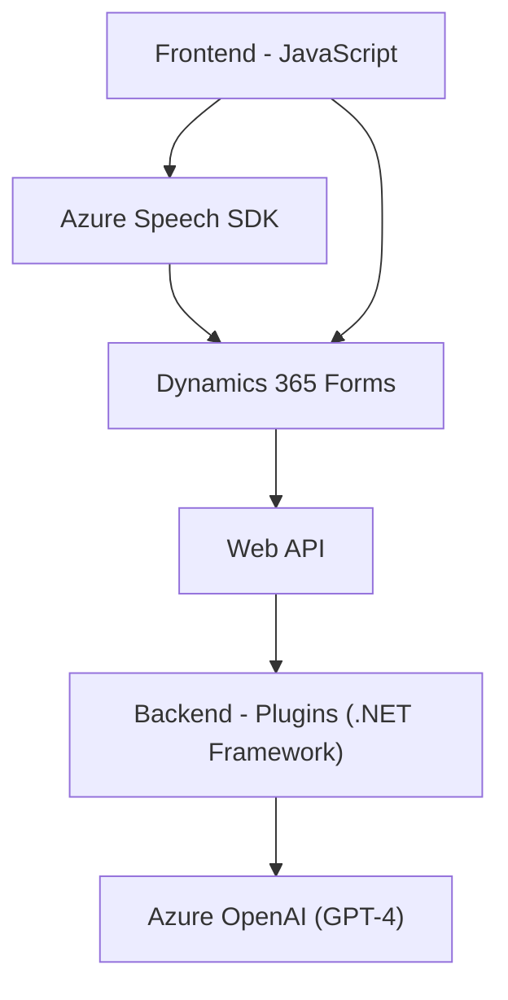

### Breve resumen técnico:
La solución en el repositorio se centra en integrar funciones de reconocimiento, síntesis de voz y transformación de texto utilizando tecnologías como Azure Speech SDK y Azure OpenAI. Se implementa tanto en el frontend, mediante archivos en JavaScript integrados con Dynamics 365 Forms, como en plugins .NET asociados al backend de Dynamics CRM.

---

### Descripción de arquitectura:
La arquitectura global sigue un **modelo de integración SaaS**, en el que Dynamics 365 actúa como centro para formularios e interacción de datos, utilizando plugins para extender funcionalidad del CRM y APIs externas para servicios inteligentes. 
- **Frontend**: Es modular, basado en el procesamiento de entrada y salida de voz asociado a UI del usuario dentro del CRM.
- **Backend**: Plugins de Dynamics usan el SDK de CRM junto con servicios de Azure OpenAI para realizar operaciones de transformación de datos y dar soporte al frontend.

---

### Tecnologías usadas:
1. **Frontend**:
   - **JavaScript**: Lenguaje principal para funciones de recogida y síntesis de voz.
   - **Azure Speech SDK**: API para reconocimiento y síntesis de voz externa.
   - **Dynamics 365 Form Context**: Para interactuar con formularios.
   - **Dynamics Web API**: Consultas y actualizaciones en el sistema de CRM.

2. **Backend**:
   - **C# con .NET Framework**: Implementación de plugins de Dynamics.
   - **Dynamics CRM SDK**: Framework para desarrollar plugins y extensiones.
   - **Azure OpenAI API**: Se consume el servicio GPT-4 para la transformación de texto relevante.
   - **JSON Libraries**: Manipulación de datos entre Dynamics y Azure OpenAI API (`System.Text.Json`, `Newtonsoft.Json.Linq`).

---

### Diagrama Mermaid válido para GitHub:

### Conclusión final:
Esta solución integra **Azure Speech SDK** y **Azure OpenAI** en un entorno Dynamics 365 CRM, implementando tanto características de transformación de texto como entrada/salida de voz. Su diseño modular en frontend, junto con una arquitectura basada en **microservicios y APIs** en el backend, ofrece escalabilidad y gran rendimiento en el manejo dinámico de datos. Sin embargo, aunque la integridad técnica es sólida, algunos aspectos como el almacenamiento seguro de claves de API deben mejorarse para garantizar una implementación escalable y segura.