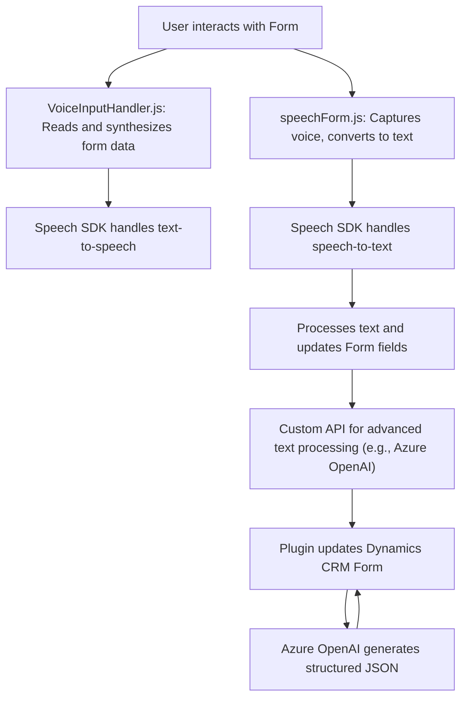

### Breve resumen técnico

El repositorio presenta una solución que integra funcionalidades de procesamiento de formularios y síntesis/reconocimiento de voz, además del procesamiento y transformación de texto mediante inteligencia artificial. Se identifican distintas piezas que trabajan juntas en un sistema de interacción de usuario basado en formularios y servicios de Microsoft Azure.

### Descripción de arquitectura

Este sistema tiene una arquitectura **n-capas** donde cada archivo representa una capa específica:
1. `FRONTEND/JS/readForm.js` y `FRONTEND/JS/speechForm.js` corresponden a la capa de presentación, enfocada en interacciones con formularios y usuarios.
2. `Plugins/TransformTextWithAzureAI.cs` pertenece directamente a la capa de lógica de negocio, ampliando las capacidades del entorno Dynamics CRM mediante un *plugin*.
3. La solución depende fuertemente de servicios externos, como **Azure Speech SDK** para voz a texto/texto a voz y **Azure OpenAI Service** para procesamiento de texto avanzado.

En general, la arquitectura sigue un **event-driven approach**, especialmente en el manejo de SDK externos mediante callbacks, APIs internas (Dynamics Web API), y APIs externas (Azure AI).

### Tecnologías usadas

1. **Frontend (JS)**:
   - Dependencia de Azure Speech SDK para interacción por voz.
   - Manipulación de formularios usando JavaScript con Dynamics CRM (via `formContext`).
   - Patrones como MVC-like estructurales (modelo-controlador-vista para formularios y voz).

2. **Backend (C#)**:
   - Dependencia directa del SDK de Dynamics CRM (`IPluginExecutionContext`, `IOrganizationServiceFactory`).
   - Solicitudes HTTP a Azure OpenAI Service utilizando `HttpClient`.
   - Serialización/deserialización de JSON con `System.Text.Json`.

### Diagrama Mermaid válido para GitHub

### Conclusión final

Este repositorio representa una solución basada en **n-capas**, integrando servicios externos para sintetizar voz y realizar reconocimiento de voz en interfaces de usuario, además de extender funcionalidad en un entorno de Dynamics CRM con plugins para procesamiento de texto mediante inteligencia artificial (Azure OpenAI).

#### Puntos fuertes:
- Aprovechamiento de procedimientos estándar y SDKs de Microsoft Azure y Dynamics.
- Modularización de funciones para garantizar escalabilidad.
- Uso de tecnologías modernas como servicios serverless y reconocimiento automático.

#### Áreas de mejora:
- Externalización de configuraciones sensibles como claves API.
- Implementar validación extensiva para el procesamiento de datos.
- Para un sistema distribuido más escalable, evolucionar hacia una arquitectura de **microservicios** con mensajería asincrónica entre servicios.