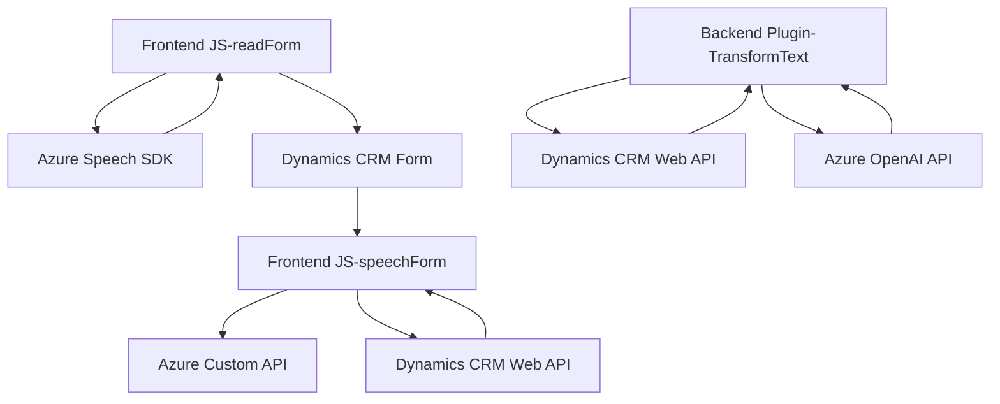

# Análisis técnico del repositorio y su arquitectura

## **Breve resumen técnico**
El repositorio implementa funcionalidades relacionadas con Microsoft Dynamics CRM, enfocándose particularmente en el procesamiento de datos de formularios mediante comandos de voz y texto, con integración de servicios externos de Microsoft Azure Speech SDK y Azure OpenAI API. Tiene tres componentes principales:
1. **Frontend (JS)**: Procesamiento de formularios y generación/reconocimiento de texto por voz, utilizando un servicio externo.
2. **Backend (Plugin)**: Transformación de texto mediante Azure OpenAI en un formato estructurado (JSON) para uso en CRM.

---

## **Descripción de arquitectura**
La arquitectura general sigue un enfoque híbrido, integrando servicios de terceros mediante estructuras basadas en eventos y promesas. Se detectan los siguientes elementos:
1. **Modularización del frontend**:
   - Separación de responsabilidades en funciones bien definidas.
   - Interacción con formularios dentro del Dynamics CRM.
2. **Interfaz asincrónica hacia servicios externos**:
   - Usa APIs externas como Azure Speech SDK y Azure OpenAI para el procesamiento de voz y texto estructurado, facilitando escalabilidad y desacoplamiento.
3. **Patrón Plugin en backend**:
   - Implementación del plugin arquitectónico de Dynamics CRM con la clase `TransformTextWithAzureAI`, extendiendo funcionalidad del CRM.

En términos de clasificación:
- **Tipo de solución**: Híbrido.
   - Frontend: Funcionalidades para Dynamics CRM mediante JS.
   - Backend: Plugin para transformación de datos con normas específicas.
- **Tipo de arquitectura**: Mixta entre una arquitectura de servicios y enfoque monolítico del CRM.
   - **Frontend**: Modular y desacoplado.
   - **Backend**: Plugin acoplado a Dynamics CRM.
   - **Azure Speech SDK**: Proveedor externo de servicios de síntesis/reconocimiento de voz.
   - **Azure OpenAI**: Proveedor externo de servicios de transformación de texto.

---

## **Tecnologías usadas**
1. **Lenguajes**:
   - **JavaScript**: Procesamiento frontend para voz y texto.
   - **C#**: Lógica de backend como plugin en Dynamics CRM.
2. **Frameworks/Servicios**:
   - **Dynamics CRM**: Sistema CRM escalable para manejar los datos del cliente.
   - **Azure Speech SDK**: Proceso de entrada/salida de voz.
   - **Azure OpenAI API**: Procesamiento avanzado de texto.
3. **Bibliotecas**:
   - **Newtonsoft.Json**: Serialización y deserialización JSON.
   - **System.Net.Http**: Manejo de conexiones HTTP para APIs.
4. **Patrones arquitectónicos**:
   - Callback Design Pattern: En JavaScript para manejar carga del SDK de voz.
   - Service-based Design: En el plugin para interactuar con dependencias de Dynamics CRM.
   - Microservicio: Funciones que interactúan con APIs externas para responsabilidades específicas.

---

## **Dependencias o componentes externos**
### **Frontend**
1. **Azure Speech SDK**: Servicio externo para reconocimiento de voz y síntesis de texto.
2. **Dynamics CRM Web API**: Interactúa con formularios en Dynamics CRM.
3. **Custom API**: Puede procesar transcripciones médiante IA (no detallada en el repositorio).

### **Backend**
1. **Microsoft CRM SDK**: Servicios de integración dentro del plugin.
2. **Azure OpenAI API**: Interpreta y transforma texto a JSON siguiendo normas predefinidas.

---

## **Diagrama Mermaid**

A continuación se muestra una representación gráfica simplificada de las interacciones entre los componentes del sistema:

---

## **Conclusión final**
El repositorio combina una solución híbrida orientada a servicios para procesamiento de datos en formularios de Dynamics CRM. El uso del Azure Speech SDK y Azure OpenAI fortalece la capa de procesamiento inteligente, mientras que la arquitectura modular del frontend y el diseño basado en plugins del backend facilitan su integración y escalabilidad. Sin embargo, el diseño depende fuertemente de servicios externos de Microsoft, lo que limita la independencia de la solución.