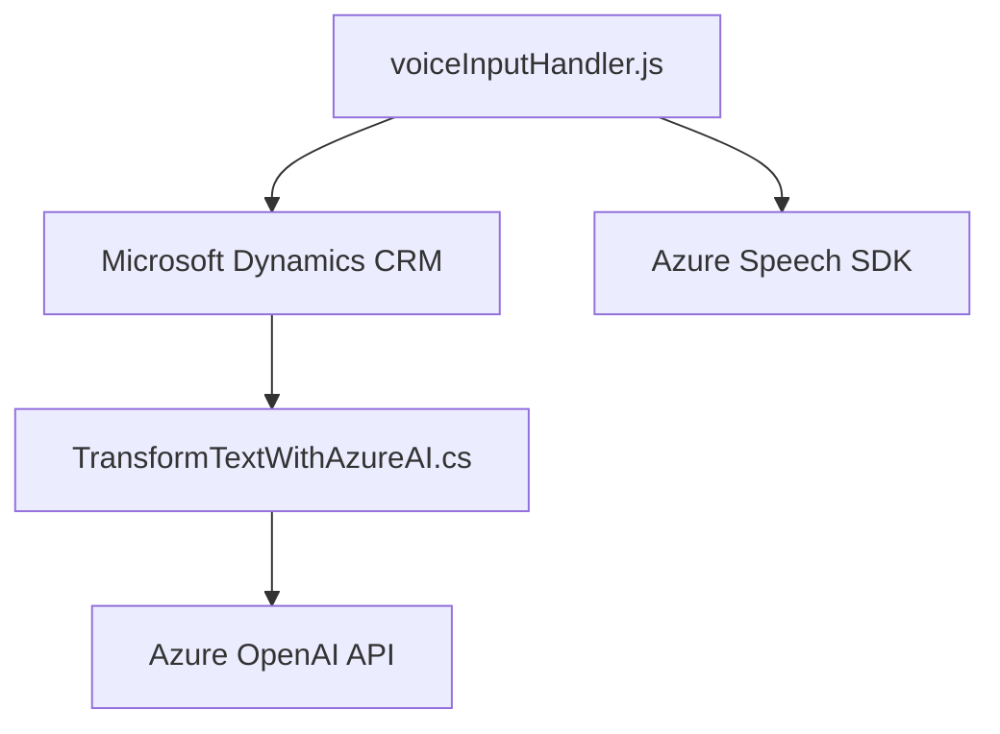
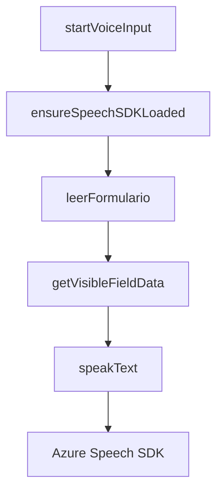
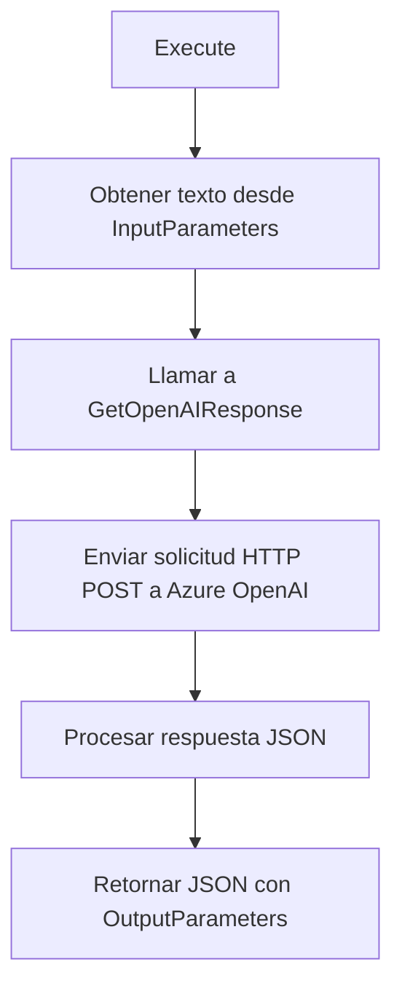

### Breve resumen técnico

El repositorio implementa una solución híbrida basada en interacción por voz y texto con formularios de Microsoft Dynamics 365 CRM, empleando reconocimiento de voz y procesamiento de lenguaje natural mediante Azure Speech SDK y Azure OpenAI. Los componentes clave del repositorio incluyen:

- **`voiceInputHandler.js`**: Módulo frontend para leer formularios e interpretar comandos de voz.
- **`TransformTextWithAzureAI.cs`**: Plugin para Dynamics CRM que transforma texto usando reglas específicas mediante Azure OpenAI.

### Descripción de arquitectura

La arquitectura sigue un modelo **modular y orientado a servicios**, con interacción entre frontend y backend a través de APIs y SDKs externos. Se utiliza Dynamics CRM como base de datos y capa de interacción, mientras que Azure Speech SDK y Azure OpenAI actúan como microservicios integrados para manejar voz y procesamiento de IA.

### Tecnologías usadas

1. **Frontend (`voiceInputHandler.js`)**
   - Lenguaje: JavaScript
   - Framework: Azure Speech SDK para reconocimiento de voz y síntesis.
   - Herramientas de desarrollo: Promesas y callbacks para asincronía en carga dinámica.

2. **Backend (`TransformTextWithAzureAI.cs`)**
   - Lenguaje: C#
   - Frameworks: Dynamics CRM Plugin Framework (basado en Event-Driven Architecture).
   - SDKs externos: Azure OpenAI API.
   - Librerías: Microsoft.Xrm.Sdk, Newtonsoft.Json para estructuras JSON.

### Diagramas Mermaid válidos para GitHub

Representación de interacción entre módulos del repositorio:

#### Diagrama general

#### Flujo dentro del módulo `voiceInputHandler.js`

#### Flujo dentro del plugin `TransformTextWithAzureAI.cs`

### Conclusión final

La solución implementada utiliza un enfoque modular basado en una arquitectura de **servicios integrados** con herramientas avanzadas como Azure Speech SDK y Azure OpenAI. Esto permite operar con voz y texto en tiempo real y aprovechar IA en la transformación contextual de datos. Los patrones empleados (modularidad, asincronía y event-driven) proporcionan una estructura flexible, escalable y mantenible, adecuada para ampliar funcionalidades en aplicaciones empresariales como Dynamics CRM.