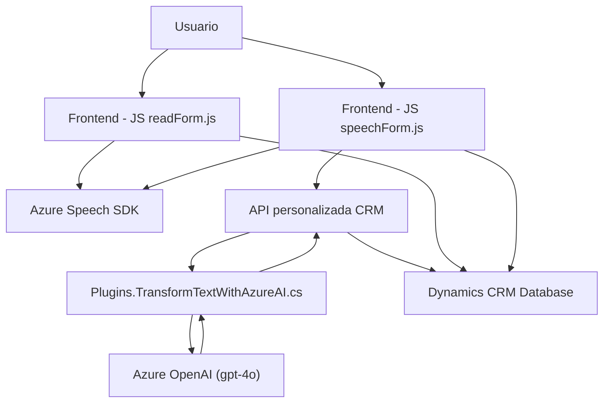

### Resumen técnico
El repositorio describe una solución que combina un **frontend** JavaScript con una API personalizada **Dynamics CRM Plugin** para procesar formularios interactivos mediante reconocimiento de voz y transformación de texto con **Azure OpenAI**. Está orientado hacia un sistema CRM que facilita la interacción de usuarios con formularios dinámicos, tanto en términos de entrada de voz como generación de contenido hablado.

### Descripción de arquitectura
1. **Frontend:** 
   - Implementa funciones para reconocer y sintetizar voz mediante el SDK de Azure Speech y manipula dinámicamente datos del formulario.
   - Encapsula lógica de procesamiento en funciones modulares que interactúan con APIs externas (Azure Speech y posiblemente otros servicios CRM).

2. **Backend Plugin:** 
   - Extiende funcionalidades de Dynamics CRM utilizando un plugin basado en C#. Este plugin procesa texto desde una API externa de Azure OpenAI y devuelve JSON estructurado para enriquecer procesos CRM.

La arquitectura general parece seguir un diseño de **n capas**, donde:
- **Capa de presentación:** El frontend maneja la interacción con el usuario.
- **Capa lógica:** Las funciones de JavaScript interactúan con el contexto del formulario y procesan datos desde voz, mientras que el plugin manipula texto de OpenAI.
- **Capa de servicios:** Integraciones con APIs externas (Azure Speech SDK, Azure OpenAI).

### Tecnologías usadas
- **Frontend JavaScript:**
  - Azure Speech SDK para voz y transcripción.
  - CRM APIs (Xrm.WebApi para interacción con formularios en Dynamics CRM).
  - Patrones de delegación y cargador dinámico.

- **Backend (Dynamics CRM):**
  - Área extendida con un Plugin basado en Microsoft.Xrm.Sdk.
  - Integración con Azure OpenAI (`gpt-4o`) para transformación de texto.

### Dependencias o componentes externos
- **Azure Speech SDK:** Para síntesis y reconocimiento de voz.
- **Azure OpenAI API:** Procesamiento y transformación avanzada de texto.
- **Dynamics CRM Plugin Framework:** Extensión estándar para integrar funcionalidades en Microsoft Dynamics CRM.
- **Newtonsoft.Json:** En el backend para manejo JSON.
- **System.Net.Http:** Para conexiones HTTP con APIs externas.
- **Xrm.WebApi:** En el frontend para manipular datos en el contexto CRM.

### Diagrama Mermaid

### Conclusión final
La solución presenta una arquitectura modular de **n capas**, donde se integran **tecnologías de Azure (Speech SDK, OpenAI), Dynamics CRM, y JavaScript**. Existe una clara separación de responsabilidades, consolidada por patrones como modularidad y delegación en el frontend y el plugin pattern en el backend. Sin embargo, el uso de `apiKey` directamente en el código fuente vulnera la seguridad y es un área que puede mejorarse mediante soluciones como Azure Key Vault o variables de entorno. Este diseño favorece la escalabilidad y adopta un enfoque Service-Oriented Architecture (SOA) para garantizar la interoperabilidad entre sistemas internos y externos.