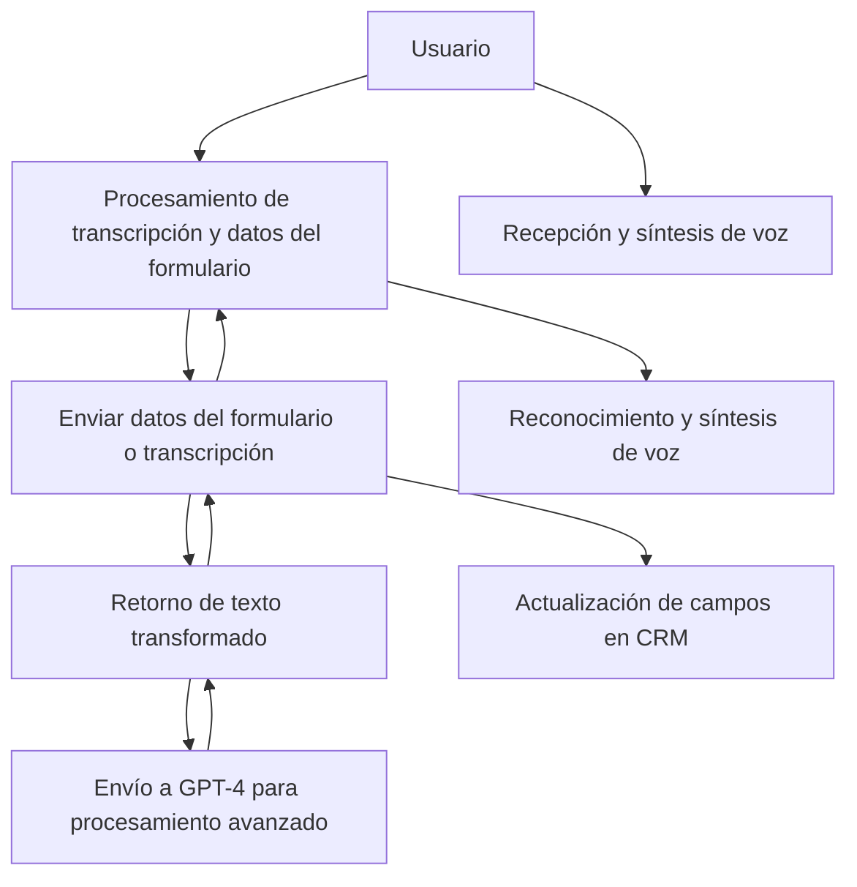

## Breve resumen técnico

El repositorio contiene una solución que implementa una **interfaz de usuario** con un componente de **procesamiento de voz** en el frontend y un **plugin de backend** para Microsoft Dynamics CRM. La solución se conecta con servicios externos como **Azure Speech SDK** para síntesis y reconocimiento de voz, así como **Azure OpenAI GPT-4 API** para procesamiento de texto mediante inteligencia artificial.

---

### Descripción de arquitectura

La solución tiene una arquitectura **n capas** con una parte de frontend (implementada en JavaScript) que interactúa con Microsoft Dynamics 365 a través del Web API y un backend que opera como un plugin desarrollado en C#. El backend utiliza servicios externos como Azure OpenAI GPT-4.

- **Frontend:**
  - Recibe entrada de voz, realiza síntesis de texto y conversión a través del **Azure Speech SDK**.
  - Interactúa con Dynamics CRM y utiliza la API personalizada del backend para procesamiento con IA avanzada.

- **Backend (Plugin de Dynamics CRM):**
  - Define una lógica para transformar texto mediante reglas específicas y Azure OpenAI GPT-4.
  - Proporciona a Dynamics CRM (consumido desde el frontend) una API personalizada para realizar transformaciones.

Características:
1. Modularidad.
2. Soporte para servicio de reconocimiento y síntesis de voz.
3. Integración fuerte con servicios de terceros (Azure).
4. Procesamiento de datos mediante patrones como Singleton y Service Locator.
5. Comunicación bidireccional entre frontend y backend (API).

---

### Tecnologías usadas

- **Frontend:**
  - **JavaScript** para la lógica en el navegador, incluyendo manipulación del DOM.
  - **Azure Speech SDK**: Servicio para reconocimiento y síntesis de voz.
  - **Dynamics 365 Web API (Xrm.WebApi.online.execute)**: Para enviar la transcripción al backend personalizado.

- **Backend:**
  - **C# Plugin**: Implementa lógica en Microsoft Dynamics CRM.
  - **Microsoft.Xrm.Sdk**: Framework para crear plugins en Dynamics CRM.
  - **Azure OpenAI GPT-4 API**: Procesamiento de texto mediante inteligencia artificial.
  - **Newtonsoft.Json** y **System.Text.Json**: Manipulación de JSON para comunicación REST.
  - **System.Net.Http**: Gestión de solicitudes HTTP al servicio exterior de Azure.

---

### Diagrama Mermaid válido para GitHub

---

### Conclusión final

La solución presentada en el repositorio está compuesta por tres áreas principales: **frontend**, **backend**, e integración con servicios externos. Es un sistema basado en Microsoft Dynamics CRM con el objetivo de transformar datos de texto y voz en su contexto operativo. La arquitectura es modular y de n capas, con una clara separación entre los roles de frontend, backend y servicios externos.

Además, emplea **Azure Speech SDK** para lectura/síntesis de voz y **Azure OpenAI GPT-4 API** para transformar texto mediante IA avanzada. La solución utiliza patrones como Singleton, Service Locator y Modularidad, asegurando un diseño escalable y reutilizable.

Este tipo de arquitectura resulta idónea para organizaciones que necesitan automatizar y enriquecer procesos de negocio a través de herramientas de CRM y capacidades de IA. Sin embargo, requiere la gestión robusta de los servicios externos y de sus configuraciones para garantizar estabilidad y escalabilidad.