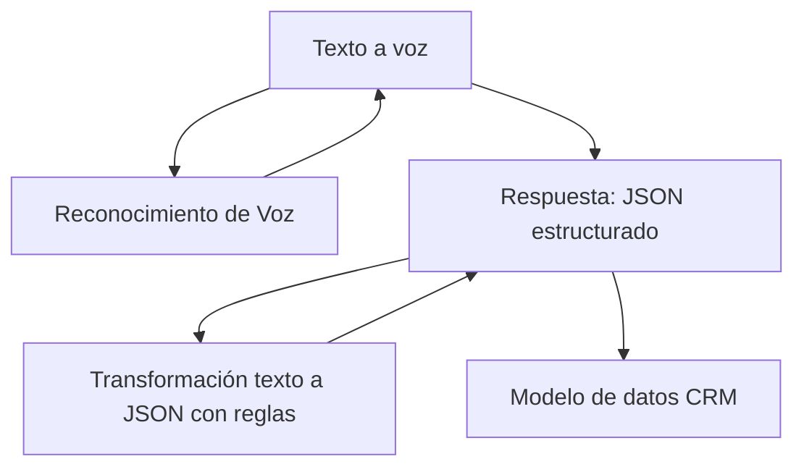

### Breve resumen técnico
El repositorio proporciona soluciones de software para dos objetivos íntimamente relacionados con la interacción humana y los servicios de análisis de datos basados en inteligencia artificial (IA):
1. **Frontend:** Implementa la gestión de voz en formularios para aplicaciones Dynamics 365, utilizando Azure Speech SDK para entrada y salida de voz.
2. **Backend:** Plugin dedicado para Dynamics CRM que interactúa con Azure OpenAI para transformar texto mediante inteligencia artificial.

---

### Descripción de arquitectura
Este sistema tiene una arquitectura híbrida **cliente-servidor basada en n capas**, con las siguientes características destacadas:
1. **Frontend con JavaScript Applications:** JS se utiliza para añadir funcionalidad dinámica basada en voz dentro de formularios de Dynamics 365.
2. **Middleware Plugin en Dynamics CRM:** Un plugin interactúa con el modelo de datos de Dynamics y se integra con Azure OpenAI.
3. **Integración con servicios externos**: Aprovecha los servicios cloud de Microsoft Azure (Azure Speech SDK y Azure OpenAI) para generar funcionalidades avanzadas de voz e IA.

---
### Tecnologías usadas

1. **Frontend**:
   - **Lenguaje:** JavaScript.
   - **SDK externo:** Azure Speech SDK (procesamiento de texto a voz y reconocimiento de voz).
   - **Framework asociado:** Dynamics 365 JavaScript API (Xrm.FormContext para manipulación de formularios).
   - **Patrones usados:**
     - **Event-Driven Programming:** Métodos activados por eventos del usuario (como la acción de hablar o interactuar con el formulario).
     - **Helper Functions:** Recolección y procesamiento modular de datos visibles en formularios.

2. **Backend**:
   - **Lenguaje:** C# (.NET).
   - **Plataforma:** Microsoft Dynamics CRM.
   - **Dependencias adicionales:**
     - Dynamics CRM SDK (`Microsoft.Xrm.Sdk`).
     - Azure OpenAI API.
     - `HttpClient` y bibliotecas para análisis JSON.
   - **Patrones usados:**
     - **Facade hacia API externa:** Encapsula la interacción con Azure OpenAI.
     - **Plugin Pattern:** Lógica ejecutable deseada directamente dentro de Dynamics CRM.

---
### Diagrama Mermaid válido para GitHub Markdown

---

### Conclusión final
El repositorio implementa una solución híbrida cliente-servidor para mejorar la accesibilidad y modernizar la interacción con formularios en Dynamics 365. Aprovechando dos servicios principales de Microsoft Azure (Speech SDK y OpenAI), la arquitectura ofrece procesamiento de texto a voz, reconocimiento de voz y transformación de datos asistida por IA.

#### Fortalezas:
- Uso estratégico de servicios en la nube.
- Modularidad y desacoplamiento entre las capas de frontend y backend.
- Mejora en accesibilidad y usabilidad del usuario final.

#### Áreas de mejora:
- Seguridad de las claves API mediante servicios de gestión segura como **Azure Key Vault**.
- Externalizar configuración de idiomas/regiones y reglas para cumplir con la variación requerida en entornos multiculturales y de múltiples clientes.

