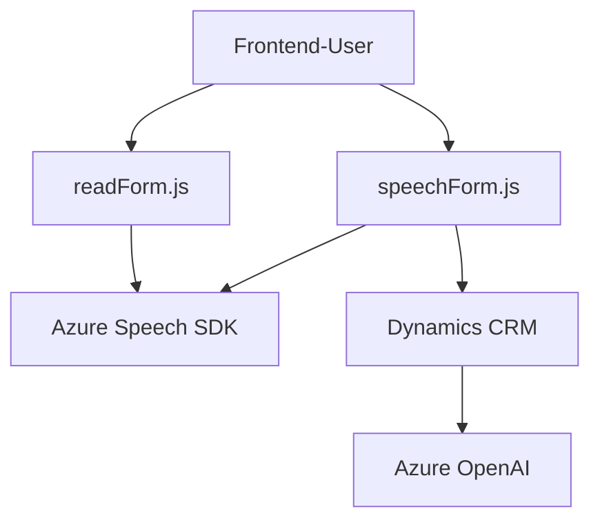

### Breve resumen técnico
El repositorio contiene tres archivos que implementan soluciones basadas en la integración con **Azure Speech SDK**, **Dynamics CRM API** y **Azure OpenAI API**. Los componentes están diseñados para trabajar principalmente con formularios en aplicaciones empresariales, ofreciendo funcionalidades como síntesis y lectura de voz, procesamiento de datos mediante reconocimiento de voz y conversión de texto a estructuras JSON utilizando IA.

---

### Descripción de arquitectura
1. **Frontend** (`readForm.js` y `speechForm.js`):
   - Implementa funcionalidades centradas en la entrada y salida de voz.
   - Utiliza un patrón modular con funciones específicas para realizar tareas como extracción de datos de formularios, síntesis de texto a voz y reconocimiento de voz.
   - Integra servicios externos (Azure Speech SDK y APIs del navegador) para estas capacidades.
   - Opera como parte de una arquitectura posiblemente orientada al usuario en una interfaz web conectada a un backend.

2. **Backend Plugin** (`TransformTextWithAzureAI.cs`):
   - Implementa un plugin para Dynamics CRM, adherido a la arquitectura basada en `IPlugin`.
   - Se utiliza para integrar servicios de Azure OpenAI y realizar procesamiento de texto.
   - Ofrece una modularización clara y utiliza patrones de integración directamente con APIs externas para obtener resultados estructurados.

3. **Global Architecture**:
   - La solución exhibe características de una arquitectura **n capas**:
     - **Presentación (frontend):** Provee capacidades de síntesis y reconocimiento de voz para interactuar con formularios dinámicos en la UI del cliente.
     - **Lógica de negocio (plugin):** Procesa datos utilizando Azure OpenAI y los integra con Dynamics.
     - **Persistencia/Datos:** Utiliza Dynamics CRM como backend para almacenar y procesar datos.

---

### Tecnologías, frameworks y patrones usados
#### Tecnologías:
1. **Frontend (JavaScript):**
   - Azure Speech SDK.
   - Vanilla JavaScript (interacción con DOM).
   - Dynamics Web API (integración con formularios).

2. **Backend (C#):**
   - C# .NET Framework.
   - Microsoft Dynamics SDK.
   - Azure OpenAI via `HttpClient`.
   - Libraries: `Newtonsoft.Json`, `System.Net.Http`, `System.Text.Json`.

#### Patrones:
1. **Modular Design:** Cada archivo ofrece funciones o clases encapsuladas que pueden ser combinadas para cumplir con objetivos específicos.
2. **Callback Pattern:** Utilizado con funciones en JavaScript que reciben callbacks para modular y encadenar tareas (ej. SDK loading).
3. **Integration Patterns:** Implementación de servicios externos usando REST APIs (Azure Speech SDK, Azure OpenAI, Dynamics CRM API).
4. **N Capas:** Separación clara entre presentación, lógica de negocio y datos.
5. **Plugin Pattern:** En el backend, se utiliza el enfoque de Plugins propio de Dynamics CRM para extensibilidad y eventos.

---

### Dependencias o componentes externos presentes
- **Frontend (JavaScript):**
  - Azure Speech SDK.
  - Dynamics Web API.
  - APIs del navegador (DOM methods: `document.createElement`, `document.head.appendChild`).

- **Backend (C# Plugin):**
  - Microsoft Dynamics SDK.
  - REST API para Azure OpenAI (GPT-4).

---

### Diagrama Mermaid

---

### Conclusión final
La solución es una combinación de un frontend basado en JavaScript (con integración de Azure Speech SDK y Dynamics Web API) y un backend en C# que funciona como un plugin de Dynamics CRM. Cumple objetivos empresariales como procesamiento de voz y texto, actualización dinámica de datos en formularios, y conversión de texto en JSON utilizando IA.

La arquitectura es **n capas**, y cada componente está muy bien estructurado con patrones de integración y modularización que facilitan la extensibilidad tanto en el frontend como en soluciones backend empresariales conectadas.